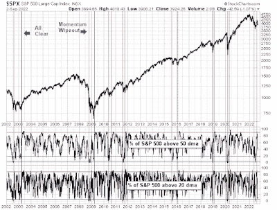

<!--yml
category: 未分类
date: 2024-05-18 01:39:52
-->

# Humble Student of the Markets: How the trade the failed breadth thrust

> 来源：[https://humblestudentofthemarkets.blogspot.com/2022/09/how-trade-failed-breadth-thrust.html#0001-01-01](https://humblestudentofthemarkets.blogspot.com/2022/09/how-trade-failed-breadth-thrust.html#0001-01-01)

**Preface: Explaining our market timing models** 

We maintain several market timing models, each with differing time horizons. The "

**Ultimate Market Timing Model**

" is a long-term market timing model based on the research outlined in our post, 

[Building the ultimate market timing model](https://humblestudentofthemarkets.com/2016/01/26/building-the-ultimate-market-timing-model/)

. This model tends to generate only a handful of signals each decade.

The 

**Trend Asset Allocation Model**

 is an asset allocation model that applies trend-following principles based on the inputs of global stock and commodity prices. This model has a shorter time horizon and tends to turn over about 4-6 times a year. The performance and full details of a model portfolio based on the out-of-sample signals of the Trend Model can be found

[here](https://humblestudentofthemarkets.com/trend-model-report-card/)

.

My inner trader uses a 

**trading model**

, which is a blend of price momentum (is the Trend Model becoming more bullish, or bearish?) and overbought/oversold extremes (don't buy if the trend is overbought, and vice versa). Subscribers receive real-time alerts of model changes, and a hypothetical trading record of the email alerts is updated weekly 

[here](https://humblestudentofthemarkets.com/trading-track-record/)

. The hypothetical trading record of the trading model of the real-time alerts that began in March 2016 is shown below.

The latest signals of each model are as follows:

*   Ultimate market timing model: Sell equities*
*   Trend Model signal: Neutral*
*   Trading model: Bearish*

** The performance chart and model readings have been delayed by a week out of respect to our paying subscribers.***Update schedule**

: I generally update model readings on my 

[site](https://humblestudentofthemarkets.com/)

 on weekends and tweet mid-week observations at @humblestudent. Subscribers receive real-time alerts of trading model changes, and a hypothetical trading record of those email alerts is shown 

[here](https://humblestudentofthemarkets.com/trading-track-record/)

.

Subscribers can access the latest signal in real time 

[here](https://humblestudentofthemarkets.com/my-inner-trader/)

.

**Faltering momentum**

Technical analysts recently became excited when the percentage of S&P 500 stocks above their 50 dma surged from below 5% at the June low to over 90% in mid-August. In the past, such strong price momentum has always signaled the start of a new equity bull.

Since then, the S&P 500 fizzled at its 200 dma. Markets further took a risk-off tone when the Fed and other central bankers signaled their determination to raise interest rates and warned about pain ahead. The reversal has been so dramatic that the percentage of S&P 500 stocks above their 20 dma has retreated to under 10%.

If it's any consolation, the intermediate technical outlook is still bullish for equities.

The full post can be found

[here](https://humblestudentofthemarkets.com/2022/09/04/how-the-trade-the-failed-breadth-thrust/)

.