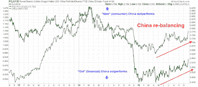

<!--yml
category: 未分类
date: 2024-05-18 03:13:56
-->

# Humble Student of the Markets: How to energize returns even as momentum fades

> 来源：[https://humblestudentofthemarkets.blogspot.com/2015/11/how-to-energize-returns-even-as.html#0001-01-01](https://humblestudentofthemarkets.blogspot.com/2015/11/how-to-energize-returns-even-as.html#0001-01-01)

**Trend Model signal summary**

Trend Model signal: Neutral

Trading model: Bullish

The Trend Model is an asset allocation model which applies trend following principles based on the inputs of global stock and commodity price. In essence, it seeks to answer the question, "Is the trend in the global economy expansion (bullish) or contraction (bearish)?"

My inner trader uses the trading model component of the Trend Model seeks to answer the question, "Is the trend getting better (bullish) or worse (bearish)?" The history of actual out-of-sample (not backtested) signals of the trading model are shown by the arrows in the chart below.

**Update schedule**

: I generally update Trend Model readings on

[my blog](http://humblestudentofthemarkets.blogspot.com/)

on weekends and tweet any changes during the week at @humblestudent.

**Time to pay off the VISA card?**

Three weeks ago, I wrote a provocative post entitled

[A "What's the credit limit on my VISA card" buy signal](http://humblestudentofthemarkets.blogspot.com/2015/10/a-whats-credit-limit-on-my-visa-card.html)

, based on the thesis that US equities were experiencing a powerful global momentum thrust off a deeply oversold position. Stocks have rallied nicely since I wrote those words. Last week, I re-affirmed my position of a momentum driven market and postulated further gains (see

[Momentum = Risk on!](http://humblestudentofthemarkets.blogspot.com/2015/10/momentum-risk-on.html)

).

This week, I am less sure that stock prices can continue to grind upwards. To be sure, the combination of improving fundamentals and positive seasonality all suggests that the next 5-10% move will be positive, but I have no idea what next 1-2% might do. It may be time for a pause.

**Improving fundamentals**

As we are well into Earnings Season, the latest update from

[John Butters](http://www.factset.com/websitefiles/PDFs/earningsinsight/earningsinsight_10.30.15)

of Factset was good news for the bull camp. With 67% of SPX components having reported results, the EPS beat rate at 76% is ahead of its 5-year average, though the revenue beat rate came in at a disappointing 47%. More importantly, forward EPS has arrested its decline of the last few weeks and started to tick up again (chart annotations are mine):

In addition,

[Brian Gilmartin](http://fundamentalis.com/?p=5308)

wrote that SPX ex-energy revenues and earnings continuing to grow at a decent, though unspectacular rate:

> Using Factset’s Weekly Earnings Insight, Ex-Energy, SP 500 earnings are +5% – 6% for Q3 ’15, probably slightly slower than the first and 2nd quarter’s of 2015.
> 
> Ex-Energy, SP 500 revenue has grown +2.2% y/y, with retail or Consumer Discretionary set to report in November ’15\. Financials, Technology and Energy have pretty much all reported Q3 ’15 earnings...
> 
> Core SP 500 earnings growth Ex-Energy is still growing at a mid-single-digit pace, but slowing somewhat. What is the catalyst that will accelerate SP 500 earnings growth ? Hard to say. I think it will be SP 500 corporate boards and leadership growing more positive about the future. There is no question that SP 500 earnings growth is locked in this “slow, stable, mid to high-single-digit, year-over-year growth” range, quarter-in, quarter out, which despite the headlines and negative earnings pessimism, continues unabated.

I interpret these conditions as being constructive for equities.

**A mixed sentiment picture**

By contrast, the sentiment picture is a bit mixed. Market sentiment has moved from a crowded short level to a neutral or slightly bullish reading. The CNN Money

[Fear and Greed Index](http://money.cnn.com/data/fear-and-greed/)

 tells the story. The index is now mildly bullish, though not at extremes. As stock prices and investor sentiment have moved very quickly in a the space of about a month, this could a good time for the market to pause and consolidate its gains.

This

[historical chart](http://kirklindstrom.com/Articles/2013/0625_Fear-And-Greed-Index_vs_S&P500_Chart-History.html)

of the Fear and Greed Index in 2011 could serve as a template of what might happen in the next few weeks. Though the market continued to rise into year-end after its initial rally in August 2011, stock prices and sentiment did correct briefly before the market resumed its upward progress.

As well, the latest report of insider activity from

[Barron's](http://www.barrons.com/public/page/9_0210-instrans.html)

shows that the "smart money" has turned from buying stocks in mid-August to selling. While these numbers are noisy and insiders tend to be early in their timing, it does indicate that stocks do not represent compelling value for the smart money crowd.

On the other hand, other sentiment models indicate that the market could continue to rise from current levels.

[NAAIM](http://www.naaim.org/newsresources/naaim-exposure-index/)

exposure is neutral to slightly bearish, which suggests potential for more buying should a year-end FOMO rally materialize.

Option based sentiment are also supportive of further gains. The CBOE equity-only put/call ratio remains high by historical standards. Such levels of mild bearishness is contrarian bullish, especially after the powerful market rally that we've seen. Simply put, the market continues to climb the proverbial wall of worry:

The ISE equity-only call/put ratio also tells the same story as the CBOE equity-only put/call ratio. ISE statistics only count customer opening transactions, which is a more accurate measure of market sentiment. The chart below shows no signs of euphoria, which is bullish (remember that this is a call/put ratio and therefore the direction of the chart is inverted compared to the above put/call chart):

In the meantime, the Trend Model, which monitors the behavior of global stock and commodity markets, continue to signal recovery. However, the Trend Model is designed to spot the big moves in the market and cannot anticipate every 1% or 2% squiggle.

These conditions presents a dilemma for my inner trader. Should he take partial profits or stay for the bull ride? Trying to resolve that problem is hurting his head. Instead, he is looking for other profit opportunities beyond a simple directional exposure to stocks.

**Energizing returns with commodity exposure**

Here is another way of thinking about the market. I have written about Jim Paulsen's thesis that commodity prices are due for a bounce back (see past posts 

[The weak USD scenario for equity bulls](http://humblestudentofthemarkets.blogspot.com/2015/10/the-weak-usd-scenario-for-equity-bulls.html)

and

[How I differ from Jim Paulsen](http://humblestudentofthemarkets.blogspot.com/2015/10/how-i-differ-from-jim-paulsen.html)

). To briefly recap, USD strength has been a headwind for earnings and the USD is inversely correlated to commodity prices.

[Jim Paulsen](https://www.blogger.com/)

of Wells Capital Management believes that USD strength is due for a pause and commodity prices are likely to see a counter-trend rally:

> In three of the last four recoveries (i.e., the late-1970s, 1980s and 1990s recoveries), commodity prices suffered a severe decline “during an ongoing economic recovery. In each of these cases, the economic recovery persisted well beyond the bottom in commodity prices. Indeed, in the past, once commodity prices bottomed, the pace of economic growth accelerated and the recovery did not end until commodity prices had substantially recovered. For example, in the late-1970s recovery, commodity prices bottomed in July 1977 and the recovery did not end until January 1980\. Similarly, commodity prices bottomed in July 1986 but the economic recovery continued until July 1990\. Finally, commodity prices bottomed in early 1999 but the recovery did not peak until March 2001\. As shown, a significant decline in commodity prices usually points to stronger rather than weaker future economic growth. Moreover, once commodity prices do finally bottom, they have typically risen throughout the balance of the economic recovery.
> 
> Although most believe oil prices (and overall commodity prices) are continuing to collapse, chart 2 suggest they have been in a bottoming process since early this year. While the spot price of WTI crude oil did collapse last year, it is currently about $45, a level it first reached in mid-January. We suspect the commodity markets are about to embark on a multi-year advance which will likely alter leadership in the economy and in the stock market.

The chart below of the USD (top panel, inverted scale) and the relative performance of energy stocks (middle panel, US=black line, Europe=green line) and materials stocks (bottom panel, US=black line, Europe=green line) tell the story. The USD is range-bound and trading at the top of its range (remember the scale is inverted) while energy and material stocks are forming relative bases and performance is starting to turn upwards.

What I find encouraging about the commodity revival thesis is that the pattern is evident in both the US and European markets. This suggests that the commodity revival story is global in nature, which lends greater support for the case for a tactical rebound in these sectors.

**Commodity bull = USD bear**

Much of the case for commodity strength rests on USD weakness, as the two have been inversely correlated on a historical basis. Generally speaking, currency movements depend on the following two factors:

*   Relative growth and inflation rates
*   Differentials in monetary policy

Here is the current market consensus on the USD:

1.  The US economy is growing, but China is slowing and Europe is struggling. 
2.  There is no inflation anywhere.
3.  The Federal Reserve is about to raise interest rates while other global central banks are easing.

While the consensus view is supportive of USD strength, I am seeing developments that undermine that the USD bull case. On the issue of relative growth rates, the latest US Q3 GDP came in at 1.5%, which was below market expectations of 1.6%.

China is starting to experience a resurgence of growth, which is also contrary to the market consensus. I already wrote about how China is re-balancing in my last post and not freak out over a disappointment in M-PMI (see

[More evidence of China re-balancing](http://humblestudentofthemarkets.blogspot.com/2015/10/more-evidence-of-china-re-balancing.html)

). My long New (consumer) China and short Old (financial) China pairs trades seem to be signaling better household sector led growth:

As well, Moody's is projecting further price momentum in Chinese property prices, which has been a source of vulnerability for the economy (via

[Xinhua](http://news.xinhuanet.com/english/2015-10/29/c_134762926.htm)

):

> Positive sales momentum for China's property sector, a major pillar for economic growth, will continue in the last quarter of 2015, Moody's Investors Service said Thursday.
> 
> Moody's attributed the positive momentum to supportive monetary and regulatory polices implemented since the second half of 2014.

Meanwhile, in Europe, unemployment is plunging and the latest eurozone unemployment figures surprised on the downside (via

[Business Insider](http://www.businessinsider.com/eurozone-unemployment-figures-september-2015-10)

):

Frederik Durcrozet of Pictet also pointed out that stronger eurozone credit flows is foreshadowing a positive investment growth surprise (via

[Business Insider](http://www.businessinsider.com/bi-most-important-charts-october-2015-10?op=1)

):

As for the question of the differential in monetary policy, the latest FOMC statement squarely put a December rate hike back on the table and the USD rallied in knee-jerk reaction. But John Williams of the San Francisco Fed seemed to walk back the hawkish tone in the latest round of post-meeting Fedspeak (via

[ABC News](http://abcnews.go.com/Business/wireStory/fed-official-central-bank-made-decision-rate-hike-34854659)

, emphasis added):

> John Williams, president of the Fed's San Francisco regional bank, said he wants to study more economic data in coming weeks before deciding whether the economy is strong enough for the Fed to raise its key short-term rate from a record low, where it's been for seven years.
> 
> Williams said in an interview with The Associated Press that ***the Fed chose to mention in its latest policy statement that it could decide on a rate hike at its next meeting to avoid surprising investors in case it did raise rates then***.

Is December rate hike a possibility? Definitely. But Williams' comments made the FOMC statement sound more like a CYA comment rather than a definitive commitment that the Fed will raise rates at its December meeting, especially in light of weaker than expected GDP growth and little signs of inflation pressure from the latest core PCE release, which is the Fed's preferred measure of inflation.

**The bull case for energy stocks**

While energy, materials and emerging market stocks are all correlated to each other, I wrote before that the greater upside potential appears to be in energy stocks because they got more oversold than the others (see 

[The weak USD scenario for equity bulls](http://humblestudentofthemarkets.blogspot.com/2015/10/the-weak-usd-scenario-for-equity-bulls.html)

). I will therefore focus my analysis on the energy sector, though the comments apply to materials and EM as well.

The bull case for oil and energy stocks rests on the following factors;

*   Improving demand-supply fundamentals
*   A washed-out market psychology indicating a crowded short

Recently, I have been seeing more and more analysis come across my desk that the cure for low oil prices is low prices and we are starting to see a supply response as to falling oil prices. The IMF recently issued a 

[report](http://www.imf.org/external/pubs/ft/reo/2015/mcd/eng/pdf/menap1015.pdf)

 warning of severe strains that the current low oil price environment is putting on Saudi Arabia;s fiscal position. The Saudi needs $106 oil to breakeven on its budget. With prices where they are today, their budget is swimming in a sea of red ink, which has so far been financed by its SWF reserves, but those reserves could be reduced to zero within five years. Such a precarious fiscal position therefore greatly limits their oil production and price policy and therefore highly suggestive of supply cutbacks in the medium term.

In addition, 

[Fatih Birol](http://economictimes.indiatimes.com/industry/energy/oil-gas/global-oil-investments-to-be-20-less-than-2014-iea-chief-fatih-birol/articleshow/49197844.cms)

of the IEA reported that industry capex had cratered by 20% in 2015:

> "We expect this year, in 2015, global oil investments to be 20 per cent less than 2014," Birol told a news conference at a G20 Energy Ministers' meeting in Istanbul. This is the biggest decline in oil history," IEA Executive Director Fatih Birol told reporters in Istanbul.
> 
> "As a result of this, we expect that next year, US oil production will fall by 400,000 barrels per day because of projects not making economic sense ... We may well seen soon upwards pressure in price," he said.

As EM demand continues to rise and supply cutbacks looming on the horizon, the oil glut is eroded and analysis like this from Barclays is becoming more commonplace (via

[Sober Look](https://twitter.com/SoberLook/status/656634575700033536)

):

In addition, extreme crowded short readings are showing up in energy stocks. Bespoke reports that energy shorts are nearing levels seen in the financial sector at the height of the 2008 financial crisis (via

[Bloomberg](http://www.bloomberg.com/news/articles/2015-10-28/investors-dislike-energy-stocks-nearly-as-much-as-they-disliked-financial-stocks-in-2008)

, emphasis added):

> Bespoke Investment Group observes that short interest as a percent of shares available for trading, known as the "float," has spiked for the average company in the energy sector, to 11.6 percent as of mid-October:

> ***In mid-2008, short interest as a share of float for the average financial stock peaked at 11.7 percent, a tick higher than the current level for energy equities, according to the report.***
> 
> But Bespoke noted that short interest in financials was capped through a prohibition by the U.S. securities watchdog on short-selling in response to an outcry from Wall Street executives, chief among them Dick Fuld of Lehman Brothers.

Then there is this oil market commentary from last week, which is also indicative of a crowded short in crude oil (via

[Marketwatch](http://www.marketwatch.com/story/why-oil-is-rallying-despite-5-weeks-of-rising-supplies-2015-10-28)

, emphasis added):

> U.S. crude inventories marked a fifth straight weekly increase, but oil prices rallied to their best gain in three months.
> 
> That doesn’t make sense at first glance. The degree to which oil rallied has some analysts stumped, but there are good reasons why oil prices are climbing.
> 
> Early Wednesday, the U.S. Energy Information Administration reported an increase of 3.4 million barrels in crude supplies for the week ended Oct. 23\.
> 
> That was well above the increase of 1.6 million barrels forecast by analysts polled by Platts, but analysts surveyed by The Wall Street Journal looked for a bigger 3.7 million-barrel rise and the American Petroleum Institute Tuesday said inventories rose 4.1 million barrels.
> 
> “***It looks like the majority of shorts got ahead of themselves and were looking for another high single-digit build that didn’t pan out, so they all ran for the door at once to unwind***,” said Tyler Richey, co-editor of the 7:00’s Report.

I may be early on the energy and commodity theme, but I believe that downside risk is relatively limited in this trade. We are starting to see signs of better non-US growth, which puts downward pressure on the USD  (bullish for large cap US multi-nationals EPS and commodity prices). Better global growth also leads to a virtuous cycle of higher commodity demand, which is also bullish. Sentiment readings are wash-out and we are seeing a basing pattern in the relative performance of energy and material sectors. In addition, 

[Callum Thomas](https://twitter.com/callum_thomas/status/658907582786998272?refsrc=email&s=11)

also highlighted an intriguing potential bullish analog for oil prices based the pattern seen in 1998-99:

While I am not forecasting a revival of the secular commodity bull, current conditions represent a setup for a tradeable rally over the next 3-12 months.

**The week ahead**

Looking to the week ahead, the SPX has been grinding upwards and flashing a series of "good" overbought readings on RSI(5) and the uptrend continues in RSI(14). There are good reasons the advance can continue. However, market could also pull back and consolidate. In that case, the obvious downside support levels are:

1.  The 200 day moving average, which coincides with a gap that could get filled at 2050-2060; or
2.  Fibonacci retracement levels at 2007 and 1980.

A glance at breadth indicators from

[IndexIndicators](http://www.indexindicators.com/indicators/breadth/)

, such as the average RSI(14) of SPX members, is instructive. This indicator, which tends to have a 1-2 week time horizons, show that readings are mildly overbought by 2015 standards but not at the kind of extreme levels seen a year ago. I would not be overly surprised if the market were to pause and correct here, but there are no signs of an intermediate term top.

Despite the near overbought readings shown in a variety of indicators, this chart from

[TradeFollowers](https://www.tradefollowers.com/stock/breadth_detail.jsp)

, which measures Twitter sentiment of (mostly) day and swing traders, is suggestive of further near-term gains. As the chart below shows, twitter breadth is trending up and bullish sentiment has spiked to a post-correction high, indicating positive breadth and bullish participation of the mainly high-octane stock universe favored by traders.

The technical pattern for oil prices and its mirror image are even more interesting. Oil has been range bound for the past couple of months. It touched the bottom of their range, started to turn up and is on the verge of a positive MACD signal. On the other hand, the USD Index appeared to get rejected at a resistance zone last week and it`s starting to turn down. Moreover,

[Marc Chandler](http://www.marctomarket.com/2015/10/dollar-may-trade-with-heavier-bias.html)

suggested that the USD may trade heavier this week ahead of the US Employment Report, which is expected to be weak.

My inner investor remains bullishly positioned, but my inner trader is getting nervous. He is still positioned for the stock market to grind upwards and he is maintaining an open mind as to whether the market is likely to pause its advance, but he is tightening up on his trailing stops as a way of defining his risk parameters. Both are long energy stocks in anticipation of further commodity strength and USD weakness.

**Disclosure:**

Long SPXL, ERX