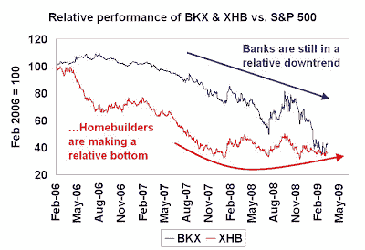

<!--yml
category: 未分类
date: 2024-05-18 00:56:51
-->

# Humble Student of the Markets: How to spot THE BOTTOM

> 来源：[https://humblestudentofthemarkets.blogspot.com/2009/03/how-to-spot-bottom.html#0001-01-01](https://humblestudentofthemarkets.blogspot.com/2009/03/how-to-spot-bottom.html#0001-01-01)

Was that the real thing? Is this the new bull?

Just as the consensus was forming that the rally from the lows last week was the start of a bear market rally (example

[here](http://macro-man.blogspot.com/2009/03/repeat-after-me.html)

), the Fed announced that it invented another tool to throw money at the financial system by buying U.S. Treasury bonds at the long end of the yield curve. The announcement sparked off a stock market rally that took the S&P 500 to an interim resistance level of 800.

**What now?**

What’s more, Merrill Lynch’s institutional survey shows

[increasing levels of bullishness among fund managers](http://www.marketwatch.com/news/story/Managers-view-economy-improves-risk/story.aspx?guid=%7BDCDAB7F9%2DE313%2D4B25%2D8D02%2D24F3D6956BAB%7D)

. If they start to put money back into the market, the funds flow could easily raise the S&P 500 by 100 points or more in fairly short order.

Is this the start of a new bull?

This has been a market of maximum frustration for many traders. While the consensus has been that we are witnessing a bear market rally, I would not be surprised that if the market powered itself upward and then fell back but does not test the bottom made last week, as expected by many technicians. Instead it bottoms at 5-10% above those levels, faking everyone out again.

**Stealth bottom?**

My base case is a “stealth bottom” as called for by Bill Luby at

[VIX and More](http://vixandmore.blogspot.com/2009/03/possibility-of-stealth-bottom.html)

and

[other analysts](http://www.marketwatch.com/news/story/Tuesday-more-a-bear-market/story.aspx?guid=%7BF072CB1B%2DD990%2D4D3A%2D8F45%2DD92AB9FCCFFA%7D)

. Instead of a dramatic high volume capitulation V-shaped bottom, we could very see a bottom marked by an attitude of “I don’t want to hear anymore about stocks”:

> [P]ast bottoms were more often than not distinguished by investor disgust, exhaustion and apathy. Having been burned for so long by the bear markets that preceded those bottoms, investors resolved never, ever, to trust the market again. By the time the market did finally bottom, therefore, there were relatively few investors who were even interested enough to take notice.

**What to watch for**

The fact is, I have no idea of whether we have seen the bottom of the market for this Bear. I tend to agree with

[Jeremy Grantham](http://www.gmo.com/websitecontent/JG_ReinvestingWhenTerrified.pdf)

that equities look attractive right now. Long-term investors should have a long-term plan, which includes being fully weighted in equities (possibly on a dollar-cost average basis) at current levels. As an investor, you will find it very hard to catch the exact bottom but the likelihood of regret in 3-5 years is low if you bought into stocks in 2009.

For traders who are willing to bear tactical risks and want to spot THE BOTTOM, here is a list of what I am watching for (in addition to Barry Ritholtz’s

[list](http://www.ritholtz.com/blog/2009/03/stock-markets-relief-rally-or-new-bull/)

):

**Sentiment:**

I would like to see sentiment measures, such as the

[AAII bull/bear ratio](http://www.sentimentrader.com/subscriber/charts/WEEKLY/SURVEY_AAII_BULLRATIO_4WK.htm)

, approach new lows while the market makes a higher low (and forming a positive divergence).

**Phoenix list composition:**

The

[latest list of Phoenix stocks](http://humblestudentofthemarkets.blogspot.com/2009/03/phoenix-strategy-update.html)

numbered 58 names. Of the stocks on that list, about 25, or 43%, were in sideways basing formations. I would like to see that percentage of Phoenix stocks in basing mode increase to at least 60% before I could be confident that a bottom is truly in place.

**Better market action from the financials:**

The chart below shows the relative performance of the KBW Banking Index (BKX) and S&P Homebuilder SPDRs against the S&P 500\. Since the market is so focused on the troubles experienced by the banks right now, I would like to see some basing action from the banks and financials, much like the formation shown by the homebuilding stocks.

