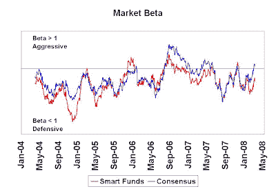
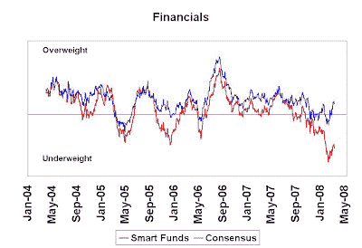

<!--yml
category: 未分类
date: 2024-05-18 01:07:53
-->

# Humble Student of the Markets: Idiot’s market neutral fund: A mid-year report card

> 来源：[https://humblestudentofthemarkets.blogspot.com/2008/07/idiots-market-neutral-fund-mid-year.html#0001-01-01](https://humblestudentofthemarkets.blogspot.com/2008/07/idiots-market-neutral-fund-mid-year.html#0001-01-01)

I first wrote about construction of the idiot’s market neutral fund

[here](http://humblestudentofthemarkets.blogspot.com/2008/02/idiots-equity-market-neutral-fund.html)

and I further addressed the controversy of why the technique may work

[here](http://humblestudentofthemarkets.blogspot.com/2008/03/idiots-equity-market-neutral-fund-more.html)

. A mid-year update of this hypothetical fund shows that estimated YTD returns to June 30 was 3.5%. This is ahead of the HFRX Equity Market Neutral Index of 2.3% for the same period. Other investable hedge fund equity market neutral indices (e.g. Dow Jones Equity Market Neutral at 1.5%) show even worse performance than HFRX.

***Smart funds* remain defensive** 

The idiot’s market neutral fund’s alpha is mainly derived from the market positions of a group of

*smart funds*

. The question in many investors' mind must be what are the

*smart funds*

doing now?

The orientation of

*smart funds*

hasn’t changed significantly since my last

[update](http://humblestudentofthemarkets.blogspot.com/2008/04/still-waiting-for-market-bottom.html)

in late April.

*Smart funds*

continue to be more defensive. The managers of these funds seem to believe that the worst may not be over for the US economy.

As the chart below shows,

*smart fund*

market beta shows that they are defensively positioned. By contrast, the consensus funds, a group of funds run by the largest mutual fund complexes have market betas roughly in line with the S&P 500:

Smart funds continue to be underweight Financials, while consensus funds are slightly overweight:

…and smart funds are roughly market weight Consumer Cyclicals, while consensus funds are overweight: