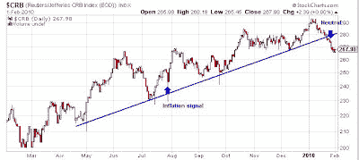
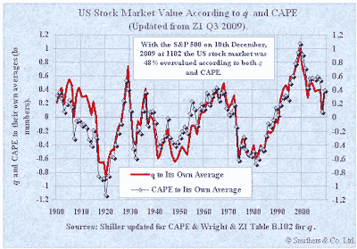

<!--yml
category: 未分类
date: 2024-05-18 00:39:03
-->

# Humble Student of the Markets: Inflation-Deflation Timer turns neutral

> 来源：[https://humblestudentofthemarkets.blogspot.com/2010/02/inflation-deflation-timer-turns-neutral.html#0001-01-01](https://humblestudentofthemarkets.blogspot.com/2010/02/inflation-deflation-timer-turns-neutral.html#0001-01-01)

The

[Inflation-Deflation Timer](http://www.qwestfunds.com/publications/newsletters_pdf/newsletter_november_2009.pdf)

model turned neutral last week after showing an “inflation” signal that has been in place since July 2009.

The above chart shows the price graph of the Reuters/Jeffries CRB Index and the timing of the most recent signal. The Inflation-Deflation Timer model turned bullish on inflation and commodities in late July and moved to a neutral stance this week, which represents a profit of about 8.5%.

There is a possibility that the model could turn positive on inflation again. The commodity and stock markets appear to be staging an oversold rally, which could create a whipsaw condition and flip the model back to inflation. Such a reversal is likely to be a fake-out. For example, consider the technical position of gold, a leading indicator of inflationary expectations. Gold is facing significant resistance

[technical resistance](http://slopeofhope.com/2010/02/interesting-gold-futures-actions.html)

that if faces if it were to rally significantly. Investors are

[overly eager to be bullish](http://www.marketwatch.com/story/contrarian-analysis-of-gold-sentiment-2010-02-02)

, which is contrarian bearish. Moreover, commodity prices as measured by the CRB have violated the uptrend line shown in the above chart.

**A more defensive position?**

An investor who strictly follows the Inflation-Deflation Timer model would move from a position of holding a basket of commodities into a 100% equity allocation. However, I would be inclined to be more cautious than to assume the risk of an all-equity portfolio.

There is substantial valuation risk embedded in the stock market. The chart below shows the

[Tobin Q ratio](http://www.smithers.co.uk/page.php?id=34)

, or the market value of a company divided by the replacement value of the firm's assets. (A low Q, between 0 and 1, implies undervalue while a high Q, over 1, implies overvalue.) Right now, it indicates that the S&P 500 is substantially overvalued.

In addition, other respected investors believe the stock market to be overvalued.

[John Hussman](http://www.hussmanfunds.com/wmc/wmc091214.htm)

believes fair value is between 672 and 810\.

[Jeremy Grantham](http://www.gmo.com/websitecontent/JGLetter_ALL_3Q09.pdf)

has a fair value estimate of 860 on the S&P 500.

**Technical violations also a negative**

As well, stock and commodity prices have violated a number of important technical trendlines. This loss of momentum also indicates that investor sentiment may be turning against the investment thesis of economic recovery.

The combination of a valuation headwind and neutral or negative price momentum makes us highly nervous about a full all-equity commitment. Under these circumstances, I would be inclined to add a greater bond component to a balanced fund portfolio.