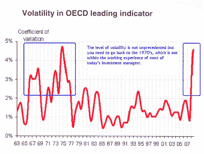

<!--yml
category: 未分类
date: 2024-05-18 00:38:23
-->

# Humble Student of the Markets: Inflation or Deflation? Cancer or heart attack?

> 来源：[https://humblestudentofthemarkets.blogspot.com/2010/02/inflation-or-deflation-cancer-or-heart.html#0001-01-01](https://humblestudentofthemarkets.blogspot.com/2010/02/inflation-or-deflation-cancer-or-heart.html#0001-01-01)

I have been pounding on the inflation vs. deflation theme for some time, largely because I believe that this is likely to be the Investment Call of the Decade. Get it right and you’ll be a hero, but get it wrong and you’ll be a goat.

Why is making such a forecast so hard?

John Mauldin recently wrote in his essay

[Between dire and disastrous](http://www.ritholtz.com/blog/2010/02/between-dire-and-disastrous/)

:

> [W]e have made a series of bad choices, often the easy choices, all over the developed world. We are now entering an era in which our choices are being limited by the nature of the markets. Not only are we in a path-dependent world, but the number of paths from which we may choose are becoming fewer with each passing year.
> 
> Our economic future is more and more a product of the political choices we make, and those are increasingly difficult. We have no good choices. We are left with choosing the best of bad options. Some countries, like Greece, are now down to choices that are either dire or disastrous. There is no "easy" button.

**Inflate, raise taxes or default**

In other words, the developed world has done some really stupid things and it’s time to pay the piper.

[Paul Kedrosky](http://paul.kedrosky.com/archives/2010/02/mauldin_between.html)

's comments on the Mauldin essay was also apocalyptic:

> We are in the fullness of time approaching the End Game. In country after country, the choices that have been made over the last decades will yield a Greek situation, where there are no good choices. And the longer the hard choices are put off, the more difficult they will become.
> 
> For some countries it could mean deflation. For others, it will look like inflation on steroids. Countries with sensible budgets and policies will thrive.

How the piper gets paid is dependent on future policy decisions, which are unknown. David Merkel of Aleph Blog says that governments have three choices,

[inflate, raise taxes or default](http://alephblog.com/2010/02/07/default-inflation-higher-taxes-choose-one/)

. The first will lead to the cancer of rising inflation, the last two to the heart attack of a deflationary collapse.

**This time is (sort of) different**

I cringe whenever someone says “this time is different.” However, the policy choices that we face indicate that we are entering an era where things are different, but not unprecedented. The chart below from Macquarie Equities Research shows that macro-economic volatility has significantly risen.

Is this a New Era? Yes.

Is this time different? Yes.

Is it unprecedented? No.

**Portfolio implications**
The OECD experienced similar levels of macro-economic volatility back in the 1960’s and 1970’s. However, most of the investment professionals today have not experienced these kinds of macro conditions in their working lives and may not be able to adequately respond to this sea change.

Investment policies such as buy-and-hold which have worked well over the last 30 years are likely to be sub-optimal. Neither is the gold bugs' solution to buy gold, as the yellow metal is likely to perform poorly under a deflationary scenario. Dynamic asset allocation strategies, such as the [Inflation-Deflation Timer model](http://www.qwestfunds.com/publications/newsletters_pdf/newsletter_november_2009.pdf) which are based on [trend following principles](http://www.qwestfunds.com/publications/newsletters_pdf/newsletter_february_2010.pdf), are likely to be better tools for navigating the treacherous seas ahead.