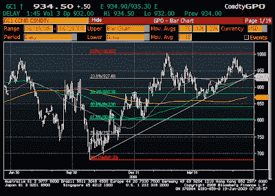
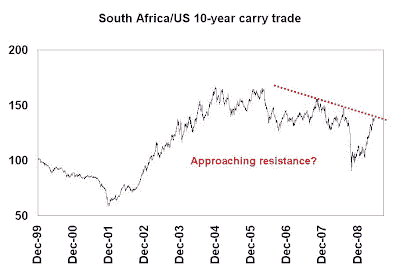

<!--yml
category: 未分类
date: 2024-05-18 00:51:30
-->

# Humble Student of the Markets: Inflation trade faces critical technical test

> 来源：[https://humblestudentofthemarkets.blogspot.com/2009/06/inflation-trade-faces-critical.html#0001-01-01](https://humblestudentofthemarkets.blogspot.com/2009/06/inflation-trade-faces-critical.html#0001-01-01)

As I write this on Friday morning, the gold price is at $934.50 and is testing the uptrend that began in October 2008\. Prices are also hovering near the 23.6% Fibonacci retracement level.

For technicians this represents an important test for gold.

**The Rand carry trade**

South African has long been viewed as a commodity producer, mainly gold. The South African Rand has been thought of by FX traders as a commodity play currency, much like the AUD or CAD.

The ten-year benchmark South African bond is yielding 8.83%, considerably above the US ten-year at 3.83%, for a spread of 500 bps. Just for kicks, I looked at the cumulative P&L of this carry trade. As the chart below shows, this trade is also approaching a technical overhead resistance zone.

Which way any of these break, I have no idea. But it’s important to monitor these charts as they indicate a critical test for inflationary expectations.