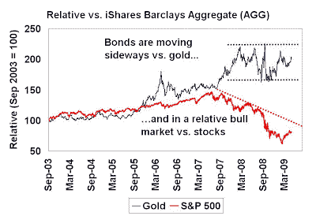

<!--yml
category: 未分类
date: 2024-05-18 00:52:46
-->

# Humble Student of the Markets: Inflationary fears appear overblown

> 来源：[https://humblestudentofthemarkets.blogspot.com/2009/05/inflationary-fears-appear-overblown.html#0001-01-01](https://humblestudentofthemarkets.blogspot.com/2009/05/inflationary-fears-appear-overblown.html#0001-01-01)

Yesterday on May 28, 2009, David Rosenberg, formerly of Merrill Lynch and now at

[Gluskin Sheff](http://www.gluskinsheff.com/)

, put out a note entitled “Buying Opportunity of the Year in Bonds?” He gives several reasons for anticipating a bond rally, here is an excerpt of his most important ones[emphasis mine]:

> The yield curve (2s/10s) has massively steepened to 275bps. This is unsustainable and is going to flatten but the question is how? Will it be by the Fed raising rates and taking away the carry? With the unemployment rate heading above 10%, hardly likely. The output gap is so big that the funds rate, in theory, should be closer to -5% than 0%. So which entity is going to be the one that starts to take advantage of this massive ‘carry trade’?
> 
> The banks, that’s who. They are the ones with the cash — over $1 trillion on the balance sheet, which is not only a record but more than triple what was considered a normal level in the past. At the same time, even with private sector borrowing on the decline, the commercial banks have not added anything — nada — to their cache of Treasury securities this year. But, it’s one thing to have the curve at 170bps as it was four months ago and the huge 275bps spread the market is offering today. ***The banks have never before had so much cash to be put to work in the most attractive carry trade in Treasuries in recorded history.***

**Inflationary expectations appear well-contained**

Given Rosie’s comment, I analyzed the returns of gold and equities against the U.S. bond market. The chart below shows the relative total returns of gold (as an inflationary expectations indicator) and the S&P 500 (as an economic growth indicator) against the iShare Barclays Aggregate Bond Fund (AGG), which is representative of the returns of the U.S. bond market. When the line is rising, bonds are underperforming and when the line is falling, bonds are outperforming.

Despite the uproar over quantitative easing, credit concerns, etc., gold has been moving sideways against bonds since the end of 2007\. During the same period, bonds have been in a relative bull and outperforming the S&P 500.

With gold in a basing pattern relative to bonds, it is suggestive that inflationary expectations are still under control. With sentiment readings overly bullish on gold (see

[here](http://www.marketwatch.com/story/contrarian-signs-for-gold-sentiment-point-down)

and

[here](http://www.sentimentrader.com/subscriber/charts/WEEKLY/SURVEY_GOLD.htm)

), which is contrarian bearish, it confirms my

[previous view](http://humblestudentofthemarkets.blogspot.com/2009/05/start-of-great-commodity-bull-market.html)

that:

> The day for a sustainable commodity bull and the commodity supercycle will come – but not yet.

Technically speaking, the behavior of AGG vs. the S&P 500 indicates that bonds are still in a relative bull against stocks and I have to give bonds the benefit of the doubt, for now. The alternative scenario is just not plausible: The U.S. consumer is coming back, we are starting a V-shaped recovery and investors should therefore get very long equities.

Rosenberg could be right - we may have another leg up in the U.S. bond market over the next few months.