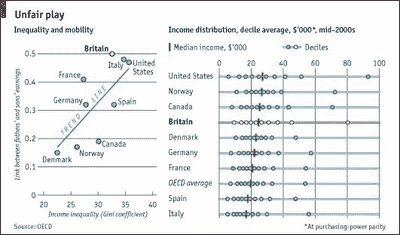
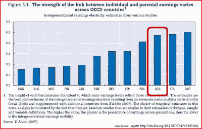
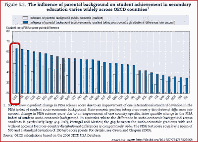
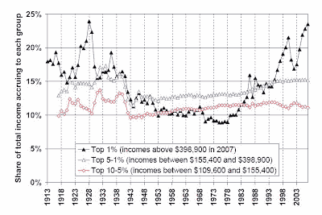
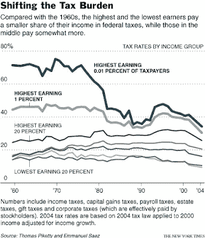

<!--yml
category: 未分类
date: 2024-05-18 00:34:19
-->

# Humble Student of the Markets: Is America becoming like China?

> 来源：[https://humblestudentofthemarkets.blogspot.com/2010/04/is-america-becoming-like-china.html#0001-01-01](https://humblestudentofthemarkets.blogspot.com/2010/04/is-america-becoming-like-china.html#0001-01-01)

I have written before that

[America is becoming like Argentina](http://www.qwestfunds.com/publications/newsletters_pdf/newsletter_september_2009.pdf)

. Disturbing characteristics such as the emergence of a social elite, combined with low class mobility combined to drive Argentina from a promising emerging market economy that was on par with countries like the United States a century ago to the long road to stagnation that we have seen today.

Unfortunately, there are signs that America is not only going down the road to Argentina, but also adopting the worse social practices seen in China.

**The destruction of the American Dream**

I had previously posted the results of an

[OECD study](http://www.economist.com/world/britain/displaystory.cfm?story_id=12480828)

that showed low social mobility in the US, as defined by the correlation of the Gini coefficient of parent and offspring, compared to more “egalitarian” countries like Denmark and Norway. High Gini coefficients combined with low social mobility indicates that elites are entrenched and the American Dream is only a dream.

Now an updated

[OECD study](http://www.oecd.org/dataoecd/17/42/44566315.pdf)

reiterates those results about income persistence across generations. In America, rich kids tend do better than poor kids compared to most other countries.

The OECD report states:

> Parents can affect their descendants’ labour market outcomes in different ways. One runs through labour productivity, which is often affected by schooling choices, parents’ private investment in education outside the educational system and individuals’ own investment in higher education. The extent to which productivity is then reflected in wages is influenced by labour market institutions, which vary across countries. Parents can also affect the success and integration in the labour market in more indirect ways, such as through the transmission of social norms, work ethics or social networks.

The main reason for the observed inequality is education. Wealthier families in America are in a better position to invest more in their children’s education compared to other income groups. The chart below shows the influence of parental background on their children’s education, before (white bar) and after (blue bar) adjustments for socioeconomic class. The system in America is showing a definite “class” effect in achievement.

The result of all this inequality has morphed into an “Olympics” in income distribution (if you aren’t a gold medalist, you are nothing.)

[Emmanuel Saez](http://elsa.berkeley.edu/~saez/saez-UStopincomes-2007.pdf)

of Berkeley documents the division of the spoils in the top 10% of the income distribution in the United States. Most of the gains in the past few decades have accrued to the top 1%.

Being in the top 10% doesn’t cut it anymore as those groups saw little or no relative gain. You need to be in the top 1% - the

***real***

elite. In addition,

[David Leonhardt](http://economix.blogs.nytimes.com/2010/04/13/taxing-the-rich-over-time/)

highlighted the fact that policymakers have lowered the tax rates for the super-rich since the 1970's.

**China’s princelings: A nagging political problem**

Ironically, "Communist" China is showing similar problems with income distribution.

[Victor Shih](http://chinesepolitics.blogspot.com/2010_02_01_archive.html)

, assistant professor of political science at Northwestern University specializing in Chinese politics, highlights the so-called problem with princelings in China:

> The Communist Party has enjoyed enormous success in turning China into a powerful nation and lifting its citizens out of poverty. But the party is also a club that allocates political, financial and social privilege to its members. It has its own internal system of hierarchy and quasi-royalty, where revolutionary leaders bequeath their status to their children and children's children. Those descendants are called "princelings" in China.

[Shih](http://chinesepolitics.blogspot.com/2010_03_01_archive.html)

believes that the princelings are now more in the driver’s seat than ever as beneficiaries of the growth in China:

> Many of the elite’s children are western educated and, over the past 15 years, dozens have been recruited by western companies and banks hoping to secure an entry into the Chinese market and win mandates to take state-owned companies public in New York or Hong Kong. As most foreign investors know, employing the relative of a senior party leader as an adviser or employee can help cut through bureaucratic obstruction and resistance from local interest groups.
> 
> But today those institutions and investors are scrambling to invest in the private equity funds of princelings who would once have been on their payroll. “In the past, the best option for these people with ‘background’ was to go to the high-paying western investment banks but now the economic strength has shifted,” says one person in the private equity industry, asking not to be named because of the sensitivity of the topic. “Now they’re saying to the foreigners, ‘Hey, I’m in the driving seat, I have all the deals – so you give me your money and I’ll invest it myself and take a big cut’.”

A China analyst once told me privately that the popular perception is that the Communist Party elite controls 80% of the economy and the rest of the population 20%. Already there is a fair amount of resentment among the populace over this state of affairs. If China continues to grow at its breakneck pace, there is plenty of new wealth to go around and tensions are likely to be contained. Should growth slow for any reason, the political backlash would be terrible.

Under the current system, China watcher

[Michael Pettis](http://mpettis.com/2010/04/who-will-pay-for-chinas-bad-loans/)

believes that it is the Chinese middle class that will pay for the bad loans should growth falter. He believes that the current asset bubble in China is a tax on the Chinese middle class, as the property bubble acts as a “tax” on savings that gets funneled to the business elite by penalizing savers in order to cheaply fund the builders of infrastructure.

[Andy Xie](http://www.ritholtz.com/blog/2010/04/put-down-trade-spats-pick-up-a-mirror/)

comes to a similar conclusion, but from a different path [emphasis mine]:

> To strengthen China’s position in the coming conflict with the United States, taming the land bubble is a must...China’s main challenges are internal. How to divide the pie created by economic development is critical to the country’s future. Many argue growth will solve all problems. I’m not sure about that.
> 
> Asset bubbles in China are mainly for taxing the middle class, and they stunt growth. ***No modern economy can be stable without a big, healthy middle class.*** As long as China’s middle class is vibrant and growing, external challenges cannot derail economic development. So the answer to China’s problems lies within. International confrontation offers no solutions.

Xie reiterated this theme of the risks of unbalanced growth in another

[article](http://www.cibmagazine.com.cn/Columnists/Andy_Xie.asp?id=1283&no_room_to_relax.html)

:

> The stability of a modern society depends on its middle class being in the majority and content with its situation. The high land-price policy is a form of tax on the middle class, which will slow its growth. China may become a country with a small group of the super-rich, a vast lower class with no property, and a small middle class. Such a social structure would not be good for long-term stability.

In other words, trouble could brew in China if the authorities don’t keep the growth machine going.

[Political stability rests with the middle class](http://humblestudentofthemarkets.blogspot.com/2009/10/political-stability-and-middle-class.html)

, just as it does in America.

When we look across the Pacific, we can see the landmines beneath the surface. Can the America psyche its social consensus and social contract in time to avoid the China/Argentina trap? Or does all this spell the decline of the American Empire?