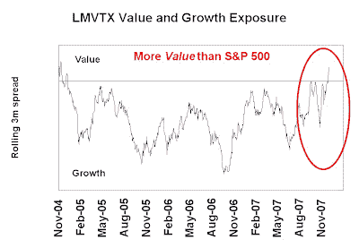

<!--yml
category: 未分类
date: 2024-05-18 01:16:09
-->

# Humble Student of the Markets: Is Bill Miller becoming a (gasp) Value manager?

> 来源：[https://humblestudentofthemarkets.blogspot.com/2007/12/is-bill-miller-becoming-gasp-value.html#0001-01-01](https://humblestudentofthemarkets.blogspot.com/2007/12/is-bill-miller-becoming-gasp-value.html#0001-01-01)

Bill Miller’s Legg Mason Value Trust (LMVTX) has had a great long-term track record that would be the envy of most managers. Unfortunately the fund lagged the S&P 500 in 2006 and it looks like it will lag again in 2007, barring a last minute recovery.

Using the techniques shown in the sidebar titled *Reverse engineering a manager's macro exposures*, I estimated his style (Value/Growth) exposures. Despite the “value” label in LMVTX, Miller has long been thought of as tilting towards the Growth style (remember his big holdings in AOL in the fund?) However the fund has tilted more towards the Value style and has tended to outperform when Value outperforms Growth and underperformed when Growth outperforms Value.

Using the same form of analysis, his other macro exposures are:

- Long market beta
- Short oil and USD
- Long emerging markets vs. the US market

In future posts I will use the same technique to examine what other investors (hedge funds, mutual funds, etc.) are doing in the market.