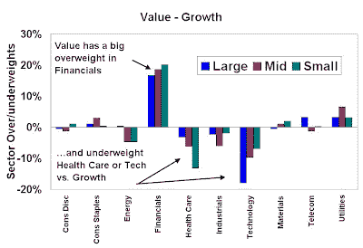

<!--yml
category: 未分类
date: 2024-05-18 01:07:03
-->

# Humble Student of the Markets: Is Value just a big bet on Financials?

> 来源：[https://humblestudentofthemarkets.blogspot.com/2008/08/is-value-just-big-bet-on-financisl.html#0001-01-01](https://humblestudentofthemarkets.blogspot.com/2008/08/is-value-just-big-bet-on-financisl.html#0001-01-01)

Recently, the relative performance of Value vs. Growth seems to be driven mainly by the relative performance of Financials.

The chart below shows the relative weights of the Value and Growth indices in the large cap (Russell 1000 Value and Growth), mid cap (Russell Mid-cap Value and Growth) and small cap (Russell 2000 Value and Growth) indices. As you can see, the Value indices have consistent large overweight in Financials across all market cap bands when compared to the Growth indices. By contrast, the Growth indices are overweight Health Care or Technology, depending on when it’s a large cap (Technology) or small cap (Health Care) index.

Given the recent problems that the Financials have had, it’s not surprising that Value has become tilted towards the sector. In this environment, relative returns are becoming dominated by one big bet on Financials.

Investors in Value funds may want to check their fund if that’s the big bet they want to make.