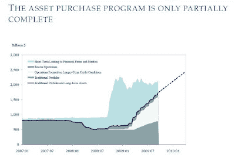
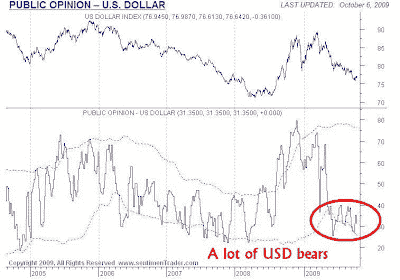

<!--yml
category: 未分类
date: 2024-05-18 00:44:54
-->

# Humble Student of the Markets: Is the Fed changing its tune?

> 来源：[https://humblestudentofthemarkets.blogspot.com/2009/10/is-fed-changing-its-tune.html#0001-01-01](https://humblestudentofthemarkets.blogspot.com/2009/10/is-fed-changing-its-tune.html#0001-01-01)

The headline read

[Bullard warns on inflation, unemployment](http://www.marketwatch.com/story/feds-bullard-warns-on-inflation-unemployment-2009-10-11)

. On the weekend St. Louis Fed governor James Bullard warned on the risks of inflation. The

[press release](http://www.stlouisfed.org/newsroom/displayNews.cfm?article=523)

reads that:

> Bullard also expressed concern that inflation risks in the medium term may be higher than widely believed. He said that too much emphasis is being given to the idea that the recession implies that the output gap is currently quite large, minimizing the risk of inflation.

What's going on? Isn’t this the same man that

[declared back in August](http://humblestudentofthemarkets.blogspot.com/2009/09/recession-over-what-now-ben.html)

that interest rates would stay low for a very, very long time and the “markets haven’t digested what that means?”

**Inflationary expectations are rising**

The answer can be found in a recent

[speech](http://www.federalreserve.gov/newsevents/speech/kohn20091009a.htm)

by Fed vice chair Don Kohn [emphasis mine]:

> To be sure, we have not followed the theoretical prescription of promising to keep rates low enough for long enough to create a period of above-normal inflation. The arguments in favor of such a policy hinge on a clear understanding on the part of the public that the central bank will tolerate increased inflation only temporarily--say, for a few years once the economy has recovered--before returning to the original inflation target in the long term. In standard theoretical model environments, long-run inflation expectations are perfectly anchored. In reality, however, the anchoring of inflation expectations has been a hard-won achievement of monetary policy over the past few decades, and we should not take this stability for granted. Models are by their nature only a stylized representation of reality, and ***a policy of achieving "temporarily" higher inflation over the medium term would run the risk of altering inflation expectations beyond the horizon that is desirable. Were that to happen, the costs of bringing expectations back to their current anchored state might be quite high.***

The Fed is worried about the “anchoring” of inflationary expectations, or inflationary expectations rising out of control. They have embarked on a policy of jawboning inflationary expectations down even as Bullard, in the same breath that he used to warn against rising inflationary expectations, admits that

[quantitative easing isn’t done](http://www.stlouisfed.org/newsroom/pdf/JamesBullardNABEStLouisOct11Final.pdf)

yet. Just look at the projections shown in the chart he shows in his presentation:

Kohn reiterated this dichotomy of accommodation against the Fed's fear of rising inflationary expectations in a [speech](http://www.federalreserve.gov/newsevents/speech/kohn20091013a.htm) yesterday at the National Association for Business Economics [emphasis mine]:

> ***But it's not the current level of inflation or of output that figure into our policy decisions directly--rather, it is the expected level some quarters out, after the lags in the effects of policy actions have worked themselves out*.** In that regard, the projection of only a gradual strengthening of demand and subdued inflation imply that that these gaps--of inflation and output below our objectives--are likely to persist for quite some time. In these circumstances, at its last meeting, ***the FOMC was of the view that economic conditions were likely to warrant unusually low levels of interest rates for an extended period.***

**Investors should prepare for reversals**

What does this mean for investors?

[Investor sentiment on US Dollar](http://www.sentimentrader.com/subscriber/charts/WEEKLY/SURVEY_DOLLAR.htm)

is universally bearish, as shown by the chart below. Stories like

[this](http://www.bloomberg.com/apps/news?pid=20601087&sid=aOTmsmEQpY6A)

about central banks diversifying away from Dollar reserves only adds to the hysteria (note that they aren’t selling Dollars, just buying fewer Dollar assets).

In the weeks ahead, I would expect the Fed to continue its program of jawboning inflationary expectations down. At some point, the slightly more hawkish tilt is going to show its effects.

If rates rise, the Dollar would rally. Dollar weakness would turn into Dollar strength, starting a countertrend rally. Commodity prices would then weaken under such a scenario. Stock prices, which had been buoyed mainly by the reflation trade, would correct. In his latest weekly comment,

[John Hussman](http://www.hussmanfunds.com/wmc/wmc091011.htm)

characterizes the current state of US equities as expensive and overbought [emphasis mine]:

> The Market Climate for stocks remained characterized by ***unfavorable valuations***, general strength on the basis of major indices, a few emerging divergences (one notable technical one being the non-confirmation between the Dow Industrials and Transports), and ***a fresh overbought condition*** resulting from the recent advance.

The combination of an expensive and overbought market with an unfriendly Fed could be setting us up for a bearish reversal. Downside risks could rise even further if [investor sentiment gets more bullish](http://humblestudentofthemarkets.blogspot.com/2009/10/where-are-bulls.html) or by unexpected changes in fiscal policy such as the enactment of a [tax on financial transctions](http://online.wsj.com/article/SB125512957855977163.html).