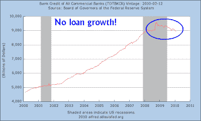
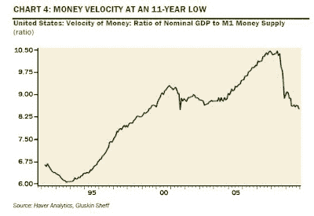

<!--yml
category: 未分类
date: 2024-05-18 00:37:43
-->

# Humble Student of the Markets: Is the Fed looking at the right indicators?

> 来源：[https://humblestudentofthemarkets.blogspot.com/2010/02/is-fed-looking-at-right-indicators.html#0001-01-01](https://humblestudentofthemarkets.blogspot.com/2010/02/is-fed-looking-at-right-indicators.html#0001-01-01)

On Thursday February 18, 2010 the Federal Reserve raised the discount rate. The

[press release](http://www.federalreserve.gov/newsevents/press/monetary/20100218a.htm)

began soothingly:

> The modifications are not expected to lead to tighter financial conditions for households and businesses and do not signal any change in the outlook for the economy or for monetary policy, which remains about as it was at the January meeting of the Federal Open Market Committee (FOMC). At that meeting, the Committee left its target range for the federal funds rate at 0 to 1/4 percent and said it anticipates that economic conditions are likely to warrant exceptionally low levels of the federal funds rate for an extended period.

They added that [my emphasis]:

> In addition, the Board announced that, effective on March 18, ***the typical maximum maturity for primary credit loans will be shortened to overnight***. Primary credit is provided by Reserve Banks on a fully secured basis to depository institutions that are in generally sound condition as a backup source of funds.

Excuse me, isn’t that a tightening of credit? How are these changes not “the not expected to lead to tighter financial conditions”?

**Why did they do it?**

The announcement was a bit of a surprise. The question is, why did they do it?

Were they looking at the

[yield curve](http://www.bloomberg.com/markets/rates/index.html)

, which is steeply upward sloping? This would be an indication that conditions were returning to “normal”.

**A double-dip in the cards?**

From my perspective, the economy is still very weak. A move towards even normalizing monetary conditions puts the US economy at serious risk of a double dip. The latest statistics show that the banks aren’t lending:

In addition,

[David Rosenberg](https://ems.gluskinsheff.net/Articles/Breakfast_with_Dave_022210.pdf)

of Gluskin Sheff commented yesterday that the money multiplier was still falling:

And monetary velocity was very weak:

**Fragile financials**

The financial system remains fragile. John Hussman wrote in his

[December 14, 2009 commentary](http://www.hussmanfunds.com/wmc/wmc091214.htm)

that financials have to tell-all starting in January 2010 [my emphasis]:

> Meanwhile, in January, new accounting rules will kick in which will force banks to move off-balance-sheet “structured investment vehicles,” “trust preferred assets” and other beasts onto their balance sheet, ***which is expected to result in some sharp hits to bank capital***. In response, regulators such as the FDIC will most probably be called upon to look the other way for a while.
> 
> Floyd Norris of the New York Times refers to these off-balance-sheet assets as “a black hole that regulatory rules had ignored in assessing how much capital the banks needed to hold. The beauty of those securities was that they were really debt that the holding companies could call capital. Having that “capital” meant the bank could take on more debt. A system that lets a bank borrow more money because it has already borrowed money – rather than because it has sold stock – is hardly a wise one.”

In the meantime, Mish is warning about the [Commercial real estate apocalypse in 2011-2012](http://globaleconomicanalysis.blogspot.com/2010/02/commercial-real-estate-apocalypse-in.html).

**No recovery in trade**
Back in the real economy, indicators of trade remain weak. The [Baltic Dry Index](http://investmenttools.com/futures/bdi_baltic_dry_index.htm), which is reflective of shipping rates, isn’t exactly going like gangbusters.

There seems to be no [rebound in rail traffic](http://markettalk.newswires-americas.com/?p=8943) either. With commodity prices seemingly rolling over (my [Inflation-Deflation Timer model turned neutral in late January](http://humblestudentofthemarkets.blogspot.com/2010/02/inflation-deflation-timer-turns-neutral.html)), all indications are from the markets and the economy are pointing to at least a pause.

If the Fed mistakenly tightens monetary conditions, the chances of a double tip will undoubtedly increase.