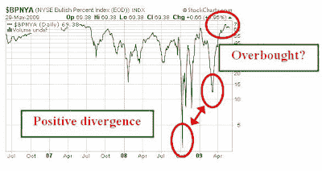
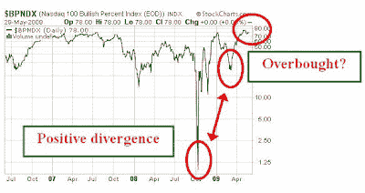

<!--yml
category: 未分类
date: 2024-05-18 00:52:37
-->

# Humble Student of the Markets: June Phoenix update

> 来源：[https://humblestudentofthemarkets.blogspot.com/2009/06/june-phoenix-update.html#0001-01-01](https://humblestudentofthemarkets.blogspot.com/2009/06/june-phoenix-update.html#0001-01-01)

By request, here is the latest update on the

[Phoenix](http://humblestudentofthemarkets.blogspot.com/2008/05/waiting-for-ride-on-phoenix.html)

list:

> ACCO Brands Corp (ABD), American Axle & Manufacturing Holdings I (AXL), ArvinMeritor Inc (ARM), Belo Corp (BLC), Clear Channel Outdoor Holdings Inc (CCO), Crosstex Energy Inc (XTXI), Dana Holding Corp (DAN), Delta Petroleum Corp (DPTR), Developers Diversified Realty Corp (DDR), Eastman Kodak Co (EK), Emcore Corp (EMKR), EW Scripps Co (SSP), FCStone Group Inc (FCSX), Ferro Corp (FOE), First Industrial Realty Trust Inc (FR), Gannett Co Inc (GCI), Great Atlantic & Pacific Tea Co (GAP), Hercules Offshore Inc (HERO), ION Geophysical Corp (IO), iStar Financial Inc (SFI), Phoenix Cos Inc/The (PNX), Sunrise Senior Living Inc (SRZ), Technitrol Inc (TNL), Warren Resources Inc (WRES), YRC Worldwide Inc (YRCW) and Zale Corp (ZLC).

There are 26 stocks on the list, compared to 39 stocks in the April update. As a reminder, the Phoenix stock list consists of stocks that pass the following criteria:

*   Stock price between $1 and $5 (low-priced stocks)
*   Down at least 80% from a year ago (beaten up)
*   Market cap of $100 million or more (were once "real" companies)
*   Net insider buying in the last six months (some downside protection from insider activity)

**Few green shoots: Wait for the re-test** [Mark Hulbert](http://www.marketwatch.com/story/a-retest-march-9-lows)

has said before that the market will likely re-test the March lows and I would tend to agree with that view.

In the short term, the bulls seem to have the momentum but the “green shoots” thesis is getting a little tired. There doesn’t seem to be much of a recovery from many of the people on the ground. The CEO of McDonald’s

[indicated](http://www.marketwatch.com/story/what-bottom-mcdonalds-ceo-doesnt-see-one)

that the company doesn’t see any “green shoots”. In addition, David Sokol, who

[Jeff Matthews](http://www.marketwatch.com/story/what-bottom-mcdonalds-ceo-doesnt-see-one)

characterized as Warren Buffett’s likely successor and who is currently CEO of MidAmerican Holdings Company reported that he was not seeing any green shoots either.

**What to watch for**

One of the indicators that I am watching is $BPNYA on stockcharts.com, which is the percentage of NYSE listed stocks that are on a point and figure buy signal. As the chart below shows, this indicator had a higher low in March – a bullish divergence. I would look for a similar positive divergence on the next re-test of the lows as an indication of a lower risk entry point.

$BPNDX, which is the percentage of NASDAQ stocks showing a P&F buy signal, also shows a similar pattern:

Both these indicators are looking distinctly overbought right now. I would wait for the pullback and re-test before entering the Phoenix trade.

Be patient.