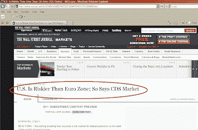

<!--yml
category: 未分类
date: 2024-05-18 00:36:07
-->

# Humble Student of the Markets: Just when you thought it was safe to go back in the water...

> 来源：[https://humblestudentofthemarkets.blogspot.com/2010/03/just-when-you-thought-it-was-safe-to-go.html#0001-01-01](https://humblestudentofthemarkets.blogspot.com/2010/03/just-when-you-thought-it-was-safe-to-go.html#0001-01-01)

With the

[Dubai news](http://money.cnn.com/2010/03/25/news/international/Dubai_World/)

and the Greek/Eurozone crisis seemingly winding down, investors might have thought that it was time to take on risk again. Then this story from the

[WSJ](http://online.wsj.com/article/SB10001424052748703312504575142112712294450.html)

came across my desk:

Just when you thought it was safe to go back into the water...