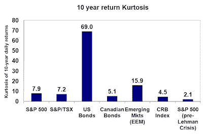
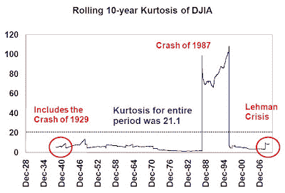

<!--yml
category: 未分类
date: 2024-05-18 00:35:42
-->

# Humble Student of the Markets: Life in Extremistan, or Minskyville

> 来源：[https://humblestudentofthemarkets.blogspot.com/2010/03/life-in-extremistan-or-minskyville.html#0001-01-01](https://humblestudentofthemarkets.blogspot.com/2010/03/life-in-extremistan-or-minskyville.html#0001-01-01)

I got some interesting feedback about my recent post

[when is diversification important](http://humblestudentofthemarkets.blogspot.com/2010/03/when-is-diversification-important.html)

. To paraphrase, some of the reasoned responses said that my approach of focusing on the event extremes is highly dependent on the likelihood of extreme events, or the fatness of return distributions. Already, there are warnings from the likes of

[BCA Research](http://www.bcaresearch.com/public/story.asp?pre=PRE-20100226.GIF)

and

[Greg Mankiw](http://www.nytimes.com/2010/03/28/business/economy/28view.html)

, who was the head of George W. Bush's Council of Economic Advisors, to prepare for the next financial crisis:

> A few years ago, some people thought that major financial crises were a thing of the past. We know that was wrong. Despite our best efforts, more financial crises are likely to occur. As we recover from the last one, we should prepare for the next.

**How likely are extreme events?**

Most people in finance recognize that while capital market returns are distributed in a bell-shaped Gaussian curve, the distribution isn’t the standard normal distribution that we all learned in school. The distinguishing feature is that the tails are fatter, i.e. there is a higher probability of extreme events than assumed by the normal distribution model.

That’s why we seem to seem to see the proverbial “100 year flood” every few years, such as the Lehman Crisis, 9/11, Argentina Crisis, Russia Crisis, etc.

How fat are the tails of the return distributions? One way of determining the amount of fatness is kurtosis measure.

[Wikipedia](http://en.wikipedia.org/wiki/Kurtosis)

explains that “a high kurtosis distribution has a sharper peak and longer, fatter tails, while a low kurtosis distribution has a more rounded peak and shorter thinner tails.” In other words, a kurtosis measure of zero indicates that returns are normally distributed, a negative kurtosis has thin tails while a positive kurtosis has fat tails.

Hedge funds pay a lot of attention to kurtosis, largely because of the leverage in their trading books. When I worked at a hedge fund, the risk manager explained to me that a kurtosis measure of 2-3 is somewhat acceptable, but if the kurtosis of a strategy were to balloon beyond 4 or so, they would get nervous because the possibility of extreme loss would be unacceptably high.

**Capital market returns are incredibly fat-tailed**

The chart below shows the kurtosis of the various asset classes over the last 10 years. The US bond market was proxied by the total returns of the iShares Barclays Aggregate Bond Fund (AGG) and the Canadian bond market was proxied by the total returns of iShares CDN Bond Index Fund (XBB).

Kurtosis was incredibly high across all asset classes. US bonds, as measured by AGG, showed an astonishing level of kurtosis at 69.0\. Canadian bonds, which were less affected by the Lehman Crisis, were still relatively high at 5.1\. As a point of reference, I looked at the 10-year trailing kurtosis of the S&P 500 before the Lehman Crisis and it came in at 2.1.

Recall my previous comment that my hedge fund risk manager said that a kurtosis of 2-3 was ok, but beyond 4 they would get nervous.

So is the risk of extreme events so high that we should all be nervous?

**A series of Minsky moments?**
For some historical context, the chart below shows the rolling 10 year kurtosis of daily returns for the Dow Jones Industrials Average back to 1928 (so this analysis includes the Crash of 1929). It appears that these fat tailed episodes, or high kurtosis, aren’t unusual at all. In fact, the Lehman Crisis was just a blip compared to the Crash of 1987\. Periods of stability are followed by periods of instability, or [Minsky moments](http://en.wikipedia.org/wiki/Minsky_moment). ([John Maudlin](http://www.ritholtz.com/blog/2010/03/what-does-greece-mean-to-you/) also has a good essay on Minsky and the threats from "fingers of instability".)

**Back to the 1970s?**
The chart below shows that that the level of macro-economic volatility is rising. I shudder whenever someone says “this time it’s different.” Well, this time isn’t different, you just have to look back far enough in history. We experienced similar levels of macro-economic volatility back in the 60’s and 70’s. Unfortunately, most investment professionals weren’t in the business back then and may not be mentally equipped to deal with the new environment.

**Living in Extremistan**
Nicholas Nassim Taleb, the author of *The Black Swan*, coined the term [Extremistan](http://humblestudentofthemarkets.blogspot.com/2009/11/get-ready-for-extremistan.html), a state where one's wealth can change massively in a very short time. Under those kinds of circumstances, investors should have the necessary [tools](http://www.qwestfunds.com/publications/newsletters_pdf/newsletter_november_2009.pdf) to deal with this new environment.