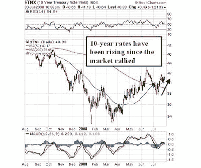

<!--yml
category: 未分类
date: 2024-05-18 01:07:13
-->

# Humble Student of the Markets: Many headwinds for this market rally

> 来源：[https://humblestudentofthemarkets.blogspot.com/2008/07/many-headwinds-for-this-market-rally.html#0001-01-01](https://humblestudentofthemarkets.blogspot.com/2008/07/many-headwinds-for-this-market-rally.html#0001-01-01)

You can tell a lot about a market by the way it reacts to news. Merrill Lynch’s

[announcement](http://www.reuters.com/article/ousiv/idUSN2930358920080729)

of more writedowns and capital raising, ten days after its quarterly earnings report, should have been a shocker to the market. The stock opened down but closed up strongly on the day.

***This suggests to me that this oversold rally in the Financials has more to go in the very short term**.*

Yet I am under no illusions that this is a bear market rally. A bear market serves to shake out the excesses of the last boom. In the medium term, I continue to be concerned that the shakeout and adjustment process is nowhere near complete.

**Interest rates are rising**

The chart below shows the yield on 10-year Treasuries, which has risen since the market began to rally. Mortgage rates have been rising in along with the 10-year yield (see comments

[here](http://bespokeinvest.typepad.com/bespoke/2008/07/this-cant-be-he.html)

and

[here](http://calculatedrisk.blogspot.com/2008/07/wsj-mortgage-rates-increase-sharply.html)

) and such a development can’t be good for the

[beleaguered housing market](http://online.wsj.com/article/SB121733609900093091.html)

.

**An old-fashioned credit crunch** 

In typical recessions, lenders pull in their horns and tighten up their lending standards. When done to excess these actions result in a credit crunch, which the

[IMF is now warning about](http://www.marketwatch.com/news/story/fed-tweaks-emergency-lending-operations/story.aspx?guid=%7B71C2F44A%2D23EF%2D49AF%2D8D7E%2D26DF366B51F7%7D)

and is also being reported

[elsewhere](http://www.nytimes.com/2008/07/28/business/economy/28credit.html?sq=Worried%20Banks%20Sharply%20Reduce%20Business%20Loans&st=cse&scp=1&pagewanted=all)

in the press. The Fed has already in place a new

[alphabet soup](http://www.marketwatch.com/news/story/fed-tweaks-emergency-lending-operations/story.aspx?guid=%7B71C2F44A%2D23EF%2D49AF%2D8D7E%2D26DF366B51F7%7D)

acronyms of emergency lending facilities, how much more can it do?

More importantly, what will a credit crunch do to the real economy?

**Longer term imbalances remain**

Brad Setser also

[pointed](http://blogs.cfr.org/setser/2008/07/24/too-big-to-fail-or-too-large-to-save-thinking-about-the-us-one-year-into-the-subprime-crisis/)

out that many of the long-term imbalances, which a recession should correct, are unresolved. US savings rates have stopped falling but remain

[low](http://www.bea.gov/briefrm/saving.htm)

.

In mortgage lending, he writes that the US government is becoming the lender of last resort:

> Mortgage lending hasn’t even collapsed. Demand for “private” mortgage-backed securities has disappeared. But the [Agencies stepped in](http://time-blog.com/curious_capitalist/2008/07/fannie_freddie_ginnie_now_acco.html) and bought mortgages both for their own book and for the mortgage-backed securities that they guaranteed.

**Enjoy the ride but trade with tight stops** In the short term, the fact that the market rose on bad news from Merrill Lynch is bullish. However, many of the problems remain unresolved and we will likely see further adjustments that will affect the real economy. In the medium term, this can’t be a bullish sign for US equities.