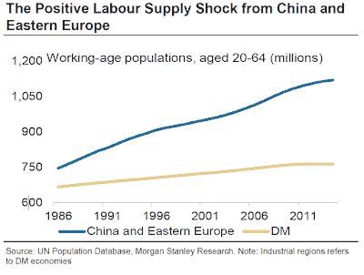

<!--yml
category: 未分类
date: 2024-05-18 03:15:12
-->

# Humble Student of the Markets: Margin pressures = Subdued L-T equity returns

> 来源：[https://humblestudentofthemarkets.blogspot.com/2015/10/margin-pressures-subdued-l-t-equity.html#0001-01-01](https://humblestudentofthemarkets.blogspot.com/2015/10/margin-pressures-subdued-l-t-equity.html#0001-01-01)

In a recent post (see

[Why this is not the start of a bear market](http://humblestudentofthemarkets.blogspot.com/2015/09/why-this-is-not-start-of-bear-market.html)

), I raised the question of how a maturing economic cycle might pressure margins. My thesis was mainly based on analysis from

[Jim Paulsen](http://wellscap.com/docs/emp/20150818.pdf)

of Wells Capital Management who believed that operating margins face a lose-lose situation in 2016 (emphasis added):

> Earnings performance is well past its best for this recovery and investors need to consider whether earnings growth will prove sufficient to support current stock market valuations. The rapidly aging earnings cycle is perhaps best illustrated by an economy nearing full employment with corporate profit margins near record highs. ***Should global growth remain tepid and overall sales results modest, since profit margins are unlikely to rise much, earnings trends will also likely prove disappointing. Conversely, should global growth and corporate sales results accelerate, because the U.S. is nearing full employment, companies may soon face cost-push pressures and margin erosion which will likely off set improved sales results.***
> 
> Essentially, it is difficult to see how earnings growth will be adequate during the rest of this mature recovery to support current price/earnings multiples. Is a relatively modest earnings growth against a backdrop of rising inflation and higher interest rates sufficient to support

The 

[Atlanta Fed](https://www.frbatlanta.org/chcs/labormarket.aspx)

`s Labor Market Spider Chart shows the continued robustness of the US labor market as metrics have improved in the last six and twelve months, despite the disappointing Employment Report last Friday.

Indeed, the

[Atlanta Fed Wage Growth Tracker](https://www.frbatlanta.org/chcs/wage-growth-tracker.aspx)

shows that wage pressures have been rising at a healthy clip, with prime age wage growth, which adjusts for the the demographic effects of aging Baby Boomers, up at 3.4% in August.

With the labor market still tight, you have to wonder to what extent rising wages are going to squeeze operating margins.

**More long-term headwinds**

So far, the case for margin compression has been an investment story for 2016\. A

[Bloomberg](http://www.bloomberg.com/news/articles/2015-09-28/the-three-major-trends-that-shaped-the-global-economy-for-decades-are-about-to-change)

article recently came across my desk indicating longer term global pressures on corporate margins.

That's because the demographic tailwind from a rising global labor supply is turning into a headwind:

> Goodhart argues that since roughly 1970, the world has been in a demographic sweet spot characterized by a falling dependency ratio, or in plainer terms, a high share of working age people relative to the total population. At the same time, globalization provided multinational companies the ability to tap into this new pool of labor. This positive supply shock was a negative for established workers, forcing down the price of labor as capital flowed to these areas.
> 
> "Naturally, and quite properly, the West supplied much of the management; the East supplied the labor," wrote Goodhart.
> 
> Outsourcing labor to less costly locales kept wages at home from rising too fast. This, in turn, entailed that inflationary pressures were benign, as best depicted by the concept of the Great Moderation, or the idea that central bankers were better able to stabilize the business cycle.
> 
> As companies were encouraged to boost capacity with workers rather than capital equipment, this put downward pressure on the cost of the latter.
> 
> "Access to a new reserve army of cheap global labor through globalization has encouraged companies to invest in this workforce rather than in capital at home. A garment company, for example, could choose to build a highly automated, capital-intensive factory in the U.S. or build a low-tech, high-labor factory in the Far East," said Toby Nangle, who published a column on the connection between labor power and interest rates in May. "For years, companies have been choosing the latter option, which reduces the requirement for capital in the West, thereby reducing the price of that capital."

The positive operating margin effects of globalization are coming to an end as global population is aging.

Such a demographic development translates into wage and inflationary pressures (emphasis added):

> Unlike many other economists, Goodhart does not believe the demographic backdrop of an aging population is inherently deflationary. ***The pool of labor around the globe that kept wages suppressed domestically on the island nation has nearly run dry; Japan, in other words, was a victim of circumstance. More generally, in order to meet the obligations of the state, the shrinking pool of workers will be forced to pay higher taxes at the same time that they'll be in a position to haggle for better wages.***
> 
> "This is a recipe for a recrudescence of inflationary pressures," wrote Goodhart. "The present concerns about deflation are fleeting and temporary; enjoy it while it lasts."

Please note that the points raised in the article refer to long term forces affecting corporate profitability that stretch out decades into the future.

**The McKinsey view**

A

[Harvard Business Review](https://hbr.org/2015/10/the-future-and-how-to-survive-it)

article, which was adapted from work from the McKinsey Global Institute, told a similar story of a negative reversal in the effects on corporate operating margins from globalization:

> [T]he favorable cost drivers that Western multinationals were able to exploit have largely run their course. Interest rates are now so low in many countries that borrowing costs simply can't fall much further and might even be starting to rise. The big tax-rate decline of the past three decades also seems to have ended. Indeed, tax inversion schemes, offshoring, and the use of transfer pricing are drawing political flak in several deficit-ridden countries.
> 
> As for labor costs, wages in China and other emerging markets are rising.
> 
> Rather than continuing to reap gains from labor arbitrage, companies will fight to hire skilled people for management and technical positions. New jobs require disproportionately greater skills, especially in science, engineering, and math. In China, once the main source of new workers, the demographic pressures of an aging population and falling birth rates could further increase the country's labor costs. And most other emerging markets do not yet have the high-quality rural education systems required to build a disciplined workforce.

If the world is becoming global, then global wage pressures are likely to rise:

> The result is an intensifying global war for talent. In a recent McKinsey survey of 1,500 global executives, fewer than one-third said that their companies' leaders have significant experience working abroad-but two-thirds said that kind of experience will be vital for top managers in five years.

Companies are seeing other challenges. The business models of many companies have changed. New entrants are not necessarily focused on profitability, but market share:

> The growth of these players has been supported by their ownership models.
> 
> Major U.S. and European companies' broad public ownership, board structure, and stock exchange listings typically enforce a sharp focus on near-term profitability and cost control. But many emerging-market firms are state- or family-owned and so have different operating philosophies and tactics. Many of the new competitors take a longer-term view, focusing on top-line growth and investment rather than quarterly earnings. Growth can be more important than maximizing returns on invested capital: Chinese firms, for example, have grown at a blistering pace-four to five times as fast as Western firms over the past decade, particularly in capital-intensive industries such as steel and chemicals.

It`s not just the emerging market players, many of which are state-owned, that go into a market and drive down prices by focusing on market share, but western companies in the technology space, such as Amazon.com and numerous tech start-ups intent on grabbing as much virtual real estate as they can:

> Tech firms share some intriguing similarities with the new emerging-market giants. Both can be brutal competitors, and both often have tightly controlled ownership structures that give them the flexibility to play the long game. Many tech firms are privately held by founders or venture capital investors who prioritize market share and scale rather than profit. Amazon, Twitter, Spotify, Pinterest, and Yelp are on the growing list of companies that focus on increasing revenue or their user networks even while losing money over extended periods. That mindset-and the control of founders-sometimes persists even after the companies go public. Among NASDAQ-listed software and internet companies, founder-controlled firms have 60% faster revenue growth and 35% to 40% lower profit margins and returns on invested capital than do publicly held firms.

The study concluded that, much like the internet boom of the late 1990s, the benefits may accrue to the end user rather than the corporate provider of the new services:

> But whereas the outlook for revenue growth is good, the profits picture looks less promising. Consumers could be the big winners, as could some workers-especially those in emerging markets and those with digital and engineering skills, which are in short supply. As we've seen, many companies' profit margins are being squeezed. Hospitality, transport, and health care have all experienced price declines in recent years because of the emergence of new platforms and tech-driven competitors. Similar effects could soon play out on a larger scale and expand to sectors such as insurance and utilities. Nobody is immune, but companies particularly at risk include those that rely on large physical investments to provide services or that act as intermediaries in a services value chain. Large emerging-market firms in less traded capital-intensive industries such as extraction, telecom, and transportation have been relatively protected so far, but that is changing, in part because of greater deregulation. Profits are not only shrinking but also becoming more uncertain. Since 2000 the return on invested capital has been about 60% more volatile than it was from 1965 to 1980.

These factors all combine to squeeze operating margins.

For investors looking out for 10 years or more, such a scenario translates into rising inflationary pressures (bonds will be poor performers) and lower corporate margins (diminished equity returns).

**Don't abandon stocks!**

While the apparent long-term outlook appears dire for both equity and fixed income, all is not lost. What demographics takes away, it can give back as well. In a past post, I had highlighted rising demographically driven for equity investments (see

[A new golden age of demographic growth](http://humblestudentofthemarkets.blogspot.com/2014/08/a-new-golden-age-of-demographic-growth.html)

).

A

[San Francisco Fed study](http://www.frbsf.org/economic-research/publications/economic-letter/2011/august/boomer-retirement-us-equity-markets/)

showed that P/E ratios are influenced by age demographics. It projects a bottom in P/E ratios around the end of this decade and a rise afterwards.

History doesn't repeat, but it does rhyme. When I put it all together, the combination of rising margin pressures and demographic changes suggest that returns for equity investors will reasonable and not disastrous in the 2020s. On the other hand, don't expect a repeat the secular bull that we experienced in the 1980s and 1990s.

If you found this post to be valuable, please help me make a decision on the future of

***Humble Student of the Markets***

by completing a simple two question survey (if you haven't done so already). More details

[here](http://humblestudentofthemarkets.blogspot.com/2015/09/humble-student-turns-8-in-nov-time-to.html)

. I will be announcing a decision on the fate of this blog late this week.