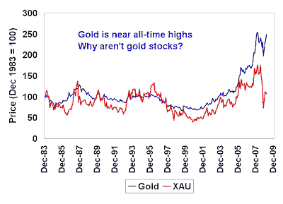
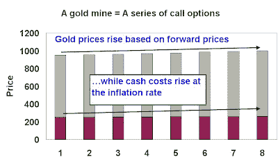

<!--yml
category: 未分类
date: 2024-05-18 00:57:01
-->

# Humble Student of the Markets: Market valuing gold stocks on cash flow, not assets

> 来源：[https://humblestudentofthemarkets.blogspot.com/2009/03/market-valuing-gold-stocks-on-cash-flow.html#0001-01-01](https://humblestudentofthemarkets.blogspot.com/2009/03/market-valuing-gold-stocks-on-cash-flow.html#0001-01-01)

Mystery solved!

In a recent post entitled

[Gold stock mystery](http://humblestudentofthemarkets.blogspot.com/2009/03/gold-stock-mystery.html)

, I had wondered that with the price of gold bullion nearing all-time highs, why were gold stocks underperforming?

The main basis for my analysis was an [option-based model](http://humblestudentofthemarkets.blogspot.com/2008/03/how-cheap-are-gold-stocks-relative-to.html) for gold mining companies, where a gold mine could be modeled as a series of call options on gold, with the strike price being the cost of production.

**Production costs are rising**
The option-based model showed that gold stocks should be near all-time highs and enjoying superior leverage to gold, except for one small detail...

Back in 2006 when I started modeling the gold mining stocks, the cash cost of production was around $250/oz. Now company guidance shows that they are mostly north of $400/oz., as shown in this chart from a recent [Goldcorp presentation to investors](http://www.goldcorp.com/_resources/presentations/archived/2009_March.pdf):

***The reason why gold stocks are underperforming bullion is because higher production costs are depressing the value of the expected future cash flows.***

**Mining lower grade ore**
Why did production costs rise? When I examined the past annual reports of the senior gold miners, it became evident that the industry has adopted a policy of mining lower grade ore in order to better preserve and extend the lives of their mines given the elevated price of gold. In all cases where the company reported the figures, the grade extracted has gone down. This is consistent with the observation by one analyst who commented that while cost per oz. has risen, cost per tonne of ore has remained relatively flat in the last few years.

**Mr. Market is paying for cash flow, not asset value**
If that is the explanation for gold stock underperformance, how do we make of the market’s reaction?

Are gold stocks cheap relative to bullion? If the market is only paying attention to cash flow (which is what it's doing right now) and not asset value, then the current practice of voluntarily raising production costs to extend mine life and optimize asset value is a great disappointment to investors. On the other hand, if an investor is willing to take the contrarian view that he is buying cheap assets then the group represents great value.

**Gold stocks may not be necessarily that cheap**
My view comes down somewhere in the middle. Over the course of an economic cycle, investors do not value companies on asset value until we get into the later phase of the cycle, when inflationary expectations are high. However, if gold and gold mining stocks are to be viewed as inflation hedges then we have to be cautious that if runaway inflation rears its ugly head, then gold mining and production costs will rise because of higher commodity prices (e.g. energy, metals, etc.) The rise in production cost may serve to counteract the higher leverage that investors may have come to expect from gold mining stocks compared to bullion.

In that case, gold stocks may not necessarily be such great bargains after all. An investor could be better off in just holding bullion, or a long dated deep-in-the-money call option on gold if he wants a leveraged inflation hedge vehicle.