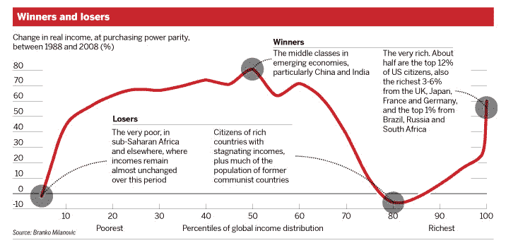

<!--yml
category: 未分类
date: 2024-05-18 03:22:22
-->

# Humble Student of the Markets: May Day thoughts on inequality (and development)

> 来源：[https://humblestudentofthemarkets.blogspot.com/2015/04/may-day-thoughts-on-inequality-and.html#0001-01-01](https://humblestudentofthemarkets.blogspot.com/2015/04/may-day-thoughts-on-inequality-and.html#0001-01-01)

As Europe marks

[May Day](http://en.wikipedia.org/wiki/International_Workers'_Day)

 with holidays, I thought that it would be appropriate to revisit the issue of inequality again.

In a past post (see

[Inequality and the genetic lottery: Two views](http://humblestudentofthemarkets.blogspot.com/2014/02/inequality-and-genetic-lottery-two-views.html)

), I showed that while global inequality has improved from 1988 to 2008 because of globalization as emerging market economies growth outperformed, wealth and income inequality within developed market countries have widened because the middle and working class in those countries lost because of the globalization trend. The winners were the top 1% and most of the emerging market world, while the losers were the poorest, largely because people in subsistence economies didn't participate in the benefits of globalization, and the middle and working class of developed market economies.

To me, the issue of inequality has never been about the fairness of the results, but should focus on the equality of opportunity. Imagine three people who were born at the same time named Bill Gates, all of whom had the same intelligence and abilities. Bill Gates 1.0 is the successful billionaire that we all know today. Bill Gates 2.0 was born a poor black kid in the American Deep South. Bill Gates 3.0 was born to a poor family living in a subsistence economy in Africa.

**A development economies question**

How can we create conditions so that Bill Gates 1.0, 2.0 and 3.0 all have equal opportunity? Given that kind of framework, the question then become a question of development economics. I have found neo-classical models of economics and the theory of comparative advantage does not explain everything. We all know about the economic miracles of China and India in the last 20-30 years. For me, the key question isn`t about India or China, but why did India and China succeed but not Kenya or Egypt, as they are all sources of cheap labor?

I have encountered a number of promising approaches. I have written about the works of Michael Porter and Jane Jacobs (

[Jacobs and Porter on development](http://humblestudentofthemarkets.blogspot.com/2008/02/jacobs-porter-on-development.html)

). The Porter book,

[The Competitive Advantage of Nations](http://www.amazon.com/Competitive-Advantage-Nations-Michael-Porter/dp/0684841479/ref=pd_bbs_sr_1?ie=UTF8&s=books&qid=1203965006&sr=1-1)

, asserts that competitive advantages are not static, but evolve over time. Porter went on to outline how the economies of countries evolve as they move up the value-chain.

Jane Jacobs published her work well before Michael Porter did and she is not as well known because she is more of an academic. However, her framework of moving up the value-chain framework is the same as Porter. What I find attractive about Jacobs is she identified the city-state as the unit of development, rather than a country, which makes sense to me as some countries can be highly economically diverse.

The question of how to resolve inequality isn't purely academic. The images from places like Baltimore and Ferguson are a reminder of how the effects of income and wealth inequality can boil over. Applying sound development economic solutions to the inequality problem will go a long way in alleviating much of those social tensions.

**A question of culture**

Despite the attractiveness of the Porter-Jacobs framework, it doesn't go fully in addressing some inequality problems. It`s may not be enough to ensure that people get equal opportunity, but how they go about attaining wealth and how they behave after they acquire wealth is also an issue.

In other words, there seems to be a cultural element to development economics.

One of the basic assumptions of economics is people are rational actors. They have rational expectations. Then how can we account for the

[NBER study](http://www.nber.org/papers/w21085)

indicating that 16% of NFL athletes go bankrupt within 12 years of retirement? Here is the abstract [emphasis added]:

> ***One of the central predictions of the life cycle hypothesis is that individuals smooth consumption over their economic life cycle; thus, they save when income is high, in order to provide for when income is likely to be low, such as after retirement.*** We test this prediction in a group of people—players in the National Football League (NFL)—whose income profile does not just gradually rise then fall, as it does for most workers, but rather has a very large spike lasting only a few years. We collected data on all players drafted by NFL teams from 1996 to 2003\. Given the difficulty of directly measuring consumption of NFL players, we test whether they have adequate savings by counting how many retired NFL players file for bankruptcy. ***Contrary to the life-cycle model predictions, we find that initial bankruptcy filings begin very soon after retirement and continue at a substantial rate through at least the first 12 years of retirement.*** Moreover, bankruptcy rates are not affected by a player’s total earnings or career length. Having played for a long time and been well-paid does not provide much protection against the risk of going bankrupt.

Are these people just stupid? If so, why does America spend weekends adoring people who run around a field with what amounts to the IQ on back of their sweaters?

**Planning vs, winging it**

It turns out that the attitudes about money therefore the behavior around wealth are cultural. Jessi Streib studied how couples from different class backgrounds interacted. In an article published in

[The Atlantic](http://www.theatlantic.com/business/archive/2015/04/how-wealth-in-childhood-shapes-personality-later-in-life/390939/)

, she revealed that there are definite differences about how different people cope. Members of the working class have a tendency to go with the flow and "wing it":

> People who grew up in households without much money, predictability, or power learn strategies to deal with the unexpected events that crop up in their lives. Often, these strategies are variations of going with the flow and taking things as they come. Sometimes there’s no other option.

By contrast, more affluent tend plan their lives a lot more:

> People who grew up with parents who had more money, job security, and power grow up with more stable lives. In these conditions, they learn that managing their resources makes sense—both because their lives are predictable enough that they can plan and because their resources are plentiful enough that they can make meaningful choices. Spouses with middle-class backgrounds wanted to manage their resources by planning.

She relates an example of how couple coped (all names are have been changed):

> One couple I talked to experienced these differences profoundly. Vicki grew up as the daughter of an upper-level manager while her husband John grew up the son of two factory workers. Vicki budgeted their money, making sure to save for their children’s college expenses and retirement. John thought their kids could figure out how to pay for college when they were older. People with working-class roots wanted to go with the flow and see what happened would figure out how to retire in the years to come. Vicki, a teacher, plotted how to become a superintendent. John, a restaurant manager, kept his eyes open for opportunities but did not plot how to get from one job to another.
> 
> Vicki also had her children’s lives planned before they were born—they would be good students and involved in many extra-curricular activities. John believed he should meet his kids before deciding on how to parent them and that it was not his place to decide who they should become. Vicki summed up their differences describing her own style as, “We need to plan! We need to schedule! We need to be neurotic!” and saying of John, “For him, it’s ‘It will always work out. It will always get done. Don’t worry.’”

Finance professionals know about the importance of a financial plan. "Winging it" is not a plan and can lead to disaster. Undoubtedly, that`s what happened to many NFL athletes who suddenly came into a lot of money. Were they irrational by ignoring the life-cycle hypothesis? A simpler explanation is that they were just "winging it" - and that approach creates a lot more risk to their lifestyle and future standard of living.

At the other end of the scale, there is an Old Money sub-culture who engaged in financial planning, but had Downton Abbey style taboo about talking about money (via

[Forbes](http://www.forbes.com/sites/laurashin/2015/04/14/the-money-taboo-why-it-exists-who-it-benefits-and-how-to-navigate-it/)

):

> The taboo among people with inherited wealth against talking about money is, like the taboo against incest, usually not spoken aloud, says Paul Schervish, director of Center on Wealth and Philanthropy and Boston College. “Most people are never told not to have sex with their brothers or sisters. You don’t hear your parents telling you that. That’s a taboo. It’s pre-vocal.”
> 
> The taboo against talking about money among people with inherited wealth has three main dimensions, he says: 1\. inter-generational, in which parents and children don’t discuss money with each other, 2\. publicity, in which wealth is not publicly disclosed (to the dismay of charities), and 3\. peers, in which one does not discuss wealth with friends or colleagues so as not to either embarrass them or feel ashamed yourself.
> 
> Many of those with inherited wealth will have a trust official take their children aside and explain what the trust is and how much they might expect to inherit, and then teach their children to be relatively silent about that money to outsiders. “The family has enjoyed privilege financially, [so] they don’t want their children to … look down on other people,” says Schervish. “It’s part of their financial morality to not live an arrogant life about money.”
> 
> In fact, he says, those with inherited wealth often live frugally on purpose and drive Toyotas or forgo yachts because their inheritance is not growing dramatically, and the principal has to be protected from generation to generation.

Noah Smith featured the work of Roland Fryer, who has done extensive work on the black-white achievement gap in America, in a

[BloombergView article](http://www.bloombergview.com/articles/2015-04-27/economics-prize-for-roland-fryer-a-lesson-on-race)

. The article is well worth reading in its entirety as it extensively details Fryer's research. Bottom line: Fryer also found a cultural effect:

> One question Fryer has [addressed](http://cseweb.ucsd.edu/~ddahlstr/misc/test-score-gap.pdf) is what causes the achievement gap. Along with Levitt, he found something very interesting. In kindergarten, the black-white gap can be entirely explained by a small number of variables, including socioeconomic status. But as the kids got older, a new racial gap appeared that wasn’t explained by those factors. That means that some other force is at work -- education, discrimination, cultural factors or something else.
> 
> Fryer set about trying to find those factors. For example, many have long argued that black culture discourages intellectual achievement, by branding academic pursuits as “acting white.” Along with co-author Paul Torelli, Fryer [investigated](http://www.quantitativesocialscience.com/uploads/5/8/3/3/5833205/fryer_torelli_2010.pdf) the hypothesis. If academics are really considered “acting white,” then it stands to reason that getting good grades should be negatively correlated with popularity. Using data from a survey that asked students who their friends were, Fryer and Torelli constructed a measure of how popular each student was among members of his or her own race (the index is constructed so that having more popular friends confers more popularity than having less popular friends). The results fit the predictions of the “acting white” hypothesis -- as students get older, the correlation between grades and popularity goes up and up for white kids, but down for black kids.
> 
> An alternative hypothesis, of course, is that racial discrimination is the cause of the black-white achievement gap. Many teachers, if asked, will tell you that this is the case (though they will probably deny that the discrimination comes from their own classrooms!). It’s a very hard thing to measure. But, as Fryer and others have [documented](http://citeseerx.ist.psu.edu/viewdoc/download?doi=10.1.1.169.2586&rep=rep1&type=pdf), racial discrimination has become less and less important in the U.S. employment market. That doesn’t prove that discrimination isn’t still the culprit at the grade school level, but it is suggestive.

Fryer’s solutions are not all politically correct. They involve specialized environments like charter schools and incentives to counteract the cultural stigma of “acting white” (emphasis added):

> Taken all together, Fryer’s work suggests that educational investments, improved motivation and cultural change have a good shot at closing the stubborn achievement gap between black and white students. That isn't going to please education reform opponents such as Diane Ravitch, who denigrate charters and pooh-pooh the idea that better education could close the gap. It’s also not going to please a lot of conservatives, who typically oppose funneling more resources into government-funded education.
> 
> But ***Fryer’s message -- that the achievement gap isn't invincible, that it can be slain by better education -- is backed up by solid data and sophisticated empirical techniques***. Those who deny Fryer’s conclusions will have a very hard time refuting the Clark Medal winner’s research.

**Towards a better development economics framework**

Basic training for economist involve a common framework for understanding human behavior. First and foremost, we assume that people are rational actors. The Washington Consensus, which has come to dominate economic thinking, believe in the Invisible Hand of the markets.

When the rubber hits the road in development economics, it can be very messy and un-PC. The neo-classical solutions that the markets will take care of everything risks the kind of social instability seen in places like Ferguson, Baltimore, or worse. Sometimes, even

[The Onion](http://www.theonion.com/articles/baltimore-residents-urged-to-stay-indoors-until-so%2C38511/)

just nails a headline.

The Porter-Jacobs framework gets us part of the way there, but the results cannot be generalized. Yes, you can use comparative advantages, such as low labor costs and convenient geographic proximity to markets, to spur development. You can then leverage your position to educate your population and move up the value-chain with goods and services with more design elements and intellectual property, which creates better paying jobs. Still, it doesn't explain why India and China succeeded and Kenya and Egypt didn't.

The third element is the messy part and it is politically incorrect. It involves a study of the culture. to understand the elements of success and their impediments. Those solutions can be highly specific and may not be generalized to the rest of the human population. Consider the following question. Both the Jews and the Romani (Gypsies) have historically been outcasts in Europe. How did one group succeed and acquired power (e.g., the Rothchilds) and the other remains shunned throughout the region?