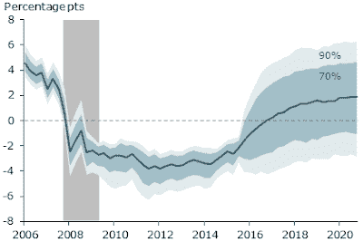
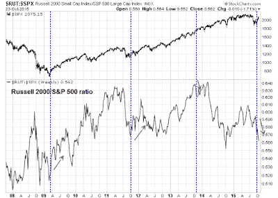

<!--yml
category: 未分类
date: 2024-05-18 03:14:13
-->

# Humble Student of the Markets: Momentum = Risk-on!

> 来源：[https://humblestudentofthemarkets.blogspot.com/2015/10/momentum-risk-on.html#0001-01-01](https://humblestudentofthemarkets.blogspot.com/2015/10/momentum-risk-on.html#0001-01-01)

**Trend Model signal summary**

Trend Model signal: Neutral

Trading model: Bullish

The Trend Model is an asset allocation model which applies trend following principles based on the inputs of global stock and commodity price. In essence, it seeks to answer the question, "Is the trend in the global economy expansion (bullish) or contraction (bearish)?"

My inner trader uses the trading model component of the Trend Model seeks to answer the question, "Is the trend getting better (bullish) or worse (bearish)?" The history of actual out-of-sample (not backtested) signals of the trading model are shown by the arrows in the chart below.

**Update schedule**

: I generally update Trend Model readings on

[my blog](http://humblestudentofthemarkets.blogspot.com/)

on weekends and tweet any changes during the week at @humblestudent.

**Central bankers throw a party**

The Trend Model is designed to spot global trends in risk appetite. As shown by the above chart of past signals, the model was fortunate to have caught the risk-on trend a few weeks ago. Now the central bankers have decided to join the party.

Last week, we saw the

[PBoC cut rates](http://www.businessinsider.com/peoples-bank-of-china-cuts-interest-rates-2015-10)

, which sparked a rally in commodity prices and troubled miner Glencore melted up by 10% on the news. In addition, ECB head Mario Draghi hinted at further QE in December (via

[The Guardian](http://www.theguardian.com/business/2015/oct/22/mario-draghi-ecb-prepared-to-cut-interest-rates-and-expand-qe)

):

> Speaking after the ECB’s latest policy meeting in Malta, Draghi revealed that some members of the governing council had favoured taking more action to stimulate the economy immediately. He blamed the slowdown in emerging markets, including China, for renewed weakness in the eurozone.
> 
> “While euro area domestic demand remains resilient, concerns over growth prospects in emerging markets and possible repercussions for the economy from developments in financial and commodity markets continue to signal downside risks to the outlook for growth and inflation,” he said in his opening statement.
> 
> Draghi said the ECB could also step up the scale of QE. A decision is likely to be made at the December meeting of its governing council, when its latest economic forecasts will be available. As Draghi spoke, the euro dropped by 1.5 cents against the dollar, to $1.117.
> 
> “The governing council is willing and able to act by using all the instruments available within its mandate, if warranted, in order to maintain an appropriate degree of monetary accommodation,” Draghi said.

Less noticed was the Federal Reserve, but it wasn't left out of the festivities either. Vasco Cúrdia of the San Franciso Fed recently published

[research](http://www.frbsf.org/economic-research/publications/economic-letter/2015/october/gradual-return-to-normal-natural-rate-of-interest/)

indicating that the "natural rate" of interest is -2.1%, which gives cover for the doves to argue that with interest rates at the zero bound, Fed policy is actually quite tight (emphasis added):

> Figure 1 shows that the natural rate declined substantially during the recession and did not start to recover until the end of 2014\. ***Currently, the median estimate is –2.1%, far below its long-run level of about 2.1%.*** The fall in the natural rate during the recession is explained by low expected productivity growth. With projected low growth, the economy would need less saving and more spending to use resources fully, hence the lower natural rate of interest. During the economic recovery, the natural rate was kept low by weak demand due to a larger propensity to save in the aftermath of the financial crisis.

|  |
| Blue shaded areas represent the range of possible estimates with 70% (darker) and 90% (lighter) probability. Gray bar indicates NBER recession dates. |

Cúrdia concluded:

> This *Letter* suggests that the natural rate of interest is expected to remain below its long-run level for some time. This implies that low interest rates over the next few years are consistent with the most efficient use of resources and stable inflation. The analysis also finds that the output gap is expected to remain negative even after the natural rate is close to its long-run level. Additionally, there is considerable uncertainty about both the short-run dynamics as well as what level should be expected in the longer run. All these considerations reinforce the possibility that interest rate normalization will be very gradual.

This research may be more than just a trial balloon.

[CNBC](http://www.cnbc.com/2015/10/14/surprising-fed-paper-drops-a-dovish-bombshell.html)

reports that Cúrdia has worked closely with Michael Woodford, who made a big splash at Jackson Hole in 2012 with his paper entitled

[Methods of Policy Accommodation at the Interest-Rate Lower Bound](https://www.kansascityfed.org/publicat/sympos/2012/mw.pdf)

, which had a profound influence on central banker thinking.

> Neil Azous of Rareview Macro points out that Curdia has worked closely with Michael Woodford, "who is widely considered to be the strongest consultant to the Federal Reserve for quite some time, and he's sort of the backbone to modern monetary policy." Further, the San Francisco Fed is "the academic arm of the entire system, and Janet Yellen came from the San Francisco Fed, so it's given additional credence."

When you combine the Cúrdia paper with the extraordinarily dovish

[speech by Fed Governor Lael Brainiard](http://www.federalreserve.gov/newsevents/speech/brainard20151012a.htm)

, which Tim Duy characterized as a "direct challenge to Chair Janet Yellen and Vice Chair Stanley Fischer", you have the potential for lots of fireworks at the next couple of FOMC meetings, particularly if Yellen wants to form a consensus about interest rate policy. We will have better clarity of this issue resolves itself as the FOMC meets this week. Stay tuned!

**Momentum, momentum!**

As well, equity price momentum is manifesting itself in a big way.

[Mark Hulbert](http://www.marketwatch.com/story/the-best-six-months-for-stocks-is-about-to-begin-2015-10-23)

pointed out that stocks are entering a period of positive seasonality, when the "sell in May" six months is expiring. Further, his found that momentum enhances returns. Stocks tend to do much better when they rise during September-October period (emphasis added):

> These already-impressive statistical odds become even better when the stock market is able to buck the seasonal odds and eke out a gain over the September-October period — the last two months of the seasonally unfavorable summer period. That’s exactly what’s happened this year, with the Dow currently 5% higher than where it stood at the end of August.
> 
> For example, according to a Hulbert Financial Digest analysis of the Dow back to its creation in the late 1800s, the Dow produced an average Halloween-through-May-Day gain of 4.0% whenever the market was a loser over the two months prior to Halloween.
> 
> ***When it was a gainer, in contrast, the Dow’s subsequent Halloween-through-May-Day gain was 6.8%. This difference of 2.8 percentage points is significant at the 95% confidence level that statisticians often use to determine if a pattern is genuine.***

David Lutz also pointed out that share buybacks tend to be especially heavy in November and December, which creates a tailwind for stock prices (via

[Business Insider](http://www.businessinsider.com/bi-most-important-charts-october-2015-10?op=1)

):

The Zweig Breadth Thrust off the bottom set in August is a also confirmation of the positive price momentum effect on stock prices (see my previous posts

[Bingo! We have a buy signal!](http://humblestudentofthemarkets.blogspot.com/2015/10/bingo-we-have-buy-signal.html)

and

[The Zweig Breadth Thrust as a case study in quantitative analysis](http://humblestudentofthemarkets.blogspot.com/2015/10/the-zweig-breadth-thrust-as-case-study.html)

). Consider what has happened in recent ZBH signals in the last 20 years, though the sample size is small at three. Here is 2009, when the stock market melted up after the March 2009 bottom and never looked back.

The 2011 ZBT saw a minor pullback after the ZBT, but any bull will take that if the 2011 experience is the worst case scenario:

We also saw a ZBH in 2013\. The market saw a period of minor consolidation and pullback and then experienced a small correction a couple months later, but the main trend was up.

I want to address the issue of poor small cap performance during this rally. Several readers have voiced concerns about how small caps have lagged during this period of strength. The chart below of the relative performance of the Russell 2000 during past ZBT is somewhat inconclusive. True, small caps led the way up in 2009 and 2011, but they initially tanked, on a relative basis, in 2013 but later recovered. Could the current episode parallel 2013? This is a situation that needs to be monitored, but there is no need to hit the panic button.

An examination of breadth behavior during past ZBTs is also instructive. The chart below shows the NYSE Common stock only Summation Index (middle panel) and the more commonly used NYSI in the bottom panel. I have also overlaid a stochastic on the former indicator. Currently, the stochastic shows that this indicator is overbought, but the record on past overbought conditions has been mixed. The Summation Index became overbought in 2009 but did not pause; it became overbought in 2011 and did pause and consolidate; but this index did not even get overbought in 2013\. One theme that did show up in all of this analysis is that breadth continued to trend upwards after ZBTs, which is better shown in NYSI (bottom panel), though that condition was also evident in the common stock only Summation Index as well.

If history is any guide, it shows that the path of least resistance for stock prices is up, at least into year-end.

**Poised for a FOMO rally**

The combination of positive price momentum and what was a crowded short is also setting the stage for a short-covering FOMO (Fear of Missing Out) rally. The latest data from Rydex show that retail traders and investors moving off a crowded short position, but readings are nowhere near neutral yet. This indicates a high potential for more panicked buying should momentum continue to carry the day.

In addition, the

[NAAIM Exposure Index](http://www.naaim.org/newsresources/naaim-exposure-index/)

shows that RIAs actually increased their bearishness even as stocks rallied last week. With year-end coming up, there will be a lot of advisors with a lot of explaining to do should stocks continue rising. If and when they throw in the towel, the market will see more melt-up stampedes.

**Key risk: Earnings**

To be sure, this is not a universal picture of rainbows and unicorns for the bull camp. The latest update from

[John Butters](http://www.factset.com/websitefiles/PDFs/earningsinsight/earningsinsight_10.23.15)

of Factset show that Street forward EPS estimates continue to fall.

Analyzing the internals further, figures from Ed Yardeni showed that most of the declines came from cyclical sectors, namely Energy and Materials, with a minor contribution from Industrials.

Here is a closeup of the evolution of forward EPS of the three sectors in question:

However, the relative performance of cyclical sectors indicate that Mr. Market appears to be discounting a scenario of global reflation (see above comment about central bankers throwing a party). I would therefore temporarily discount any concerns about falling EPS and give the bull case the benefit of the doubt (for now).

**The week ahead**

As I look to the week ahead, the SPX rallied through its 200 day moving average (dma) on Friday on a show of strength. RSI(5) is showing a series of "good" overbought readings, where overbought conditions beget more overbought conditions, and RSI(14) is trending upwards but not overbought yet.

Visually, the market appears to be extended, but breadth readings are not showing extreme overbought conditions. This chart of stocks above their 10 dma from

[IndexIndicators](http://www.indexindicators.com/indicators/breadth/)

is not especially overbought on for an indicator with a 1-3 day time horizon.

Using the net 20 day highs-low indicator, which is useful for a 1-2 week time frame, the market doesn't appear to be very overbought when viewed in the context of a rally off a corrective bottom like 2011.

In conclusion, the combination of friendly central bankers, powerful price momentum, positive seasonality and a mildly crowded short sentiment reading all suggests that the path of least resistance for stock prices is up. Even in the short-term, the market doesn't appear to be especially overbought in the context of the momentum rally. Should the market pause and consolidate, pullbacks are likely to be shallow and mild.

Both my inner investor and inner trader therefore remain bullish on equities, with a particular emphasis in beaten down cyclical sectors and industries.

**Disclosure:**

Long SPXL, ERX