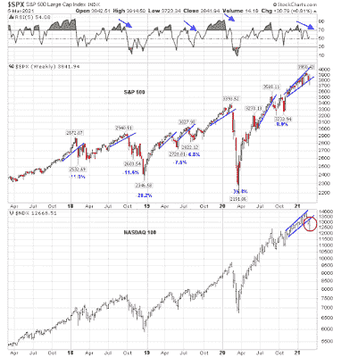

<!--yml
category: 未分类
date: 2024-05-18 02:03:32
-->

# Humble Student of the Markets: Momentum crashes, market now oversold

> 来源：[https://humblestudentofthemarkets.blogspot.com/2021/03/momentum-crashes-market-now-oversold.html#0001-01-01](https://humblestudentofthemarkets.blogspot.com/2021/03/momentum-crashes-market-now-oversold.html#0001-01-01)

 **Preface: Explaining our market timing models**

We maintain several market timing models, each with differing time horizons. The "

**Ultimate Market Timing Model**

" is a long-term market timing model based on the research outlined in our post, 

[Building the ultimate market timing model](https://humblestudentofthemarkets.com/2016/01/26/building-the-ultimate-market-timing-model/)

. This model tends to generate only a handful of signals each decade.

The 

**Trend Asset Allocation Model**

 is an asset allocation model that applies trend following principles based on the inputs of global stock and commodity price. This model has a shorter time horizon and tends to turn over about 4-6 times a year. In essence, it seeks to answer the question, "Is the trend in the global economy expansion (bullish) or contraction (bearish)?"

My inner trader uses a 

**trading model**

, which is a blend of price momentum (is the Trend Model becoming more bullish, or bearish?) and overbought/oversold extremes (don't buy if the trend is overbought, and vice versa). Subscribers receive real-time alerts of model changes, and a hypothetical trading record of the email alerts are updated weekly 

[here](https://humblestudentofthemarkets.com/trading-track-record/)

. The hypothetical trading record of the trading model of the real-time alerts that began in March 2016 is shown below.

The latest signals of each model are as follows:

*   Ultimate market timing model: Buy equities*
*   Trend Model signal: Bullish*
*   Trading model: Bullish*

** The performance chart and model readings have been delayed by a week out of respect to our paying subscribers.***Update schedule**

: I generally update model readings on my 

[site](https://humblestudentofthemarkets.com/)

 on weekends and tweet mid-week observations at @humblestudent. Subscribers receive real-time alerts of trading model changes, and a hypothetical trading record of those email alerts is shown 

[here](https://humblestudentofthemarkets.com/trading-track-record/)

.

Subscribers can access the latest signal in real-time 

[here](https://humblestudentofthemarkets.com/my-inner-trader/)

.

**Momentum crashes, S&P 500 wobbles**

I have been warning for the past few weeks that sentiment was overly frothy and due for a reset. The reset finally began in the last two weeks. The weekly S&P 500 chart shows the index fell, but held a rising trend line support after the 5-week RSI flashed a negative divergence for most of 2021\. The high-flying momentum stocks, as represented by the NASDAQ 100 (NDX), were not as fortunate. NDX violated its rising trend line indicating significant technical damage has been done.

At its deepest, the S&P 500 was -5.7% off its all-time highs. The carnage in the high-octane NASDAQ 100 was even worse. That index was off -11.3% on a peak-to-trough basis indicating a definitive loss of growth stock leadership. As Big Tech comprise nearly half of S&P 500 weight, this has important consideration for the overall market direction.

However, the short-term market action indicates an oversold market poised for a relief rally.

The full post can be found

[here](https://humblestudentofthemarkets.com/2021/03/07/momentum-crashes-market-now-oversold/)

.