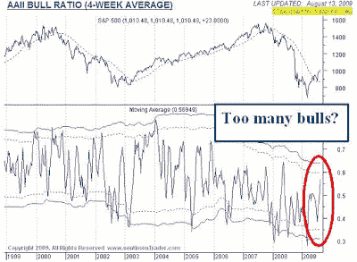
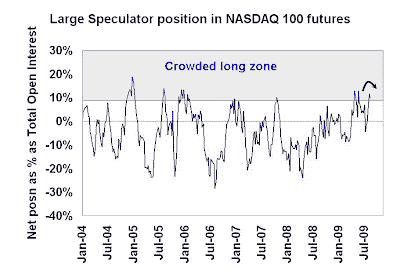

<!--yml
category: 未分类
date: 2024-05-18 00:48:20
-->

# Humble Student of the Markets: More bearish data points for equities

> 来源：[https://humblestudentofthemarkets.blogspot.com/2009/08/more-bearish-data-points-for-equities.html#0001-01-01](https://humblestudentofthemarkets.blogspot.com/2009/08/more-bearish-data-points-for-equities.html#0001-01-01)

I spent the weekend looking over some of my sentiment model indicators and things look ugly for the bulls. First of all, the latest

[AAII survey](http://www.sentimentrader.com/subscriber/charts/WEEKLY/SURVEY_AAII_BULLRATIO_4WK.htm)

of individual investors shows a spurt in bullishness, which is contrarian bearish.

Moreover, the latest

[Commitment of Traders report](http://www.cftc.gov/marketreports/commitmentsoftraders/index.htm)

shows that large speculators (read: hedge funds) are now in a crowded long in the high-beta NASDAQ 100 and the net long position has started to decline, which is another bad sign for the bulls.

**Shanghai Index breaks down**

China has become the last hope of growth in a growth starved world but the Chinese stock market is rolling over. The chart below shows the Shanghai Stock Exchange Composite Index, which has fallen through an uptrend line that began in November 2008, as well as the 50-day moving average. Both of these are important signposts for technicians that point to an interruption of the rally.

Given some of my recent warnings about the equity market (see

[here](http://humblestudentofthemarkets.blogspot.com/2009/08/v-shaped-recovery-with-4-8-gdp-growth.html)

and

[here](http://humblestudentofthemarkets.blogspot.com/2009/07/capitulation.html)

), these additional data points are more indications of the precarious state of the US equity market.