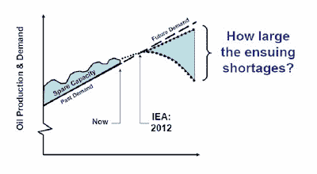
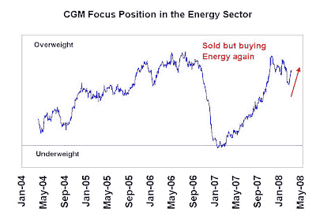

<!--yml
category: 未分类
date: 2024-05-18 01:06:52
-->

# Humble Student of the Markets: More constructive on crude oil

> 来源：[https://humblestudentofthemarkets.blogspot.com/2008/08/more-constructive-on-crude-oil.html#0001-01-01](https://humblestudentofthemarkets.blogspot.com/2008/08/more-constructive-on-crude-oil.html#0001-01-01)

In retrospect it was easy to call the top in oil. When cartoons like

[this](http://www.creators.com/comics/3/21624.html)

appeared it was clear that high oil prices had penetrated the public consciousness – a contrarian sell signal.

Now that the oil price has descended about $30 from its peak and other commodities have also been

[hammered](http://bespokeinvest.typepad.com/bespoke/2008/08/second-worst-mo.html)

, it’s time to become more constructive on crude. While downside risks remain (e.g. cyclical US slowdown affecting commodity prices, China slowing, US$ in rally mode, etc.), I would like to review the bull case for oil prices and detail the reasons why I remain a long-term oil bull.

**Peak Oil**

I could go on and on about Peak Oil but I refer you to the site

[Oil Drum](http://www.theoildrum.com/)

and Matt Simmons’

[speeches](http://www.simmonsco-intl.com/research.aspx?Type=msspeeches)

for more detail. It isn’t about the world running out of oil but more about world oil consumption running into extraction limits. Robert Hirsch wrote an important

[report](http://www.netl.doe.gov/publications/others/pdf/Oil_Peaking_NETL.pdf)

for the US Department of Energy back in 2005 discussing these concepts and how to mitigate their effects.

**Peak Oil Concepts**

**Peak Oil mitigation: 9 women can’t have a baby in 1 month**
Hirsch’s conclusion was that the US needs to invest in alternative technologies now, because mitigation technologies take time. Put it another way: nine women can’t have a baby in one month – no matter how hard they tried.

If we are indeed facing Peak Oil in the immediate future then the secular trend for energy prices is up and will continue to rise until a combination of alternative energy and conservation measures kick in. This bull would have a long way to go.

**Global cooling?**
What I am writing here may be sacrilege to some people. The popular consensus about Global Warming is that the Earth is undergoing a warming period caused by the effects of industrialization. However, there is another [view](http://solar.physics.montana.edu/SVECSE2008/publictalk.html) that global warming is caused by solar activity – sunspots and solar winds.

Currently, the [forecast](http://www.swpc.noaa.gov/SolarCycle/SC24/Press_Briefing_Biesecker.ppt) for the latest [solar cycle](http://en.wikipedia.org/wiki/Solar_cycle) is that it’s late. Such extended cycles have been associated with cooling periods such as the [Little Ice Age](http://en.wikipedia.org/wiki/Little_Ice_Age) experienced a few hundred years ago. Indeed, there have been [reports](http://dotearth.blogs.nytimes.com/2008/07/17/ice-update-and-unfiltered-us-climate-report/) that there is more ice in the Arctic (yes – it’s only one data point) and there has been some [hand wringing](http://solar.physics.montana.edu/SVECSE2008/abstract_book_SVECSE2008v4.pdf) among the scientists about the timing of the solar cycle.

Is this theory about solar activity correct? I have no idea. I do have allow for the possibility that it is a valid one and should the Earth enter a cooling period, this would be bullish for energy demand and result in higher energy prices.

**Heebner still bullish on Energy**
In s [post](http://humblestudentofthemarkets.blogspot.com/2008/06/bill-miller-ken-heebner-study-in.html) back in early June comparing Bill Miller and Ken Heebner, I noted that Ken Heebner had a hot hand largely because of his overweight position in resources and underweight position in Financials. Moreover, Heebner does not hesitate to turn over his portfolio if he thinks that it is positioned improperly.

The chart below shows the Heebner’s latest imputed position in the Energy sector. Despite the recent rally in Financials and the air pocket hit by Energy, Heebner may have trimmed back some of his Energy overweight and is now adding back to his position.

You have to respect Heebner's views given his record.

**Investor sentiment is bearish**
Finally, in the short term, [investor sentiment](http://www.sentimentrader.com/subscriber/charts/WEEKLY/SURVEY_CRUDEOIL.htm) on crude has retreated to levels that warrants taking a less bearish stance. While oil prices may not rocket up from these levels, these readings do suggest a period of stabilization or consolidation in price.

**A nervous bull on oil** Given that oil prices have retreated about $30 from their peak, I believe that the near-term upside and downside price risks are far more balanced and would be inclined to be more constructive on the oil price. Does that mean that it can’t go down any more? Of course not, there remain substantial risks to buying here. However, if you are playing the odds then the probabilities are now tilting more in favor of the bulls.

***Addendum:*** The chart estimating the CGM Focus position in Energy has been corrected as the previous x-axis was incorrect. Apologies for any inconvenience.