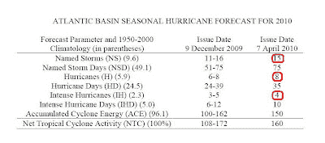

<!--yml
category: 未分类
date: 2024-05-18 00:34:41
-->

# Humble Student of the Markets: More hurricanes = Energy price volatility

> 来源：[https://humblestudentofthemarkets.blogspot.com/2010/04/more-hurricanes-energy-price-volatility.html#0001-01-01](https://humblestudentofthemarkets.blogspot.com/2010/04/more-hurricanes-energy-price-volatility.html#0001-01-01)

Philip J. Klotzbach and William M. Gray of the

[Tropical Meteorology Project](http://hurricane.atmos.colostate.edu/forecasts/)

at the Colorado State University has issued a new

[2010 forecast](http://hurricane.atmos.colostate.edu/forecasts/2010/april2010/apr2010.pdf)

and it calls for a higher than average hurricane season.

Highlights include 8 hurricanes (vs. an average of 5.9 for the 1950-2000 period), 15 named storms (vs. 9.6) and 4 intense hurricanes (vs. 2.3). More storms will mean higher energy prices and greater price volatility later this year.

Be prepared!