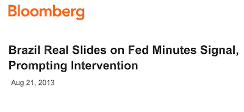

<!--yml
category: 未分类
date: 2024-05-18 03:50:22
-->

# Humble Student of the Markets: Nearing an inflection point: Watch the USD!

> 来源：[https://humblestudentofthemarkets.blogspot.com/2013/08/nearing-inflection-point-watch-usd.html#0001-01-01](https://humblestudentofthemarkets.blogspot.com/2013/08/nearing-inflection-point-watch-usd.html#0001-01-01)

Last week I wrote that I was seeing the classic signs of a late market cycle rotation into deep cyclical stocks, which would likely coincide with a stock market rally for several weeks (see

[A classic late-cycle rotation](http://humblestudentofthemarkets.blogspot.com/2013/08/a-classic-late-cycle-rotation.html)

), but recent developments suggest that the cyclical rally may be on its last legs.

Consider this chart of the relative performance of the Morgan Stanley Cyclical Index (CYC) against the market. CYC staged a relative breakout but has pulled back below the breakout level. While this may be a breakout-pullback-retest pattern, other market indicators are flashing more cautious signs that this was a false relative breakout.

**Bond prices poised to rally?**

We may be nearing an important inflection point in the markets. Bond prices, while have been been hammered recently, may be poised for a rebound. Here is a longer term chart of the 10-year Treasury yield, which shows that the 10-year yield is now testing both an important downtrend line and a Fibonacci resistance level. These are typical signs that bond yields and prices could start to revert soon.

Here is the chart of the 30-year Treasury yield in the same time frame. Note how the 30-year is also testing the 50% Fibonacci retracement level. With both the 10-year and 30-year yields testing key resistance levels, my hunch is that bond prices may be poised to rally soon.

**A crowded short reading in Treasuries**

Sentiment readings are also supportive of a rally in bond prices. Mike Santoli, writing in

[Yahoo Finance](http://finance.yahoo.com/blogs/michael-santoli/relief-rally-due-bonds-yield-stocks-170752379.html)

, stated that Treasury bonds may be poised for a relief rally:

> The case for a relief rally in Treasuries (and a corresponding decrease in yields) is built on excessive pessimism already built into the Treasury market, the likelihood that short-term rates controlled by the Fed will stay near zero for a very long time, and the reality that higher yields -- and mortgage and auto-loan rates -- themselves help brake the economy and could make the central bank less aggressive in stepping back from its stimulus.
> 
> The entire financial world, it seems, has pivoted toward an expectation that rates will surely keep rising. The Daily Sentiment Index for Treasury bonds showed only 9% were bullish on Treasuries (meaning only 9% were betting on lower yields), according to RBS strategists Friday, a lopsided stance against bonds that’s confirmed by other measures of large investors. Retail investors, as noted, have pulled some $90 billion from fixed-income funds since Memorial Day, says the Investment Company Institute.

Indeed, the yield curve has steepened to extreme levels:

> With the rush higher in Treasury yields, the gap between short- and long-term government-bond rates, known as the yield curve, is already near an extreme. The two-year Treasury, which is tightly tethered to the Fed-dictated overnight rate, is just below 0.40%.
> 
> With bonds at 2.90% this week, that gap of 2.5 percentage points is quite wide, exceeded only for rather short periods of time over the last 30 years. (Given that overnight rates have never been zero deep in a U.S. economic recovery phase, it’s possible what used to be an extreme gap is less extraordinary on an absolute basis, but nonetheless should restrain further huge upside in rates.

[The Short Side of Long](http://theshortsideoflong.blogspot.com/2013/08/weekend-sentiment-summary-august-week-4.html)

echoed Santoli's conclusion and indicated that the Commitment of Traders reports shows that the small speculator at a crowded short level in the long Treasury bond:

**EM and commodity market risks are rising**

If bond yields were to fall, what does that mean for stock prices? Bulls would argue that lower long rates are bullish for stocks because it implies P/E expansion. Bears would point to the historically inverse relationship between stock and bonds.

I look for clues in the foreign exchange market, where the US Dollar is testing an important uptrend line and what it tells me about the nature of sector leadership and their implications for the direction of equity prices.

If the USD continues to rally, it would be negative for commodity prices. We saw that last week as the USD strengthened across the board against virtually all currencies and commodity prices and deep cyclical stocks struggled. Last week, I highlighted the turnaround in industrial commodity prices as a positive sign for the deep cyclical sectors. The bottom panel also shows the low and negative correlation of industrial commodity prices to the USD.

As well, USD strength has also been negative for emerging markets. Here is a chart of EEM, the emerging market equity ETF, showing its low/negative correlation to the USD. Note that during past occasions when correlations have risen to around 0 and started to mean revert downwards, it tended to be negative for EM equities.

[Bruce Krasting](http://brucekrasting.com/black-white/)

recently openly worried about the effects of a Fed taper on the EM economies:

> I’m concerned that the Fed is going to try to accomplish a “Taper Lite” in an attempt to engineer a ‘white’ outcome. An attempt at a ‘white’ taper would be:
> 
> *FLASH – Fed to reduce QE by $5bn per month starting in October.*
> *FLASH – Fed to reduce QE by a total of $15bn from October through December and thereafter leave monthly purchases at $70Bn per month for the indefinite future.*
> *FLASH – Fed anticipates that it will take no additional policy steps until after January of 2014 (post Bernanke replacement).*
> 
> *FLASH – The Fed may elect to increase monthly purchases after January of 2014 based on data.*
> 
> This small ball approach will backfire. Dragging out the process will drag out the pain. As of today there is not much evidence of Taper Pain in the USA. But the money is moving quickly outside of the border. How long will it take for some of the Black side of the taper to come back home?

So far, the US market seems to be relatively unfazed over the prospects of a Fed taper, as shown by the relative returns of HYG, the junk bond ETF, against IEF, the 7-10 year Treasury ETF:

As Krasting noted, we are not seeing the same market reaction in EM-land. The relative performance of EMB, the emerging market bond ETF, against HYG, i.e. junk vs. junk, has breached a critical relative support level and the ratio is showing signs of considerable stress.

Moreover, the FX markets are showing signs of anxiety over tapering as de-risking continues. The chart below of DBV as a measure of the currency carry trade of buying high yielding currencies and shorting the low yielding ones shows that this trade continues to sell off in the wake of the May 22 Fed tapering message as it violated an important level of technical support last week.

**The message from sector leadership analysis**

When I analyze the character of sector leadership in order to resolve the bull/bear directional debate for stocks, here is what I see. Cyclical stocks appear to be rolling over because of USD strength. Continued USD strength will be negative for emerging market economies, whose stress levels are bound to spill over into US equities. What's more, interest sensitive sectors like homebuilding and financials are weakening on a relative basis: The relative performance of the homebuilders are rolling over after violating an important relative support zone (shown in yellow):

Financial stocks, which had been the leaders in this market, have fallen through a relative uptrend line:

The only source recent high-beta market leadership left are the consumer discretionary stocks, whose strength continues unchallenged. The key question then becomes:

***Can the American consumer carry the entire weight of the bullish hopes of equity investors on her shoulders, especially if we start to see signs of stress in emerging market bond and equity markets?***

Given the risks that I outlined in

[last week's post](http://humblestudentofthemarkets.blogspot.com/2013/08/a-classic-late-cycle-rotation.html)

 outlined below, the weight of the evidence suggests that equities are very nearing an inflection point that could send prices downward to some unknown level:

*   **Valuation signals**:  As I wrote before (see [A new secular bull? Don't count on it!](http://humblestudentofthemarkets.blogspot.com/2013/08/a-new-secular-bull-dont-count-on-it.html)), private equity firms are cashing out their equity holdings, value investors can't find any good values and VLMAP, Value Line's Median Appreciation Potential for stocks, is signaling very low return levels for equities. Mark Hulbert also wrote about the VLMAP sell signal [here](http://www.marketwatch.com/story/stocks-as-overvalued-now-as-at-2007-high-2013-08-14).
*   **Smart investor trading signals**: In addition to long-term oriented value managers feeling uncomfortable with stocks, [George Soros' largest position is a bearish bet on SPX](http://blogs.marketwatch.com/thetell/2013/08/15/soross-biggest-holding-a-bearish-call-on-the-sp-500/). I am not sure I want to be on the other side of a Soros trade, do you?
*   **The tapering risk-off trade isn't over, **especially in the [credit and foreign exchange markets](http://humblestudentofthemarkets.blogspot.com/2013/08/is-tapering-panic-over.html). As we move into September and, in all likelihood, the Fed starts to taper down its QE purchases, I would expect further angst from the markets.
*   **Political headwinds**: There are two items of note for the markets in September and October. First of all, the German elections are scheduled for September 22\. Angela Merkel is expected to return as chancellor and there seems to be a tacit agreement to minimize the level of euro-angst until after the elections. After that, don't be surprised to hear more problems with the eurozone peripheral countries like Portugal. As well, we are going to see the usual Washington drama about the debt ceiling debate. While the consensus is that the politicians will reach a last minute deal, this [Politico ](http://www.politico.com/story/2013/08/wall-street-debt-ceiling-95426.html)report suggests that September 2013 may be different from previous years because the GOP leadership is divided and Obama and the Democrats are spoiling for a fight:

> > > The House GOP is hopelessly fractured on spending strategy. Senate Republicans who might otherwise broker a deal face primary challenges that make compromise potentially deadly. Other Senate Republicans are jockeying for 2016\. And congressional Democrats have no appetite for any bargain — grand or otherwise — that cuts entitlement spending.

> > > President Barack Obama at his Friday news conference before leaving for vacation lectured Republicans and mocked their threats to shut down the government rather than fund his signature health care law. Hardly a promising sign for the fall.

In particular, I don't think I want to get overly bullish here with the news that George Soros' biggest position is a bearish bet on the SPX. The chart below also indicates that market breadth is deteriorating, with the percentage of SPX stocks (bottom panel) showing a point and figure buy signal showing lower highs even as the market (top panel) advanced:

The key bearish trigger here is the US Dollar. If it starts to rise significantly, bulls should be battening down the hatches.

*Cam Hui is a portfolio manager at [Qwest Investment Fund Management Ltd](http://www.qwestfunds.com/). (“Qwest”). The opinions and any recommendations expressed in the blog are those of the author and do not reflect the opinions and recommendations of Qwest. Qwest reviews Mr. Hui’s blog to ensure it is connected with Mr. Hui’s obligation to deal fairly, honestly and in good faith with the blog’s readers.”

None of the information or opinions expressed in this blog constitutes a solicitation for the purchase or sale of any security or other instrument. Nothing in this blog constitutes investment advice and any recommendations that may be contained herein have not been based upon a consideration of the investment objectives, financial situation or particular needs of any specific recipient. Any purchase or sale activity in any securities or other instrument should be based upon your own analysis and conclusions. Past performance is not indicative of future results. Either Qwest or I may hold or control long or short positions in the securities or instruments mentioned.*