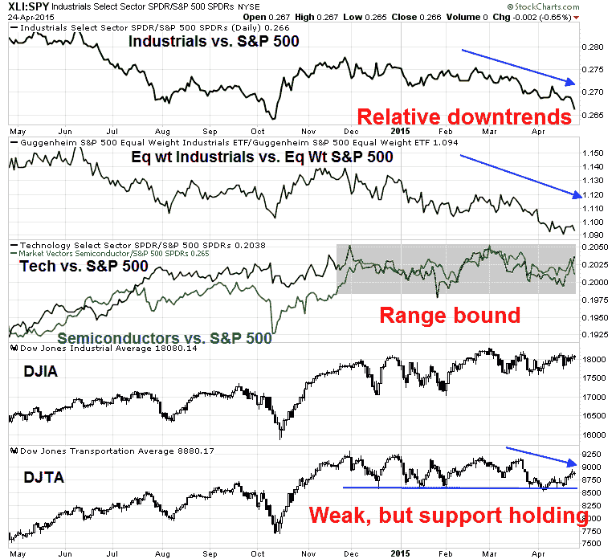

<!--yml
category: 未分类
date: 2024-05-18 03:22:35
-->

# Humble Student of the Markets: New highs = A last hurrah?

> 来源：[https://humblestudentofthemarkets.blogspot.com/2015/04/new-highs-last-hurrah.html#0001-01-01](https://humblestudentofthemarkets.blogspot.com/2015/04/new-highs-last-hurrah.html#0001-01-01)

**Trend Model signal summary**

Trend Model signal: Neutral

Trading model: Bearish

The Trend Model is an asset allocation model which applies trend following principles based on the inputs of global stock and commodity price. In essence, it seeks to answer the question, "Is the trend in the global economy expansion (bullish) or contraction (bearish)?"

My inner trader uses the trading model component of the Trend Model seeks to answer the question, "Is the trend getting better (bullish) or worse (bearish)?" The history of actual (not backtested) signals of the trading model are shown by the arrows in the chart below. In addition, I have a trading account which uses the signals of the Trend Model. The last report card of that account can be found 

[here](http://humblestudentofthemarkets.blogspot.com/2015/04/trend-model-march-report-card-02-or.html)

.

**Update schedule**

: I generally update Trend Model readings on 

[my blog](http://humblestudentofthemarkets.blogspot.com/)

on weekends and tweet any changes during the week at @humblestudent.

**All-time highs a last hurrah?**

The NASDAQ and SPX closed at an all-time highs (ATH) on Friday. While new highs are generally interpreted bullishly as they are signs of surging momentum, momentum factors have not been working lately and the ATH could be seen as warning signs for bulls. The last time the SPX and COMPQ made ATH together was December 31, 1999 - a sobering thought!

Despite the signs of apparent strength, I stand by my assertion that US stocks are in the process of making an intermediate term top. Stephen Suttmeier of BoAML recently warned about the risk of a cyclical top within a secular bull based on past historical patterns.

In the past few weeks, I have also been writing about how the stock market price trend is looking extended and short-term momentum appears wobbly. My analysis was based a study done by James Paulsen of 

[Wells Capital Management](http://ig.cdn.responsys.net/i4/responsysimages/str2/__RS_CP__/20150406_EMP.pdf)

, Such conditions typically see a price reversal in the next few months (see

[How to make your first loss your best loss](http://humblestudentofthemarkets.blogspot.com/2015/04/how-to-make-your-first-loss-be-your.html)

).

[Jesse Felder](http://advisoranalyst.com/glablog/2015/04/22/this-chart-suggests-a-bear-market-could-be-lurking.html)

also seized on the Paulsen study and added his own analysis:

> I decided it might be interesting to overlay [Doug Short’s valuation model](http://www.advisorperspectives.com/dshort/updates/Market-Valuation-Overview.php) on top of Paulsen’s trend model (black lines at the bottom of the chart) in order to see what happened to those markets that were both overbullish and overvalued:

> Of the 13 prior occurrences in Paulsen’s study when stocks became overbullish, 6 also marked times when the stock market was significantly overvalued, as represented by one standard deviation above average. These times are marked with red lines on the chart – 1906, 1929, 1937, 1965, 1998 and 2007\. ***Every one of these occurrences was followed by an almost immediate bear market.*** (Though the internet bubble didn’t peak in 1998, the stock market did fall 22% that year from high to low, the widely accepted definition of a bear market.)

**Deteriorating fundamentals**

In addition to these ominous technical warnings about a possible intermediate term top, I have also seen a number of well respected investors and analysts turn more cautious recently. As an example, investment legend Julian Robertson (see interview

[here](http://www.marketfolly.com/2015/04/julian-robertson-worried-about-bubbles.html)

) is worried about a stock market bubble.

As well, 

[David Einhorn of Greenlight Capital](http://www.valuewalk.com/2015/04/greenlight-capital-2015-q1-letter/)

stated in his 1Q letter that while there were lots of possible short opportunities, he was having difficulty finding long candidates in this market:

> Short candidates are easy to find, but as noted above, the opportunity set on the long side is quite constrained. Most of the investment theses we have reviewed over the past several months can at best be described as late-cycle opportunities, with valuations that often ignore historical economic sensitivity. The operating (and in some cases activist) execution needed to achieve target results has to be rated at Triple Lindy difficulty level.

Notwithstanding the stretched equity market valuations, Einhorn warned about an operating margin squeeze:

> Some of these challenges are well known, including lower energy prices directly impacting that sector (along with many companies that have benefitted from the domestic boom in energy development), and a stronger dollar reducing the translated effect of foreign earnings. Less discussed is the productivity bust and its impact on peak margins. At the bottom of the cycle, firms cut labor faster than output. The higher productivity led to improving margins, earnings and stock prices. Now labor is being added faster than output, and with large companies like McDonalds, Wal-Mart Stores, Inc. and Target announcing pay increases, unit labor costs are likely to increase further. All told, there is a good chance earnings will actually shrink this year. We think the market is too high if earnings have, in fact, peaked for the cycle, and we have reduced our net exposure by adding more shorts.

I had previously pointed to analysis from Ed Yardeni that forward margin estimates were rolling over (see

[Earnings headwinds in 3 charts](http://humblestudentofthemarkets.blogspot.com/2015/04/2015-earnings-headwinds-in-3-charts.html)

). Yardeni is another previously bullish analyst who has turned more cautious on the basis of excessive valuations (summary on his

[blog](http://blog.yardeni.com/2015/04/inflation-warning-excerpt.html)

, but details are only available to subscribers).

Indeed, forward EPS continues to fall as Earnings Season gets into full swing. The latest update from

[John Butters](http://www.factset.com/websitefiles/PDFs/earningsinsight/earningsinsight_4.24.15)

of Factset shows the earnings beat rate to be 73% (vs. 5-year average of 73%) but the revenue beat rate is a disappointing 47% (vs. 5-year average 53%). In other words, the preliminary report card from the current earnings season is a bare pass despite the Street lowering the bar by dropping estimates.

My own estimate of forward EPS estimates, based on blending FY2015 and FY2016 estimates from Factset data, shows that forward 12-month EPS edged down -0.09% last week, compared to -0.29% the week before.

Looking globally, research from Macquarie (via

[Nick](https://twitter.com/NickatFP/status/590543930623557633)

) indicates that global earnings estimates are also falling.

Despite these warning signs, my base case scenario does not call for a full-blown bear market, but a correction much like the experience of 2010 or 2011\. The chart below shows a stylized depiction of where different countries are in their economic cycles, while there may be a few minor quibbles about the exact positions, the key takeaway here is that the US is in the mid-cycle phase of an economic expansion and a recession, which is the major catalyst for a bear market, is not on the horizon.

**Getting speculative**

Analysis based on sector leadership point to a market that is being held up purely by risk appetite, or speculative sentiment. I pointed out in my last post that Consumer Discretionary stocks looked a bit wobbly on a relative basis (see

[Someone is going to be very wrong on the American consumer](http://humblestudentofthemarkets.blogspot.com/2015/04/somone-is-going-to-be-very-wrong-on.html)

). While these stocks have recovered a bit of relative strength, what struck me was that the relative weakness of Consumer Discretionary stocks was widely based and across the board.

Using the same techniques of measuring relative strength, I went looking for signs of market leadership to measure where the market believe the pockets of economic strength are.

So what`s holding up this market? Surprisingly, it`s the high-beta glamour groups of the stock market (plus Healthcare, which has shown a consistent pattern of relative strength).

The relative strength of a number of key sectors, such as Financials, defensive sectors (Consumer Staples and Utilities) and resource sectors do not show any sign of leadership either. The disappointing relative performance of the heavyweight Financials and its high beta cousin the broker-dealers is disappointing. Moreover, analysis from

[Nautilus Research](https://twitter.com/NautilusCap/status/590865515951816704)

that this kind of relative weakness in financial stocks is bad sign for stock prices going forward. The lack of defensive leadership is a sign that the bears aren`t about to stage a major charge. Resource stock relative strength is stabilizing, but they do not appear to be ready to stage a major advance yet, as they probably need time to base and consolidate.

What about cyclical sector? Meh! The chart below depicts the relative strength of Industrial stocks (also equal weighted because of the influence of heavyweight GE), semiconductors (and growth cyclical Technology stocks), as well as the the transportation sector. In particular, I have also been watching the DJ Transportation Average as its weakness could be the sign of a Dow Theory sell signal. While the DJTA has been weak, it has been able to hold above a key support level, indicating that the market is still in a holding pattern.

So let`s summarize. The market leaders are mainly the glamour, high-beta names. The "engines" of the economy, such as the cyclical industrial and semiconductors, financials and consumer discretionary stocks are not leading the market. On the plus side, defensive sectors such as Staples and Utilities are not showing signs of leadership either. In other words, Mr. Market is telling us not to expect much from the economy, but don`t get overly panicked because of the lack of defensive leadership.

It is ever rising risk appetite is propelling stock prices to new highs, as they lacks fundamental support.

[David Einhorn](http://www.valuewalk.com/2015/04/greenlight-capital-2015-q1-letter/)

more or less called it a market based on the greater fool theory (my words, not his, emphasis added):

> The bull case is that equities haven’t yet reached bubble levels at a time when fixed income is behaving bubbly,2 and that the Fed will support the market. As to the former, it may prove true. ***We don’t like the proposition of betting on a bubble***, though one may yet emerge (or, more clearly, a bubble might expand beyond the current small group of high flying stocks). As to the latter, despite all the attention paid to every utterance of any member of the FOMC, it is clear that the Fed isn’t going to add further accommodation unless conditions deteriorate substantially. How fast it tightens should be less important than the fact that it will tighten.

So far, other measures of risk appetite such as HY bonds are indicating that risk appetite remains healthy. However, there may be a minor negative divergence forming as the SPX has gone to new highs while HY bond relative performance has somewhat lagged. This is an indicator that I plan on keeping a close eye on.

**Frothy sentiment**

If the fundamentals are starting to deteriorate and the underpinnings of the stock market advance are increasingly based on risk appetite, we need to watch how sentiment is evolving.

[Mark Hulbert](http://www.marketwatch.com/story/investors-exuberance-is-at-a-frighteningly-high-level-2015-04-24)

 had some bad news based on the readings of his Hulbert Stock Newsletter Sentiment Index (HSNSI):

> To put the current HSNSI reading into context, consider that its average level since March 9, 2009, when the bull market began, has been 39.4%, only slightly more than half the current reading. In fact, over the past decade, there have been only two occasions when the HSNSI was higher than it is today, and on both occasions the market proceeded to fall:
> 
> *   End of 2013/beginning of 2014: The Dow Industrials fell more than 1,000 points in a month’s time, or 7.3%.
> *   February 2015: The Dow Industrials fell 600 points, or 3.2%.
> 
> To be sure, those are only two data points. But they are consistent with the pattern that has emerged over the past 15 years. As you can see from the accompanying table, the Dow on average has done better following readings of 0% and under when it’s been as high as it is currently.

In addition, 

[Urban Carmel](https://twitter.com/ukarlewitz/status/588881120382455808)

 had this warning based on

[ISE](http://www.ise.com/market-data/isee-index/)

 option data:

The CNN Money

[Greed and Fear Index](http://money.cnn.com/data/fear-and-greed/)

is somewhat elevated. While this index doesn't indicate a crowded long by conventional standards, readings are mildly overbought and at levels where they have reversed course in the last six months.

In other words, sentiment is getting frothy. Beware of near-term weakness.

**The week ahead: Hard to get too bullish**

Last week, I wrote that we have seen a pattern of failed corrections and rallies (see

[Wimpy bulls, wimpy bears?](http://humblestudentofthemarkets.blogspot.com/2015/04/wimpy-bulls-wimpy-bears.html)

). I suggested that the most likely scenario was a "wimpy bear", where stock prices fell slightly and then rallied. Instead, price weakness promptly rallied to test and breach all-time highs, which made my bear a cuddly koala bear (yes, they have sharp claws but they aren't likely to maul too many people to death).

Now that the SPX and COMPQ are at all-time highs, what's next?

In a recent post,

[Brett Steenbarger](http://traderfeed.blogspot.com/2015/04/questioning-strong-and-weak-markets.html)

put the current environment into context. He analyzed three trend and momentum indicators and found that a strategy of fading strength and buying weakness was the best strategy:

> On Friday, we had buy signals outnumber sell signals for all three of the above indicators, reflecting the recent market strength. Going back to June, 2014, when this has occurred (N=62), the next five days in SPY have averaged a gain of only +.01%, compared with an average five-day gain of +.26% for the remainder of the sample. Clearly, strong readings have not brought near-term strength--though neither have "overbought" readings reliably led to market declines. The failure of strength to be followed by strength is yet one more reflection of the distinction between trend and momentum [outlined in the recent post](http://www.traderfeed.blogspot.com/2015/04/why-fomo-fails-trending-markets-are-not.html).
> 
> Conversely, when we've had all three indicators yielding more sell signals than buys (N=49), the next three days in SPY have averaged a gain of +.33% versus +.04% for the rest of the sample. Market weakness has tended to reverse in the near term, though much of that relative performance boost tends to fade over subsequent trading sessions.

Despite the "normally" bullish price momentum readings associated with new highs, breadth and momentum readings have been fading. As an example, this chart from

[IndexIndicators.com](http://www.indexindicators.com/indicators/breadth/)

of SPX stocks at 20-day highs has been anemic. Moreover, readings weakened even as the index advanced to an ATH on Friday. I interpret this conditions as a lack of buyers, which will be an impediment to further near-term highs.

From a even shorter term perspective, this chart of stocks at 5-day highs shows that they reached levels where reversals have occurred this year. The fade on Friday is an additional ominous signs for the bulls.

It would be difficult to get overly bullish at this point. We have a number of binary events next week that could be sources of volatility. First, market heavyweight Apple reports earnings on Monday after the close. On Wednesday, we have the 1Q US GDP, with the consensus being 1.0% growth. On Wednesday afternoon, the FOMC will concluded its two-day April meeting and make its statement public.

While the AAPL earnings results is a wildcard, I will be watching the GDP report and FOMC statement more closely.

[New Deal democrat](http://community.xe.com/blog/xe-market-analysis/weekly-indicators-consumer-breakout-vs-hiring-breakdown-edition)

has reiterated this week his belief that the US is likely to see a "mild industrial recession", though consumer spending remains in good shape. I will be watching carefully the interplay between likely economic weakness and Fed policy. On one hand, many macro indicators are going south.

On the other hand, the Fed views 1Q weakness as "transitory" and sees signs of rising inflationary pressures. While some Fed officials have voiced concerns about the effects of US monetary policy on global financial stability, it will be important to see how much the FOMC statement balances these issues. A June rate hike is still on the table, though not likely. However, the risk of a policy mistake is high. Recent IMF analysis (via

[Business Insider](http://www.businessinsider.com/imf-correlations-among-asset-classes-have-risen-since-2010-2015-4)

) shows that asset class price movements have becoming increasingly correlated. A repeat of rate hike anxiety could derail markets in a highly disorderly way.

Bottom line: The will be much event-driven volatility next week but the risks are tilted to the downside. My inner investor remains cautious but not panicked. My inner trader remains short.

**Disclosure:**

Long SPXU, SQQQ