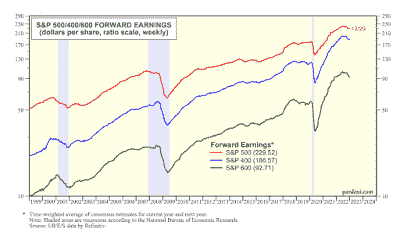

<!--yml
category: 未分类
date: 2024-05-18 01:34:44
-->

# Humble Student of the Markets: New year, new fears

> 来源：[https://humblestudentofthemarkets.blogspot.com/2023/01/new-year-new-fears.html#0001-01-01](https://humblestudentofthemarkets.blogspot.com/2023/01/new-year-new-fears.html#0001-01-01)

**Preface: Explaining our market timing models** 

We maintain several market timing models, each with differing time horizons. The "

**Ultimate Market Timing Model**

" is a long-term market timing model based on the research outlined in our post, 

[Building the ultimate market timing model](https://humblestudentofthemarkets.com/2016/01/26/building-the-ultimate-market-timing-model/)

. This model tends to generate only a handful of signals each decade.

The 

**Trend Asset Allocation Model**

 is an asset allocation model that applies trend-following principles based on the inputs of global stock and commodity prices. This model has a shorter time horizon and tends to turn over about 4-6 times a year. The performance and full details of a model portfolio based on the out-of-sample signals of the Trend Model can be found

[here](https://humblestudentofthemarkets.com/trend-model-report-card/)

.

My inner trader uses a 

**trading model**

, which is a blend of price momentum (is the Trend Model becoming more bullish, or bearish?) and overbought/oversold extremes (don't buy if the trend is overbought, and vice versa). Subscribers receive real-time alerts of model changes, and a hypothetical trading record of the email alerts is updated weekly 

[here](https://humblestudentofthemarkets.com/trading-track-record/)

. The hypothetical trading record of the trading model of the real-time alerts that began in March 2016 is shown below.

The latest signals of each model are as follows:

*   Ultimate market timing model: Sell equities*
*   Trend Model signal: Neutral*
*   Trading model: Neutral*

** The performance chart and model readings have been delayed by a week out of respect to our paying subscribers.***Update schedule**

: I generally update model readings on my 

[site](https://humblestudentofthemarkets.com/)

 on weekends. I am also on Twitter at @humblestudent and on Mastodon at @humblestudent@toot.community. Subscribers receive real-time alerts of trading model changes, and a hypothetical trading record of those email alerts is shown 

[here](https://humblestudentofthemarkets.com/trading-track-record/)

.

Subscribers can access the latest signal in real time 

[here](https://humblestudentofthemarkets.com/my-inner-trader/)

.

**Waiting for clarity from earnings season**

As the New Year dawns on investors, fresh concerns are bubbling up for the US equity outlook. The most immediate is the approaching Q4 earnings season reports, which begins in earnest when the banks report earnings this coming Friday. Already, forward 12-month EPS are rolling over across the board for large, mid, and small-cap stocks. Upcoming corporate guidance will determine the degree of valuation pressure stocks will face in the coming weeks and months.

The full post can be found

[here](https://humblestudentofthemarkets.com/2023/01/01/new-year-new-fears/)

.