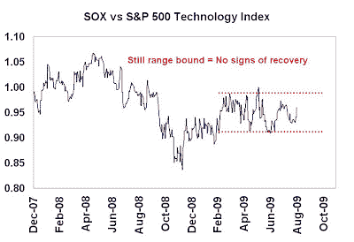

<!--yml
category: 未分类
date: 2024-05-18 00:47:45
-->

# Humble Student of the Markets: No recovery signal from semiconductors

> 来源：[https://humblestudentofthemarkets.blogspot.com/2009/08/no-recovery-signal-from-semiconductors.html#0001-01-01](https://humblestudentofthemarkets.blogspot.com/2009/08/no-recovery-signal-from-semiconductors.html#0001-01-01)

Relative charts are useful devices for filtering out the effects of the overall market. Further to my last

[post on the homebuilders](http://humblestudentofthemarkets.blogspot.com/2009/08/housing-bottoming-but-recovery-still.html)

, I decided to look for signs of a recovery in other industry groups as the market has moved from rallying on signs of stabilization to rallying on indications of a cyclical recovery.

The semiconductor group (SOX) is an ideal indicator, as the semis were not directly impacted by the mortgage and banking meltdown. The chart below shows the relative performance of SOX against the S&P 500 Technology Index. Technology had led much of the rally since late last year and this relative chart shows the performance of the more cyclical semiconductor group against broader Technology stocks.

As the chart indicates, the more cyclical semiconductor group remains range bound relative to Technology stocks. Despite Intel’s positive report last week, there is no sign of a recovery from this cyclically sensitive industry.