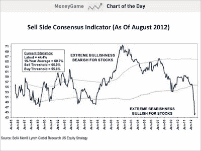

<!--yml
category: 未分类
date: 2024-05-18 04:01:17
-->

# Humble Student of the Markets: Not time to get nervous (yet)

> 来源：[https://humblestudentofthemarkets.blogspot.com/2012/09/not-time-to-get-nervous-yet.html#0001-01-01](https://humblestudentofthemarkets.blogspot.com/2012/09/not-time-to-get-nervous-yet.html#0001-01-01)

I see that there has been a certain amount of hand wringing about the poor performance of the Dow Jones Transportation Average (see example

[here](http://www.marketwatch.com/story/do-shaken-transport-stocks-signal-a-sell-2012-09-21)

):

> According to the basic version of this theory, if the Dow Jones Transport Average fails to confirm the strength of the Dow Jones Industrial Average, the market is headed for a correction. Industrials hit a fresh high Sept. 14 of 13,682 points. Dow transport stocks not only failed to confirm the gain, they lurched decidedly lower.

**A tour around the world**

In isolation, the failure of the Transports to confirm the advance is a cause for concern, but a tour around the world shows that major averages are in solid uptrends. In certain cases, the advance may have gone too far too fast and some gaps may need to get filled in on a pullback. Let's start in the United States with the SPX. This is as solid an uptrend as ever and it is holding up above the key breakout level.    

  Across the pond, the FTSE 100 is showing a similar pattern of being in an uptrend.  

  The same goes for the STOXX 600, representing European stocks.  

  In Hong Kong, the Hang Seng Index is nearing the top end of an upchannel. The QE3 inspired rally produced a gap, which the index needs to pull back and fill.  

  South Korea's KOSPI is showing a similar pattern of a upside gap that may need to get filled. Otherwise, the intermediate term outlook also looks bullish.    

  The BRIC markets generally appear to be constructive. Brazil is in the middle of an upchannel and uptrend.    

  The same could be said of Russia.  

  India's stock market, which had been the source of some investor concern, has also rallied and is displaying the familiar pattern of being at the top end of an upchannel. It does, however, have the upside gap shown by some other markets.  

   The only exception is China's Shanghai Composite, which is in a downtrend.

What about inter-market analysis? Take a look at 10-year Treasury yields. They have stopped falling and they appear to be rising, which is signaling the end of the risk-off trade and the start of the risk-on trade that is equity-bullish.

Cyclically sensitive Dr. Copper has staged an upside breakout, though it does slightly over-extended and it is at risk of a near-term pullback.

**Take a ride on the QE train**

I wrote before that we are at the start of a global QE-induced rally by central bankers around the world (see

[Party on (but watch out for the cops)](http://humblestudentofthemarkets.blogspot.com/2012/09/party-on-but-watch-out-for-cops.html)

). This chart from

[dshort.com](http://advisorperspectives.com/dshort/updates/Treasury-Yield-Snapshot.php)

shows how stocks, bond yields and Fed Funds rates have responded to past episodes of quantitative easing. I also annotated (in red circles) the dates of recent ECB actions. If the past is any guide, then this stock market rally should have legs for a few more months.

**Sentiment models supportive of more upside**

What's more, the latest sentiment survey figures from AAII (via

[Bespoke](http://www.bespokeinvest.com/thinkbig/2012/9/20/aaii-bullish-sentiment-rises-for-seventh-week-in-ten.html)

) shows that while investor sentiment has gotten more bullish, readings are not at crowded long extremes.

I would also like to address the point from the

[Pragmatic Capitalism](http://pragcap.com/some-notable-signs-of-complacency)

posting, which pointed out Mike Santoli's piece in Barrons highlighting insider selling and the excessive bullishness among newsletter writers as signs to be worried about. While I would be concerned excessive selling by insiders, i.e. the smart money, insiders have not always perfect at timing the market. As for the opinion of newsletter writers, I would argue that their excessive bullishness is actually bullish in this case as they provide buying power for the market. This is a case of watching what they do and not what they say. Anecdotal evidence from trading indicates that institutions and hedge funds have too little beta and they are in the process of beta chasing. BoAML strategist Savita Subramanian pointed out that Sell-Side Strategists were still extremely bearish on equities at the end of August:

> The Sell Side Indicator, our measure of Wall Street bullishness on stocks, ticked up slightly in August for the first time in six months. However, this month’s improvement of 0.6ppt lifted the indicator to just 44.4, still at the lowest level in the history of our data (since 1985) apart from last month’s low of 43.9\. This suggests that sell side strategists’ bearishness on equities remains at 27 year extremes. Given the contrarian nature of this indicator, we are encouraged by Wall Street’s lack of optimism and the fact that strategists are recommending that investors significantly underweight equities at 44.4% vs. a traditional long-term average benchmark weighting of 60-65%. The indicator remains firmly in “Buy” territory, a signal that it first flashed in May. Recall that we adjusted our Buy and Sell thresholds in November in an attempt to better incorporate secular shifts in equity sentiment.

Their positioning can be regarded as a proxy for how institutional portfolios are positioned. When these guys start to turn around, there is a lot of money to move markets around. Such a turn from a position of extreme bearishness tends to lead to short-term overbought conditions and excessive bullish sentiment model readings.

**The fiscal cliff a non-issue?**

The storm clouds are clearing, one by one. The ECB and Fed have taken tail risk off the table for now. Even the much feared fiscal cliff may not be a problem. The

[Washington Post](http://www.washingtonpost.com/business/economy/gop-retreat-on-taxes-likely-if-obama-wins/2012/09/20/49948828-0330-11e2-9b24-ff730c7f6312_story.html)

reported last week that the Republican Senate's leadership conceded that they may have to compromise on taxes should Obama win the election:

> Senior Republicans say they will be forced to retreat on taxes if President Obama wins a second term in November, clearing the biggest obstacle to a deal with Democrats to defuse a year-end budget bomb that threatens to rock the U.S. economy.
> 
> Republicans have long resisted tax increases of any kind. But taxes are a major battleground in the campaign between Obama and Republican Mitt Romney, Capitol Hill veterans say, and the victor will be able to claim a mandate for his policies.
> 
> “This is a referendum on taxes,” said Rep. Tom Cole (R-Okla.), a senior member of the House Budget Committee. “If the president wins reelection, taxes are going up” for the nation’s wealthiest households, and “there’s not a lot we can do about that.”

The weight of the evidence suggests that the path of least resistance remains up. While there are a couple of negatives, such as excessive insider selling and the poor performance of the Shanghai Composite, a tour around the world show powerful upside momentum in global equities, supported by a friendly macro environment and institutional buying.

Party on! It's not time to get nervous (yet).

*Cam Hui is a portfolio manager at [Qwest Investment Fund Management Ltd](http://www.qwestfunds.com/). ("Qwest"). This article is prepared by Mr. Hui as an outside business activity. As such, Qwest does not review or approve materials presented herein. The opinions and any recommendations expressed in this blog are those of the author and do not reflect the opinions or recommendations of Qwest.* *None of the information or opinions expressed in this blog constitutes a solicitation for the purchase or sale of any security or other instrument. Nothing in this article constitutes investment advice and any recommendations that may be contained herein have not been based upon a consideration of the investment objectives, financial situation or particular needs of any specific recipient. Any purchase or sale activity in any securities or other instrument should be based upon your own analysis and conclusions. Past performance is not indicative of future results. Either Qwest or Mr. Hui may hold or control long or short positions in the securities or instruments mentioned.*