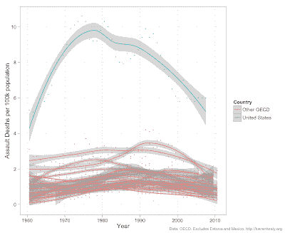

<!--yml
category: 未分类
date: 2024-05-18 03:58:30
-->

# Humble Student of the Markets: On the kinds of "conversations"

> 来源：[https://humblestudentofthemarkets.blogspot.com/2012/12/on-kinds-of-conversations.html#0001-01-01](https://humblestudentofthemarkets.blogspot.com/2012/12/on-kinds-of-conversations.html#0001-01-01)

[Josh Brown](http://www.thereformedbroker.com/2012/12/14/no-need-for-a-conversation/)

had a great post entitled "No need for a conversation":

> My heart is breaking for the families of those affected by the events in Newtown, Connecticut this morning. Just as I'm sure yours is, regardless of your stance on the gun issue.
> 
> Now, we're going to hear people talk about this sudden need for a "national conversation" or a some grand debate over guns and gun control. I can't think of a more pointless waste of time.

He correctly pointed out that there are entrenched views on both sides of the gun control issue and incidents like the latest mass shooting aren't going to have a significant effect on peoples' attitude. Mrs. Humble Student of the Markets was particularly upset with the news of the shooting, largely because we have a 7th grader and we used to nearby Stamford, Connecticut.

Nevertheless, guns are part of the culture of America. However, look into your own heart and consider how the "national conversation" would change if the shooter had been:

*   Black;
*   An illegal alien from Latin America; or
*   Muslim

Regardless of where you might stand on the issue of gun control, I believe that the allowing the presence of firearms increase the level of systematic personal risk in a society. As the

[Washington Post](http://www.washingtonpost.com/blogs/wonkblog/wp/2012/12/14/nine-facts-about-guns-and-mass-shootings-in-the-united-states/)

points out, America is a far more violent society than many other industrialized countries:

|  |
| **Deaths due to assault** |

**On the nature of risk**

Consider this financial analogy. There are some obvious benefits to financial derivatives. They are useful tools for spreading risk around and an investor can use the leverage inherent in derivatives to better enhance his useful of capital. Now imagine allowing every mom and pop investor to use derivatives such as options, futures and swaps, whether they be listed or OTC, in their portfolios.

Regardless of the benefits or derivatives, do you think that there would be more or less market volatility under such a regime?

**Addendum**

: Remember, derivatives don't destroy balance sheets, people destroy balance sheets.

*Cam Hui is a portfolio manager at [Qwest Investment Fund Management Ltd](http://www.qwestfunds.com/). ("Qwest"). This article is prepared by Mr. Hui as an outside business activity. As such, Qwest does not review or approve materials presented herein. The opinions and any recommendations expressed in this blog are those of the author and do not reflect the opinions or recommendations of Qwest.* *  *None of the information or opinions expressed in this blog constitutes a solicitation for the purchase or sale of any security or other instrument. Nothing in this article constitutes investment advice and any recommendations that may be contained herein have not been based upon a consideration of the investment objectives, financial situation or particular needs of any specific recipient. Any purchase or sale activity in any securities or other instrument should be based upon your own analysis and conclusions. Past performance is not indicative of future results. Either Qwest or Mr. Hui may hold or control long or short positions in the securities or instruments mentioned.**