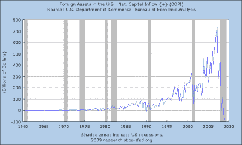

<!--yml
category: 未分类
date: 2024-05-18 00:47:10
-->

# Humble Student of the Markets: Pax Americana at dusk

> 来源：[https://humblestudentofthemarkets.blogspot.com/2009/09/pax-americana-at-dusk.html#0001-01-01](https://humblestudentofthemarkets.blogspot.com/2009/09/pax-americana-at-dusk.html#0001-01-01)

As gold breaks above the magic $1,000 level and the US Dollar weakens, more and more headlines are coming across that suggests that the center of gravity is shifting away from the United States.

I recently became a member of the Board of Advisors to [Qwest Investment Management](http://www.qwestfunds.com/), an investment management firm which specializes in identifying, structuring and managing investment products. The firm is currently focused on investments in the natural resource sector. One of my tasks is to write a monthly newsletter, known as *Qwest for Returns.* the first edition asks whether the US is becoming Argentina. Here is the synopsis:

> In this issue we explore if the U.S. is making the same mistakes as Argentina did a century ago. Will the U.S. see its competitiveness erode, its economy weaken further and the U.S. Dollar continue its decline? A weakening of the U.S. Dollar could be bullish for commodities.

You can see the newsletter [here](http://www.qwestfunds.com/qwest_information_centre/monthly_newsletter.html).