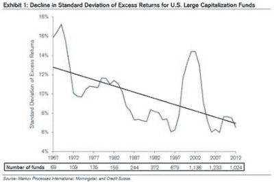

<!--yml
category: 未分类
date: 2024-05-18 02:52:49
-->

# Humble Student of the Markets: Peak smart beta?

> 来源：[https://humblestudentofthemarkets.blogspot.com/2017/06/peak-smart-beta.html#0001-01-01](https://humblestudentofthemarkets.blogspot.com/2017/06/peak-smart-beta.html#0001-01-01)

A recent comment by 

[Michael Mauboussin](https://25iq.com/2017/06/02/a-dozen-thoughts-from-charlie-munger-from-the-2017-berkshire-annual-meeting/)

of Credit Suisse that nailed the dilemma of active managers, namely that using traditional approaches to alpha generation is akin to mining lower and lower grade ore:

> Exhibit 1 shows that the standard deviation of excess returns has trended lower for U.S. large capitalization mutual funds over the past five decades. The exhibit shows the five-year, rolling standard deviation of excess returns for all funds that existed at that time. This also fits with the story of declining variance in skill along with steady variance in luck. These analyses introduce the possibility that the aggregate amount of available alpha—a measure of risk-adjusted excess returns—has been shrinking over time as investors have become more skillful. Investing is a zero- sum game in the sense that one investor’s outperformance of a benchmark must match another investor’s underperformance. Add in the fact that in aggregate investors earn a rate of return less than that of the market as a consequence of fees, and the challenge for active managers becomes clear.

I got into quantitative investing back in the 1980`s when ideas and models were fresh and plentiful. Today, factor investing has become increasingly mainstream, and so-called "smart beta" may have exceeded their best before date.

The full post can be found at our new site

[here](https://humblestudentofthemarkets.com/2017/06/05/peak-smart-beta/)

.