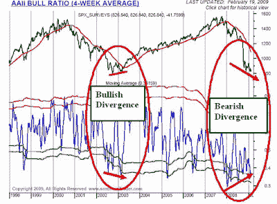

<!--yml
category: 未分类
date: 2024-05-18 00:58:07
-->

# Humble Student of the Markets: Phoenix rising?

> 来源：[https://humblestudentofthemarkets.blogspot.com/2009/02/phoenix-rising.html#0001-01-01](https://humblestudentofthemarkets.blogspot.com/2009/02/phoenix-rising.html#0001-01-01)

With the US equity market averages either probing or breaking down through their November lows, is it time to buy [Phoenix](http://humblestudentofthemarkets.blogspot.com/2008/12/mini-ride-of-phoenix.html) stocks? Others have picked up on that theme, with the latest being a [Minyanville article](http://www.minyanville.com/articles/index/a/21265) on buying beaten up stocks.

With that in mind, I screened the US market for stocks with the following characteristics:

*   Stock price between $1 and $5 (low-priced stocks)
*   Down at least 80% from a year ago (beaten up)
*   Market cap of $100 million or more (were once "real" companies)
*   Net insider buying in the last six months (some downside protection from insider activity)

This screen gives us a list of low-priced stocks of Phoenix candidates. The $100 million market cap gives us some assurance that it was once a substantial company. The net insider activity gives signals that company fundamentals are less likely to completely fall apart. The screen, which showed a count of 30 stocks that passed the criteria a week ago, jumped to 48 names when it ran after the close on Monday 23 Feb 2009:

> Affymetrix Inc (AFFX), Aircastle Ltd (AYR), Amkor Technology Inc (AMKR), ATP Oil & Gas Corp (ATPG), Bank of America Corp (BAC), BGC Partners Inc (BGCP), Boyd Gaming Corp (BYD), CapitalSource Inc (CSE), CB Richard Ellis Group Inc (CBG), CBL & Associates Properties Inc (CBL), Century Aluminum Co (CENX), Cenveo Inc (CVO), Citigroup Inc (C), Colonial Properties Trust (CLP), Conseco Inc (CNO), Delta Petroleum Corp (DPTR), Developers Diversified Realty Corp (DDR), Fifth Third Bancorp (FITB), First Industrial Realty Trust Inc (FR), Gannett Co Inc (GCI), Genworth Financial Inc (GNW), GFI Group Inc (GFIG), Global Industries Ltd (GLBL), Great Atlantic & Pacific Tea Co (GAP), Helix Energy Solutions Group Inc (HLX), Hercules Offshore Inc (HERO), Huntsman Corp (HUN), Insight Enterprises Inc (NSIT), ION Geophysical Corp (IO), Janus Capital Group Inc (JNS), Liz Claiborne Inc (LIZ), Marshall & Ilsley Corp (MI), MF Global Ltd (MF), MGIC Investment Corp (MTG), MGM Mirage (MGM), PAETEC Holding Corp (PAET), Patriot Coal Corp (PCX), Pennsylvania Real Estate Investment Trus (PEI), Popular Inc (BPOP), Protective Life Corp (PL), Quiksilver Inc (ZQK), Regions Financial Corp (RF), Reliant Energy Inc (RRI), Saks Inc (SKS), Sunstone Hotel Investors Inc (SHO), Tetra Technologies Inc (TTI), Wyndham Worldwide Corp (WYN) and XL Capital Ltd (XL).

I find it interesting that given the recent news on the weekend, both Citigroup ([C](http://finance.yahoo.com/q/it?s=C)) and Bank of America ([BAC](http://finance.yahoo.com/q/it?s=BAC)) are Phoenix candidates with positive insider activity, though insiders bought Citigroup earlier at substantially higher prices.

**Phoenix: the bull case**
Is it time to buy? Here is the bull case, based mainly on sentiment readings:

[European pension funds are throwing in the towel](http://business.timesonline.co.uk/tol/business/industry_sectors/banking_and_finance/article5779907.ece) and reducing equity weightings.
[Brokerage firms are awash in cash](http://articles.moneycentral.msn.com/Investing/Extra/brokerage-houses-are-awash-in-cash.aspx).
The [magazine cover indicator](http://www.tradersnarrative.com/two-magazine-covers-separated-by-9-years-2288.html), always a good contrarian indicator, is flashing positive.
[Bullish sentiment among individual investors is falling](http://disciplinedinvesting.blogspot.com/2009/02/investor-bullish-sentiment-continues-to.html).

**Phoenix: the bear case**
Nevertheless, there are some troubling indicators out there:

[CEOs aren’t buying their own stock](http://www.fundmymutualfund.com/2009/02/usa-today-ceos-not-buying-stock-in.html).
[AAII sentiment readings](http://www.sentimentrader.com/subscriber/charts/WEEKLY/SURVEY_AAII_BULLRATIO_4WK.htm), while bearish (contrarian bullish), aren’t at bearish extremes. The chart below shows the bull and bear sentiment ratio from AAII. Note that while the market has fallen, sentiment readings aren’t as bearish as they were in November – a bearish divergence. By contrast, extreme bearish sentiment was in evidence when the market tested its 2002 lows in 2003.

**Not oversold enough**

: Some of the proprietary overbought/oversold indicators that I watch (not shown) are not at oversold extremes.

**Commitment of Traders data is leaning bearish**

: The latest weekly Commitment of Traders report, large speculators are net long S&P 500 futures with readings near (contrarian bearish) extremes. While they are net short NASDAQ 100 futures, readings are neutral.

**Get long for a punt?**

Putting this all together, my interpretation of the big picture suggests that isn't THE BOTTOM. Any rally from these levels is still a bear market rally.

While I wouldn’t recommend it, speculators could try to get long a basket of Phoenix stocks for a punt. If you do, then I would suggest that you manage risk with some tight stops in place so that the trade doesn’t totally fall apart on you.

Needless to say, this is an extremely high risk/high reward trade. This post is by no means a recommendation to buy Phoenix stocks. You are on your own on this one.