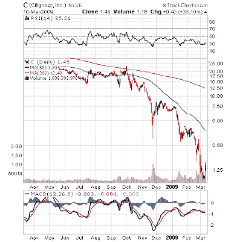
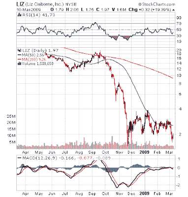

<!--yml
category: 未分类
date: 2024-05-18 00:57:16
-->

# Humble Student of the Markets: Phoenix strategy update

> 来源：[https://humblestudentofthemarkets.blogspot.com/2009/03/phoenix-strategy-update.html#0001-01-01](https://humblestudentofthemarkets.blogspot.com/2009/03/phoenix-strategy-update.html#0001-01-01)

It seems that I am not the only one highlighting a

[Phoenix strategy](http://humblestudentofthemarkets.blogspot.com/2008/05/waiting-for-ride-on-phoenix.html)

these days. Mebane Faber

[wrote](http://www.mebanefaber.com/2009/03/08/is-it-time-to-do-a-templeton/)

that John Templeton sucessfully implemented a Phoenix-like strategy in 1939\. As well,

[Standard Life](http://thescotsman.scotsman.com/business/Standard-Life-reveals--choices.5054007.jp)

is offering a Phoenix themed fund for UK investors.

Further to my last Phoenix strategy update of

[Feb 24](http://humblestudentofthemarkets.blogspot.com/2009/02/phoenix-rising.html)

, the latest update of the Phoenix screen shows the number of stocks passing the screen jumping from 48 stocks to 58 stocks this week. As a reminder, the Phoenix stock screen consists of the the following criteria:

*   Stock price between $1 and $5 (low-priced stocks)
*   Down at least 80% from a year ago (beaten up)
*   Market cap of $100 million or more (were once "real" companies)
*   Net insider buying in the last six months (some downside protection from insider activity)

As Faber points out in his post, some of the charts that passed his screen are truly nauseating. For example, Citigroup (C) remains in a downtrend despite the huge rally yesterday.

I would prefer to look for stocks like Liz Claiborne (LIZ) that shows more of a bottoming pattern:

To reiterate, I don’t believe that it’s time to buy into a Phoenix strategy yet, but the number and the composition the Phoenix list bears watching.