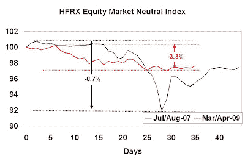
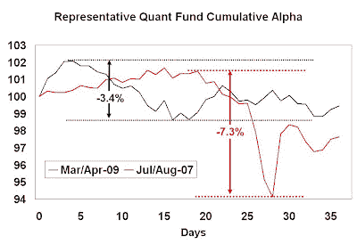

<!--yml
category: 未分类
date: 2024-05-18 00:54:33
-->

# Humble Student of the Markets: Quant funds: August 2007 and now

> 来源：[https://humblestudentofthemarkets.blogspot.com/2009/04/quant-funds-august-2007-and-now.html#0001-01-01](https://humblestudentofthemarkets.blogspot.com/2009/04/quant-funds-august-2007-and-now.html#0001-01-01)

There has been some buzz in the blogosphere about recent quant fund blowups, much of it initiated by a post over at

[Zero Hedge](http://zerohedge.blogspot.com/2009/04/incredibly-shrinking-market-liquidity.html)

[emphasis mine]:

> "Anyone who is doing anything sensible right now is either losing money or is out of the market entirely." These are the words of a quant trader, who is seeing something scary in the capital markets. Scary enough to merit a warning that we could be on the verge of another ***October 87, August 2007***, or January 2008...

The latest Zero Hedge

[post](http://zerohedge.blogspot.com/2009/04/no-trend-reversal-trading-actions.html)

indicates that there has been significant negative performance by quant funds, driven by a rally in low-quality stocks, which is a manifestation of the

[Phoenix effect](http://humblestudentofthemarkets.blogspot.com/2008/05/waiting-for-ride-on-phoenix.html)

(see my latest update on Phoenix

[here](http://humblestudentofthemarkets.blogspot.com/2009/04/april-phoenix-update.html)

).

**August 2007 and now**

With those thoughts in mind, I looked at the returns of the HFRX Equity Market Neutral Index, which Tyler Durden at Zero Hedge uses as a proxy for quant fund performance. The chart below shows the cumulative returns of the index. I based the two indices at 100 on June 30, 2007 and February 28, 2009 respectively:

Here is the daily cumulative alpha (return – benchmark) of a representative mutual fund that has a quantitatively driven investment process, which is typically a multi-factor model (Value, Growth, Momentum, etc.) controlled for risk (e.g. Barra risk-factors):

Both charts show the same pattern. While quant funds have experienced negative performance recently, they are nowhere near the drawdowns seen in August 2007.

**Heart attack vs. cancer**

Andy Lo echoes the mostly commonly advanced explanation of August 2007 when he wrote a

[paper](http://web.mit.edu/alo/www/Papers/august07_2.pdf)

about the episode. He speculated that it was

> ...initiated by the rapid unwind of one or more sizable quantitative equity market-neutral portfolios…likely the result of a forced liquidation by a multi-strategy fund or proprietary-trading desk.

In other words, quants were in a crowded trade and someone wanted to get out really fast. The system seized up and suffered a “heart attack” as a result. As the liquidity pressure eased, performance gradually came back to “normal”.

**A Phoenix effect driven underperformance**

Today, the source of negative performance was largely attributable to the Phoenix effect. The Phoenix effect is not as sudden as the heart attack liquidity effect seen in August 2007\. However, it can be longer lasting and can be like a cancer as it eats away at performance. I recall that Jeff deGraaf reported in late 2003 that the return spread between the lowest and highest decile of stock price was about 70% - an astounding return to a factor for less than one year.

Quant processes work but they don't work all the time. Quant equity managers need to prepare for these negative environments in different ways. In the case of August 2007, they need to seek out new sources of alpha that are uncorrelated with their current alphas, which is easier said than done. In the case of the Phoenix effect, the recent bout of negative performance could be just a taste of what investors could see in the next 6-12 months. This is another example of how quant managers need to think hard about the assumptions behind their models and adjust their positions accordingly in order to

[survive and prosper as a quant](http://humblestudentofthemarkets.blogspot.com/2007/12/surviving-and-prospering-as-quant.html)

.