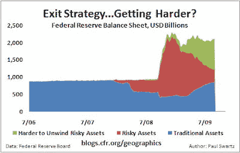

<!--yml
category: 未分类
date: 2024-05-18 00:46:51
-->

# Humble Student of the Markets: Recession is over, what now Ben?

> 来源：[https://humblestudentofthemarkets.blogspot.com/2009/09/recession-over-what-now-ben.html#0001-01-01](https://humblestudentofthemarkets.blogspot.com/2009/09/recession-over-what-now-ben.html#0001-01-01)

Fed Chairman Ben Bernanke

[declared yesterday](http://uk.reuters.com/article/idUKTRE58E4LY20090916)

that the recession was over but the recovery is weak: “Even though from a technical perspective the recession is very likely over at this point, it's still going to feel like a very weak economy for some time.”

What now Ben?

**Is Quantitative Easing a roach motel?**

Does the Fed take its foot off the accelerator in its quantitative easing? Former Federal Reserve governor Laurence Meyer believes that

[there is widespread angst among Fed officals about exit strategies](http://www.marketwatch.com/story/fed-has-angst-about-exit-insider-2009-08-28)

.

This

[chart](http://blogs.cfr.org/geographics/2009/09/08/the-great-inflation-debate/)

from the Center for Geoeconomic Studies shows that the Fed’s balance sheet is going into harder to unwind assets, which makes exit strategies harder:

Is quantitative easing becoming a roach motel? It’s easy to get into but hard to get out?

**Markets haven’t digested what this means**

On the interest rate front, St. Louis Fed governor Bullard

[declared](http://www.reuters.com/article/ousiv/idUSTRE57K5LL20090822)

that interest rates are likely to stay low for a very long time, but the markets still don’t get it [emphasis mine]:

> Financial markets have not fully understood that the U.S. Federal Reserve's pledge to keep interest rates exceptionally low for an extended period means they will stay low beyond when officials normally would raise them, a top Fed official said on Friday.
> 
> "***I don't think markets have really digested what that means***," St Louis Fed President James Bullard said in an interview.
> 
> The Fed's strategy is aimed at promoting a future rise in inflation, which should provide an immediate boost in activity in anticipation of a future boom, but that hasn't happened, Bullard said.

What does this mean for the markets?

**USD hostile and commodity friendly**

All that spells I-N-F-L-A-T-I-O-N, which will ultimately be USD hostile and commodity friendly. Barry Ritholz at

[Big Picture](http://www.ritholtz.com/blog/2009/09/new-normal-means-central-banks-wont-soon-exit/)

weighs in on the Fed’s conundrum and investment implications:

> If a strong recovery somehow takes hold, then rising inflation expectations should help the metals and be an even bigger tonic for mining shares. If the economy slips back into a funk, then a new round of policy responses (that we cannot afford) will gush forth, harming the dollar and thus helping the metals. The only way precious metals could really get hurt is for Bernanke and his central banking colleagues around the world to guide the global economy to a perfect, soft, noninflationary landing. If you think Bernanke and his buddies can usher in a painless return to the Goldilocks era, then avoid precious metals. Stocks, bonds, commodities, and the precious metals can all – in the short run – benefit from the liquidity provided by overly easy monetary policies. The recent positive correlations among these asset classes may be sending just such a message. Eventually, however, the asset classes will have to part ways. I think the central bankers will find a way to overstay their welcome, leaving the only monetary asset they can’t print as the asset of choice.

**Inflation-Deflation Timer says inflation**

Meanwhile, my

[Inflation-Deflation timer](http://humblestudentofthemarkets.blogspot.com/2009/08/timing-inflationdeflation-trade.html)

is telling me to stay with the reflation trade.