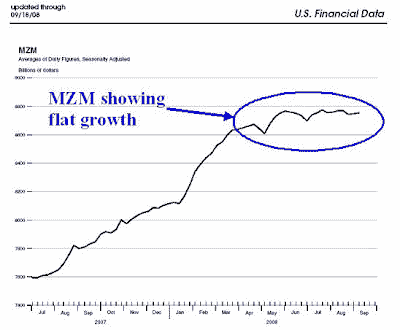

<!--yml
category: 未分类
date: 2024-05-18 01:04:58
-->

# Humble Student of the Markets: Relief rally but no convincing bottom

> 来源：[https://humblestudentofthemarkets.blogspot.com/2008/09/relief-rally-but-no-convincing-bottom.html#0001-01-01](https://humblestudentofthemarkets.blogspot.com/2008/09/relief-rally-but-no-convincing-bottom.html#0001-01-01)

It is said that you don't make money from the stories on the front page but from the stories that move from page 10 to the front page.

**What's on the front page?**

If this is the weekend then it must be time for another rescue...Bear Stearns, Fannie, Freddie, Merrill, Lehman, AIG, WaMu, short sale prohibitions and now the Morgan Stanley, Goldman Sachs reorganizations as well as the $700b bailout.

The

[Japanification of America](http://ftalphaville.ft.com/blog/2008/09/12/15825/the-japanification-of-wall-street/)

continues and the market melted up this week in response to short-term government “fixes”. Notwithstanding the

[outrages](http://globaleconomicanalysis.blogspot.com/2008/09/weep-for-free-market.html)

that others have expressed over the government’s intervention, China also signaled that

[its line of credit has limits](http://www.reuters.com/article/ousiv/idUSPEK4365020080917?sp=true)

.

**Page 10 items that I am focused on**

While all the headlines are fascinating, it is equally important not to allow them to distract you. The equity market was oversold and certainly due for a relief rally. The VIX Index spiked to 41.97 on Wednesday, which is sufficiently high for a short-term bottom. The most important "tell" of a short-term bottom has been the telephone calls and emails that I received in the past week from people that I hadn't heard from in some time - they all wanted to hear what I thought of the market.

While the panic last week likely marked a the start of a short-term rally, I don’t believe that the bottom has been put into place for this Bear Market for the following reasons:

*   **Technical**: the leadership in this rally is all wrong. Moreover, sentiment was not sufficiently bearish enough for this to be anything but a short-term relief rally.
*   **Monetary**: Money supply growth remains anemic.
*   **Fiscal**: The market hasn't discounted the likely fiscal drag on the economy that is coming next year.

**Wrong leadership in this rally**
I have pointed out before that true rising from the ashes [Phoenix bottoms](http://humblestudentofthemarkets.blogspot.com/2008/05/waiting-for-ride-on-phoenix.html) tend to be led by large cap stocks. In the two days of this rally, the small cap Russell 2000 (+11.2%) beat the large cap S&P 500(+8.4%).

**Sentiment isn't sufficiently bearish**
The [AAII sentiment survey](http://www.sentimentrader.com/subscriber/charts/WEEKLY/SURVEY_AAII_BULLRATIO_4WK.htm) of individual investors shows that while investor sentiment was bearish (contrarian bullish) going into this rally. However, readings were nowhere close to bearish extremes. [Mark Hulbert](http://www.marketwatch.com/news/story/thursday-constituted-key-reversal-day/story.aspx?guid=%7B76AEFF83%2D8BDD%2D4BAF%2D9169%2D3FE85AD8445E%7D)’s analysis led him to the same conclusion: relief rally, yes, market bottom, probably not.

**Money supply isn’t growing** No matter how you define it, money supply growth has been anemic. Macro and TAA quants know that money supply growth is correlated with equity market returns. The premise is really simple. You throw money into the system, some of it make it into the stock market in the short term and the market goes up.

The chart below from the St. Louis Fed shows [MZM](http://research.stlouisfed.org/publications/usfd/page5.pdf) updated to 19 Sep 2008\. Despite the Bear, Fannie, Freddie and AIG bailouts of the recent past, the narrowly defined MZM money supply isn’t growing at all. Using a different metric, the broadly (reconstructed) [M3 growth](http://www.nowandfutures.com/key_stats.html) has also been falling off a cliff.

Here is a puzzle. If there has been all these bailouts but no growth in the monetary base, where is it coming from? [Brad Setser’s analysis](http://blogs.cfr.org/setser/2008/09/18/the-scale-of-central-bank-and-sovereign-fund-intervention-in-global-markets-has-been-breathtaking/) suggests that it is coming from foreign central banks and sovereign funds. There is anecdotal evidence of foreign central banks lending in US Dollars. In writing about the massive intervention last Thursday, Reuters [reported](http://uk.reuters.com/article/UKNews1/idUKHKG1567720080919) that:

> In Europe, there were signs that the stress was easing. The cost of ***borrowing dollars*** overnight fell back towards the Fed's 2 percent target, and three-month borrowing costs slid. ***The Bank of England offered*** [USD] ***$40 billion to banks***, but only half of it was taken up.

******Recession watch** [John Hussman](http://www.hussmanfunds.com/wmc/wmc080825.htm)

wrote that the market consensus hasn’t quite accepted that we are in a recession:

> I'll emphasize again that at the point we do observe sufficient evidence for investors to concede recession, the potential downside could be abrupt, leaving little opportunity to make defensive changes after the fact.

A pre-condition for making a market bottom is the recognition that the economy is in a recession. Despite all the [indicators](http://www.econbrowser.com/archives/2008/09/back_to_the_rea.html), the market consensus doesn't seem to quite want to concede that reality yet. A good indicator of sufficiently bearish sentiment occurs when commentators start to talk about a double-dip slowdown. Right now, I have not even seen the “double-dip” term in the vocabulary of the economic bears like Nouriel Robini and David Rosenberg.

**Likely fiscal drag on the economy in 2009 and 2010** The likely catalyst for talk about a double-dip will be the realization a) America is in a recession; and b) that there will likely be further fiscal drag on the economy in 2009 and 2010\. The United States is going to see a presidential election in less than two months but I have not seen anyone discuss this: ***The propensity of new presidents is to take any economic pain early in his term (and blame his predecessor) so that he can have a solid base for re-election.*** 
A likely scenario will be the new president, whoever he is, will assume office and be shocked! (shocked, I say!) to find the cupboard is bare and be forced to raise taxes as a result. The Washington Post has a good [summary](http://www.washingtonpost.com/wp-dyn/content/story/2008/06/09/ST2008060900950.html) of McCain and Obama’s tax proposals. Obama’s stated net tax rate is roughly neutral for the general population (doubtful). As for John McCain, despite his stated policy to lower taxes rates, [Greg Mankiw](http://gregmankiw.blogspot.com/2008/09/mccains-likely-tax-policy.html) posted an analysis that shows the market believes that the likelihood of a tax increase under a McCain Administration is 74%.

Equities would sell off on the prospect of a tax increase and the resultant fiscal drag. That selloff could possibly set up the market bottom of this Bear.****