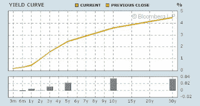
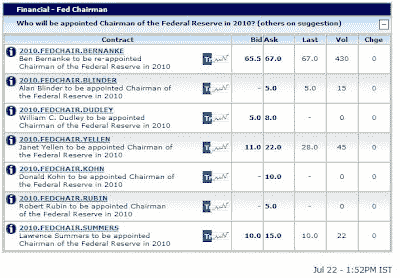

<!--yml
category: 未分类
date: 2024-05-18 00:49:59
-->

# Humble Student of the Markets: Replace Bernanke?

> 来源：[https://humblestudentofthemarkets.blogspot.com/2009/07/replace-bernanke.html#0001-01-01](https://humblestudentofthemarkets.blogspot.com/2009/07/replace-bernanke.html#0001-01-01)

Ben Bernanke’s

[Op-Ed](http://online.wsj.com/article/SB10001424052970203946904574300050657897992.html)

in the Wall Street Journal about how the Fed could remove accommodation has ignited a firestorm in the blogosphere. Most of the response has been less than complimentary (

[here](http://alephblog.com/2009/07/22/duh/)

is one of the milder ones). In connection with this article and his recent testimony, the cries to replace Bernanke in January 2010 have also been getting louder.

Yes, Dr. Bernanke, we know that the Fed has many tools to tighten its very easy stance of quantitative easing. The question is, is there the political will to do so? Today, we have a Fed Chairman spent his academic life studying the Great Depression he appears to be determined to avoid a repeat of that episode.

**Tighten? Are you out of your mind?**

On the other hand, we have a yield curve that is steeply upward sloping, with the spread between the 3-month and the 10-year well over 300 basis points. The textbook monetary policy response is to tighten now.

In response to the Op-Ed, there have also been calls to replace Bernanke as Fed Chairman when his term expires in January 2010\. This may be a case of being careful about what you wish for.

**Who are the alternatives?**

Who have the political guts to tighten now? Would even Paul Volcker, who has largely gone silent, tighten in the face of a fragile recovery?

Over at

[intrade](http://www.intrade.com/)

, Bernanke remains to be the front-runner to be re-appointed Fed Chair.

After Bernanke, the next leading contender is Janet Yellen, president of the San Francisco Fed. She recently gave a

[speech](http://www.frbsf.org/news/speeches/2009/0630.pdf)

indicating that she wants the Fed to err on the side of accommodation:

> I’ll put my cards on the table right away. I think the predominant risk is that inflation will be too low, not too high, over the next several years. I take 2 percent as a reasonable benchmark for the rate of inflation that is most compatible with the Fed’s dual mandate of price stability and maximum employment.

If you don’t like Yellen, how would you feel about Larry Summers, who is the third favorite?

If Bernanke, Yellen and Summers are the top three leading contenders to be the next Fed Chair, what does that say about the future of U.S. monetary policy?

For those who are interested, I have a free e-newletter for inflation and commodity bulls. You can sign up

[here](http://humblestudentofthemarkets.blogspot.com/2009/04/for-commodity-bulls.html)

.