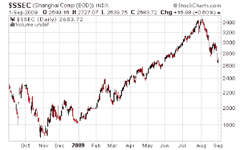
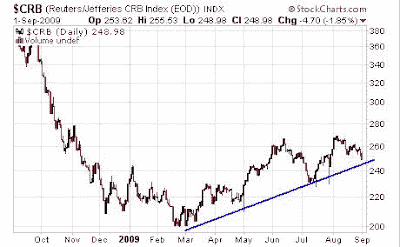
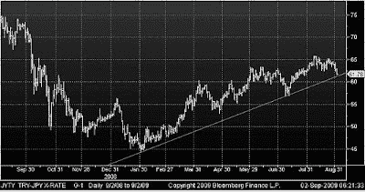
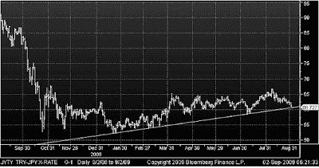
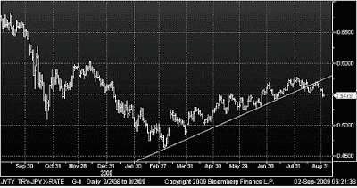
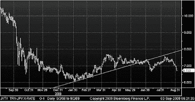

<!--yml
category: 未分类
date: 2024-05-18 00:47:35
-->

# Humble Student of the Markets: Risk on?

> 来源：[https://humblestudentofthemarkets.blogspot.com/2009/09/risk-on.html#0001-01-01](https://humblestudentofthemarkets.blogspot.com/2009/09/risk-on.html#0001-01-01)

The equity rally is part of the overall “buy risk” trade that investors have been engaged in for the past few months. A clue to its longevity is to look at other markets to see how they are faring, so that we can understand whether the bull or the bear is in control.

**Shanghai rolls over**

You have to be a market hermit to not know that the Shanghai market has rolled over. China had been the last hope of strength in a growth starved world. Moreover, the

[Baltic Dry Index](http://investmenttools.com/futures/bdi_baltic_dry_index.htm)

, as an indication of world trade, is also falling.

**Commodity uptrend still intact**

China had been a huge user and accumulator of commodities in the past few months and therefore fueled the rally in prices. Despite the crack in the Shanghai market, it is interesting that commodity prices, in aggregate, remain in a fragile uptrend.

**Carry trade mixed**

Another element of the risk trade is the currency carry trade. So how is the carry trade doing?

The chart below shows the New Zealand Dollar/Yen cross, a favorite of the carry-traders. This trade is now testing its uptrend line, but until that line is breached, the bulls should be given the benefit of the doubt.

**New Zealand Dollar/Japanese Yen**

Here is the Turkish Lira/Japanese Yen cross. Same story – as NZDJPY, the uptrend is intact, but barely.

**Turkish Lira/Japanese Yen**

What about Eastern Europe? Remember how Eastern Europeans had mortgaged their property purchase in a low yielding currency like the Swiss Franc? Here is the Hungarian Forint/Swiss Franc exchange rate. Interestingly, FX traders had been in that trade since early March. It breached its uptrend line mid-August and it appears to be in the process of rolling over.

**Hungarian Forint/Swiss Franc**

Finally, we visit the Mexican Peso. Mexico was the subject of an [S&P warning about its debt](http://www.bloomberg.com/apps/news?pid=20601086&sid=aIRD9e3y0yyo), but that weakness appears to have been widely telegraphed in the FX market.

**Mexican Peso/Japanese Yen**

**Are the bulls or bears in control?**
I have warned about the risks of this equity rally (see examples [here](http://humblestudentofthemarkets.blogspot.com/2009/08/no-recovery-signal-from-semiconductors.html), [here](http://humblestudentofthemarkets.blogspot.com/2009/08/more-bearish-data-points-for-equities.html) and [here](http://humblestudentofthemarkets.blogspot.com/2009/08/v-shaped-recovery-with-4-8-gdp-growth.html)). Instead of trying to call the turn in the market, some of these aforementioned indicators are a clue of whether the bulls or bears are in control of this market.

Right now, it appears that they are in a tug of war. Many of the indicators are now testing their uptrend lines. If they get breached, then it is a clear sign that the bears have won the upper hand.