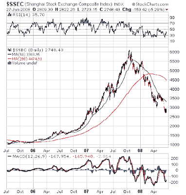

<!--yml
category: 未分类
date: 2024-05-18 01:08:07
-->

# Humble Student of the Markets: Risks rising in commodity long position

> 来源：[https://humblestudentofthemarkets.blogspot.com/2008/06/risks-rising-in-commodity-long-position.html#0001-01-01](https://humblestudentofthemarkets.blogspot.com/2008/06/risks-rising-in-commodity-long-position.html#0001-01-01)

I wrote in a previous

[post](http://humblestudentofthemarkets.blogspot.com/2008/06/stay-long-inflation-trade.html)

that “commodity inflation is likely to continue until emerging market central banks start to get tough on inflation”. Now we have this

[report](http://www.reuters.com/article/ousiv/idUSL2941725020080629)

of central bankers worldwide becoming more concerned about the inflation threat. It isn’t clear, however, what they are going to do about it.

**Time for a China slowdown "story"?**

It’s been some time since the markets have been spooked by a “China is slowing” story and we may be due. When that happens, commodity investors will hit a severe air pocket.

China’s equity investors are already feeling the pain. As I write this, the Shanghai Composite is down 56% from its highs set in October 2007\. Technically it has gone through every Fibonacci retracement support level like a hot knife through butter. The next Fibonnaci support zone represents a further 19% from current levels.

Jeff Matthews details the strains occurring in China

[here](http://jeffmatthewsisnotmakingthisup.blogspot.com/2008/06/stocks-worth-air-drivers-ready-to.html)

and

[here](http://jeffmatthewsisnotmakingthisup.blogspot.com/2008/06/olympics-coming-and-rooms-are-available.html)

. The 2008 Summer Olympics is in August and it’s likely that the authorities would try to restrain any economic slowdown stories until after the Games.

Right now my stock level model for the Energy sector, which uses momentum and trend following factors, remains long the Energy sector vs. the S&P 500 and has been working well. It indicates to me to stay long Energy but I am a very

***nervous***

long given the macro background.