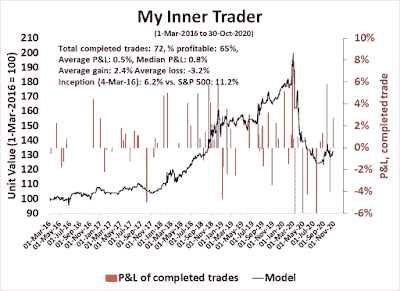

<!--yml
category: 未分类
date: 2024-05-18 02:09:41
-->

# Humble Student of the Markets: Scenario planning ahead of the Big Event

> 来源：[https://humblestudentofthemarkets.blogspot.com/2020/11/scenario-planning-ahead-of-big-event.html#0001-01-01](https://humblestudentofthemarkets.blogspot.com/2020/11/scenario-planning-ahead-of-big-event.html#0001-01-01)

**Preface: Explaining our market timing models**

We maintain several market timing models, each with differing time horizons. The "

**Ultimate Market Timing Model**

" is a long-term market timing model based on the research outlined in our post,

[Building the ultimate market timing model](https://humblestudentofthemarkets.com/2016/01/26/building-the-ultimate-market-timing-model/)

. This model tends to generate only a handful of signals each decade.

The

**Trend Asset Allocation Model**

is an asset allocation model which applies trend following principles based on the inputs of global stock and commodity price. This model has a shorter time horizon and tends to turn over about 4-6 times a year. In essence, it seeks to answer the question, "Is the trend in the global economy expansion (bullish) or contraction (bearish)?"

My inner trader uses a

**trading model**

, which is a blend of price momentum (is the Trend Model becoming more bullish, or bearish?) and overbought/oversold extremes (don't buy if the trend is overbought, and vice versa). Subscribers receive real-time alerts of model changes, and a hypothetical trading record of the email alerts are updated weekly

[here](https://humblestudentofthemarkets.com/trading-track-record/)

. The hypothetical trading record of the trading model of the real-time alerts that began in March 2016 is shown below.

The latest signals of each model are as follows:

*   Ultimate market timing model: Sell equities*
*   Trend Model signal: Neutral*
*   Trading model: Bearish*

** The performance chart and model readings have been delayed by a week out of respect to our paying subscribers.* **Update schedule**

: I generally update model readings on my 

[site](https://humblestudentofthemarkets.com/)

 on weekends and tweet mid-week observations at @humblestudent. Subscribers receive real-time alerts of trading model changes, and a hypothetical trading record of those email alerts is shown

[here](https://humblestudentofthemarkets.com/trading-track-record/)

.

Subscribers can access the latest signal in real-time 

[here](https://humblestudentofthemarkets.com/my-inner-trader/)

.

**Waiting for the Big Event**

The US election is just around the corner, and there isn't much more to say. I have been monitoring the evolution of SPY implied volatility (IV), and this chart represents the final snapshot before the election. Since I began keeping track in September, IV has spiked at the time of the election and remained elevated into 2021, indicating a high level of anxiety over the results, and the possibility of a contested outcome. It was only recently that contested election anxiety has faded, and IV began to normalize just after the initial spike.

The IV of other asset classes are following a similar pattern to stocks, as represented by SPY. Gold (GLD) and long bond (TLT) IV both surges at election time, and slowly fall afterward.

The upcoming week should provide greater clarity of macro developments. While the actual outcomes are difficult to predict, investors can engage in some scenario planning so that they can be prepared.

The full post can be found

[here](https://humblestudentofthemarkets.com/2020/11/01/scenario-planning-ahead-of-the-big-event/)

.