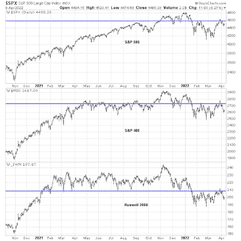

<!--yml
category: 未分类
date: 2024-05-18 01:45:46
-->

# Humble Student of the Markets: Secrets of stable returns in a chaotic bear market

> 来源：[https://humblestudentofthemarkets.blogspot.com/2022/04/secrets-of-stable-returns-in-chaotic.html#0001-01-01](https://humblestudentofthemarkets.blogspot.com/2022/04/secrets-of-stable-returns-in-chaotic.html#0001-01-01)

**Preface: Explaining our market timing models** 

We maintain several market timing models, each with differing time horizons. The "

**Ultimate Market Timing Model**

" is a long-term market timing model based on the research outlined in our post, 

[Building the ultimate market timing model](https://humblestudentofthemarkets.com/2016/01/26/building-the-ultimate-market-timing-model/)

. This model tends to generate only a handful of signals each decade.

The 

**Trend Asset Allocation Model**

 is an asset allocation model that applies trend following principles based on the inputs of global stock and commodity price. This model has a shorter time horizon and tends to turn over about 4-6 times a year. The performance and full details of a model portfolio based on the out-of-sample signals of the Trend Model can bsoe found

[here](https://humblestudentofthemarkets.com/trend-model-report-card/)

.

My inner trader uses a 

**trading model**

, which is a blend of price momentum (is the Trend Model becoming more bullish, or bearish?) and overbought/oversold extremes (don't buy if the trend is overbought, and vice versa). Subscribers receive real-time alerts of model changes, and a hypothetical trading record of the email alerts is updated weekly 

[here](https://humblestudentofthemarkets.com/trading-track-record/)

. The hypothetical trading record of the trading model of the real-time alerts that began in March 2016 is shown below.

The latest signals of each model are as follows:

*   Ultimate market timing model: Buy equities*
*   Trend Model signal: Bearish*
*   Trading model: Neutral*

** The performance chart and model readings have been delayed by a week out of respect to our paying subscribers.***Update schedule**

: I generally update model readings on my 

[site](https://humblestudentofthemarkets.com/)

 on weekends and tweet mid-week observations at @humblestudent. Subscribers receive real-time alerts of trading model changes, and a hypothetical trading record of those email alerts is shown 

[here](https://humblestudentofthemarkets.com/trading-track-record/)

.

Subscribers can access the latest signal in real-time 

[here](https://humblestudentofthemarkets.com/my-inner-trader/)

.

**A bear market**

The signs are becoming clear. This is an equity bear market. Global central banks are engaged in a coordinated round of tightening. Fed Governor Lael Brainard put on the table the prospect of quantitative tightening, or a reduction of the Fed balance sheet, in a speech last week. This was confirmed by the release of the March FOMC minutes which revealed the Fed is targeting $95 billion in balance sheet reduction per month. Cue the fears about the effects of falling liquidity on stock prices.

In addition, the hopes that the bulls had for a momentum-driven rally fizzled in late March. The S&P 500, S&P 400, and S&P 600 all stalled at resistance and have all since pulled back.

Here are some ways that traders and investors can find stable and risk-controlled returns in a chaotic bear market.

The full post can be found

[here](https://humblestudentofthemarkets.com/2022/04/10/secrets-of-stable-returns-in-a-chaotic-bear-market/)

.