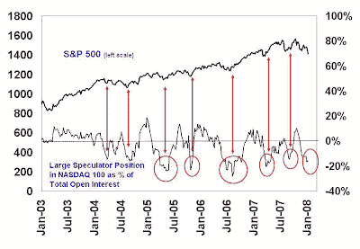

<!--yml
category: 未分类
date: 2024-05-18 01:14:47
-->

# Humble Student of the Markets: Sentiment Models Pointing to a Rally for US Equities

> 来源：[https://humblestudentofthemarkets.blogspot.com/2008/01/sentiment-models-pointing-to-rally-for.html#0001-01-01](https://humblestudentofthemarkets.blogspot.com/2008/01/sentiment-models-pointing-to-rally-for.html#0001-01-01)

**Both Fast-Money and Individual Investor Sentiment at Bearish Extremes (Contrarian Bullish)**

The US equity market’s fundamental background has been deteriorating as analysts have been drastically taking down their estimates (analysis

[here](http://bespokeinvest.typepad.com/bespoke/2008/01/forget-the-scal.html)

). The latest employment report on Friday was also a shocker to the market, which suggested a weakening economy. Sentiment data, however, shows that expectations are very low as we head into Earnings Season and any positive surprises are likely to spark a rally.

The accompanying chart shows the position of large speculators (mostly fast-money hedge funds) in NASDAQ 100 futures. I use the NASDAQ 100 instead of the S&P 500 as the fast money seem to prefer to use the NASDAQ 100 as a vehicle for its directional exposure because of its high-beta characteristics. Readings are in the crowded short area from which rallies have occurred in the past. The latest [update](http://www.sentimentrader.com/subscriber/charts/WEEKLY/SURVEY_AAII_BULLRATIO_4WK.htm) from the American Association of Individual Investors (AAII) Sentiment Survey also shows excessive bearishness from individual investors.

All this doesn’t mean that the market can’t go even lower. However, the odds given this sentiment backdrop favor a rally from current levels. Traders positioning for a rally could buy high-beta ETFs such as QQQQ or IWM. Even more aggressive traders can consider double long exposure ETFs such as SSO and QLD.