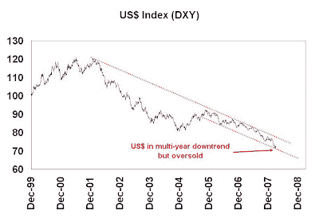
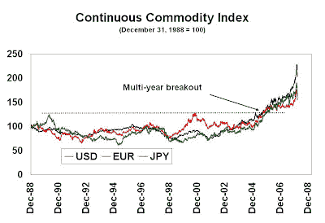
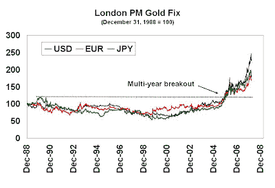
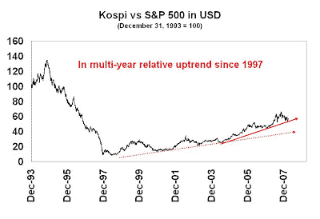

<!--yml
category: 未分类
date: 2024-05-18 01:11:44
-->

# Humble Student of the Markets: Sheep can make money too!

> 来源：[https://humblestudentofthemarkets.blogspot.com/2008/04/sheep-can-make-money-too.html#0001-01-01](https://humblestudentofthemarkets.blogspot.com/2008/04/sheep-can-make-money-too.html#0001-01-01)

As a counterpoint to my post

[Channeling my inner contrarian](http://humblestudentofthemarkets.blogspot.com/2008/02/channeling-my-inner-contrarian.html)

I thought that I would write about being a sheep and the advantages of following the crowd.

A few years ago, I managed equity market neutral portfolios at a firm that was mainly known for commodity trading using trend following techniques, which are well described by

[Michael Covel](http://www.michaelcovel.com/)

in his book. During my tenure there I noticed that while the commodity positions were spread out among various futures contracts they often amounted to a few macro bets (i.e. on interest rates, on the US$, etc.) I came to the conclusion that these models were identifying macroeconomic trends that are persistent and exhibit serial correlation, which creates investment opportunities for patient long-term investors. For example, if the Fed is raising rates the odds are they will continue to raise rates until they signal a neutral or easing bias, i.e. there is a trend to interest rates, which is information that investors can use. The key risk in this class of models is knowing when to exit the trend, as short and long term reversals can be devastating to the bottom line.

With those principles in mind, here are some of the big macro trends that could be investment opportunities (and this shouldn’t be a surprise to most people):

*   The falling US Dollar
*   Worldwide inflation, especially in commodity prices
*   Growth in China

**The falling US Dollar**

The accompanying chart shows the US Dollar Index in a multi-year downtrend (this is where technical analysis is useful as it spots long term trends). The currency is reflective of investor concerns of the current account and fiscal deficits going out as far as the eye can see and no meaningful policies to reverse them. The recent Fed actions of rescuing the system from collapse have led to some to question the Central Bank’s inflation fighting credentials, which have resulted in additional Dollar weakness. In the short term, however, the US Dollar is near the bottom of its channel and seems to be poised for a counter-trend rally.

**Worldwide inflation, especially commodity inflation** 

Inflation is everywhere and spreading. You just have to read stories like

[Stop the inflation](http://www.marketwatch.com/news/story/hey-fed-stop-robbing-my/story.aspx?guid=%7B5F50495D%2DBDB6%2D4CFC%2DB7F0%2DA6B36DF831F8%7D)

in the US and

[Workers strike at Nike contract factory](http://ap.google.com/article/ALeqM5jbpxmxdRCOLsB-aN78yYEjW1yGfAD8VOUPM00)

and demanding 20% raises in Vietnam, a low-wage country that had previously been a source of deflation.

Commodity inflation is not just restricted to headline commodities like gold and oil, but is very broad based can be seen in

[foodstuffs](http://www.bloomberg.com/apps/news?pid=20601080&sid=aMUOIe2QVYlQ&refer=news)

(which begs the question of whether Core CPI = CPI ex-food and energy is a good indicator of inflation). The accompanying chart shows the Continuous Commodity Index (CCI), which is a continuation of the old equal-weighted CRB Index before its

[re-constitution](https://customers.reuters.com/d/Reuters_Jefferies_CRB_Index.pdf)

to a liquidity-weighted index in 2005\. The CCI has been advancing in the major non-US currencies as well as US Dollars, indicating that the commodity advance is 1) broad based and 2) independent of US Dollar weakness.

Similarly, gold prices have also been showing a similar pattern to the other commodities. Gold appears to be regaining its former status as the alternative reserve currency. As I indicated

[before](http://humblestudentofthemarkets.blogspot.com/2008/03/short-term-warning-for-us-dollar-bears.html)

, the US Dollar is likely to rally in the short run and gold and other commodities would run into a headwind under such a scenario.

**"Peak Oil" is an additional possible bullish dynamic for oil prices**

Crude oil has a possible bullish dynamic of its own in addition to the rising trend in commodity prices: Peak Oil. Much has been written about peak oil by the likes of

[Matt Simmons](http://www.simmonsco-intl.com/research.aspx?Type=msspeeches)

, various contributors at the

[Oil Drum](http://www.theoildrum.com/)

and by many others at

[APSO](http://www.aspoitalia.net/index.php?option=com_content&task=view&id=113&Itemid=90)

so I won't repeat them here. If the peak oil theory is correct and world oil production is indeed rolling over, then we are in for a period of very tough adjustments in not only energy usage but in the pattern of economic growth.

**Growth in China**
The China growth story is well known and likely to persist. However, direct investment in China is problematical because of an ill-formed culture of corporate governance. A recent article in the [FT](http://www.ft.com/cms/s/0/b81b7dc2-00d0-11dd-a0c5-000077b07658.html) indicates that:

> Board structures at Chinese companies can lead to “confusion, ambiguity and potentially ... undermine the board of directors”, according to a study [by Risk Metrics] of the corporate governance risks faced by investors in China.

Even Hong Kong has its problems:

> Risk Metrics noted minority shareholders in the two jurisdictions [Mainland China and Hong Kong] do face some common risks. The state’s firm grip over China’s largest industrial and financial companies is mirrored in Hong Kong by the influence of tycoons and their families.

Instead of investing directly into China, I would suggest vehicles such as the Korean market (EWY: iShares MSCI South Korea) as a way of participating in Chinese growth. Countries such as Japan and Korea supply China with capital goods to facilitate growth in the Chinese economy. The accompanying chart shows the relative returns of the South Korean KOPSI Index in US Dollars relative to the S&P 500\. The Korean market bottomed out relative to the S&P 500 in 1997 and has been in a relative uptrend since. A trend following investor would look at that chart and say “

***stay with the trend!***

”

The key risk to this trade is that the South Korean market is generally thought as as being highly sensitive to world growth and a significant slowdown in the US could affect it disproportionately.