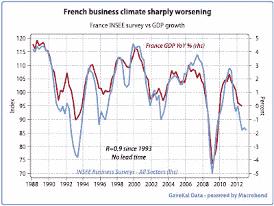

<!--yml
category: 未分类
date: 2024-05-18 03:54:34
-->

# Humble Student of the Markets: Short France?

> 来源：[https://humblestudentofthemarkets.blogspot.com/2013/04/short-france.html#0001-01-01](https://humblestudentofthemarkets.blogspot.com/2013/04/short-france.html#0001-01-01)

I have found that the best trades are ones based on a well-defined fundamental reason combined with a market catalyst. Investors who put on a trade based purely on fundamentals run the risk of being early - and Value investors are a classic example of this tendency. Fundamentals have a way of not mattering to the market until it matters. A much better way to position your portfolio is to wait for the market catalyst by watching the technical conditions of the trade.

**A bearish call on France**

Consider this article from Charles Gave of Gavekal (via

[ZeroHedge](http://www.zerohedge.com/print/472639)

): France Is On The Brink of A Secondary Depression:

> France is engulfed by a political, economic and moral paralysis. The president has record low popularity, unemployment is making new highs and the tax czar of a supposedly left wing government just quit after repeatedly lying about a pile of cash he had stashed in a Swiss bank account. From such a sorry state of affairs, you might think that things could only get only get better. Unfortunately, economic cycles do not work this way and it is my contention that France is about to enter what was known during the gold standard era as a “secondary depression.” The rigid design of the euro system means the whole eurozone is prone to the kind of brutal cyclical adjustments seen in that hard money era of the 19th and early 20th centuries. But having reached the logical limits of its decades long experiment in state-run welfare-capitalism France is far more exposed than even its struggling neighbors.

The article is well worth reading in its entirety, because it lays out the bearish divergence for France against the rest of Europe. There is a French elephant in the eurozone room that no one dares to speak about. While Brussels can manage crisis after crisis in peripheral countries, a blowup in France is too big to contain as the French-German relationship lies at the political heart of the European Union.

Hale Stewart at the

[Bonddad Blog](http://bonddad.blogspot.com/2013/04/market-analysis-france.html)

jumped on the same theme last week when he wrote:

> The French ETF is looking more and more like a great short opportunity. [As I first noted a little over a week ago](http://bonddad.blogspot.com/2013/03/will-france-be-next-eu-basket-case.html), the French economy is in terrible shape: GDP has barely grown for the last 7 quarters, unemployment is rising, industrial production is dropping and the budget and current account deficits are increasing.

**Too early to short France**

What has been described so far is best characterized as a "trade setup". This is a trade with a strong fundamental backdrop. My inner investor tells me to be wary of France and its effects on Europe, but my inner trader tells me, "Not yet."

These fundamentals have a way of not mattering to the market until it matters. Right now, the market is shrugging off the warning signs. Consider this chart of the relative performance of French equities to eurozone equities below. Relative support seems to have held despite the potential negative news and the CAC is actually rally on a relative basis in the short term.

This may be a case of when it rains, it pours, but you have to wait for the rain. The "rain" to which I refer to is the emergence of a risk-off trade. Right now, there is no sign of that happening. Look at the relative strength of Greek stock to eurozone stocks - it's signaling a risk-on market.

The same could be said of Italy. Look at the relative performance of the MIB against the Euro STOXX 50:

In short, this is a trade setup to be watched. Watch how the fundamentals develop, because you have the time. Should the technicals deteriorate, then you have a great trade with tremendous upside potential - but not today.  

Later this week, I will write about another potential trade setup in a hot topic - gold.

*Cam Hui is a portfolio manager at [Qwest Investment Fund Management Ltd](http://www.qwestfunds.com/). ("Qwest"). This article is prepared by Mr. Hui as an outside business activity. As such, Qwest does not review or approve materials presented herein. The opinions and any recommendations expressed in this blog are those of the author and do not reflect the opinions or recommendations of Qwest.* *None of the information or opinions expressed in this blog constitutes a solicitation for the purchase or sale of any security or other instrument. Nothing in this article constitutes investment advice and any recommendations that may be contained herein have not been based upon a consideration of the investment objectives, financial situation or particular needs of any specific recipient. Any purchase or sale activity in any securities or other instrument should be based upon your own analysis and conclusions. Past performance is not indicative of future results. Either Qwest or Mr. Hui may hold or control long or short positions in the securities or instruments mentioned.  *