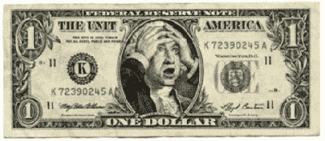

<!--yml
category: 未分类
date: 2024-05-18 01:04:17
-->

# Humble Student of the Markets: Signs of a panic bottom?

> 来源：[https://humblestudentofthemarkets.blogspot.com/2008/10/signs-of-panic-bottom.html#0001-01-01](https://humblestudentofthemarkets.blogspot.com/2008/10/signs-of-panic-bottom.html#0001-01-01)

This week I have had several calls and emails from friends, acquaintances and former colleagues to discuss the state of the market. Mrs. Humble Student of the Markets also got this "joke email" from one of her friends.

> **The Treasury Department is putting out a new Dollar bill...**
> 
> 