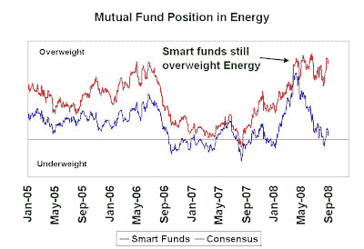
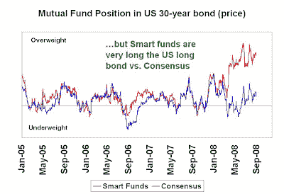

<!--yml
category: 未分类
date: 2024-05-18 01:05:50
-->

# Humble Student of the Markets: Smart funds: Still early in the inflation trade

> 来源：[https://humblestudentofthemarkets.blogspot.com/2008/09/smart-funds-still-early-in-inflation.html#0001-01-01](https://humblestudentofthemarkets.blogspot.com/2008/09/smart-funds-still-early-in-inflation.html#0001-01-01)

I have written about

[smart mutual funds](http://humblestudentofthemarkets.blogspot.com/2008/02/smart-money-postured-for-recession.html)

and reversed engineered their macro exposures before. One of the benefits of such an exercise is to formulate a longer term macro scenario and examine it for internal consistency and to see if I am comfortable with the general thesis. In looking at smart funds today, their macro exposures can be summarized as follows:

*   Still believers in the Inflation Trade;
*   Still underweight Financials; and
*   Long the US long bond!

**Still overweight Energy vs. Consensus**

The chart below shows the imputed exposure of smart mutual funds and consensus mutual funds in the Energy sector. As the chart shows, smart funds remain overweight Energy while consensus funds have cut back their exposure to roughly market weight:

Consistent with the hard asset and inflation theme, smart funds are also overweight Materials vs. the consensus (chart not shown).

**Underweight Financials** 

Smart funds are still heavily underweight Financials compared to the consensus:

******…but smart funds are long the US long bond**
Surprisingly, the imputed duration of smart fund portfolios seem to be higher than the S&P 500 compared to the consensus:**** 

****

**Long inflation, Fed in a bind and behind the curve**
On the surface, the macro position of smart funds lack internal consistency. Usually, if you are long the inflation (Energy and Materials) bet, you are short the bond market. The experience of the 1970s showed that if inflation wins, bondholders lose.

However, I believe that the portfolio managers of these funds believe that longer term, inflation is here and rising. Moreover, the Fed is behind the curve in its inflation fight. It is further handcuffed by the fragility of the financial system (hence the underweight position in Financials). In the short term, the combination of the cyclical effects of the economic slowdown and the Fed’s focus on core inflation, which appears relatively benign, will serve to put a lid on long rates (and therefore the long bond bet).

In other words, they are betting on inflation rising and believe that it’s very early in the trade. The long bond exposure implies that inflationary expectations remain contained and are not yet ready to rise.****