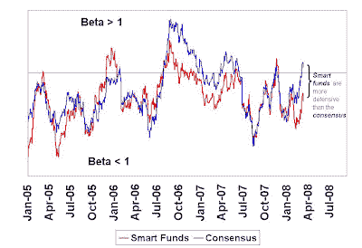

<!--yml
category: 未分类
date: 2024-05-18 01:12:13
-->

# Humble Student of the Markets: Smart funds still more defensive than the consensus

> 来源：[https://humblestudentofthemarkets.blogspot.com/2008/03/smart-funds-still-more-defensive-than.html#0001-01-01](https://humblestudentofthemarkets.blogspot.com/2008/03/smart-funds-still-more-defensive-than.html#0001-01-01)

Was Tuesday's FOMC equity rally for real? Or should we take Wednesday's pullback as the real trend in the stock market?

A check in with the

[smart funds](http://humblestudentofthemarkets.blogspot.com/2008/02/smart-money-postured-for-recession.html)

show that they are still more defensive than the consensus.

***Smart funds***

are showing a market beta that is lower than 1, or the market. By contrast the

***consensus funds'***

beta is at or slightly above 1.

There are very good

[technical reasons](http://www.marketwatch.com/news/story/tuesdays-market-flashed-double-9-to-1/story.aspx?guid=%7BC61515A8%2D00F0%2D4460%2DAC40%2D51E2BA8D864B%7D)

why this market should rally. It is extremely oversold and due for a bounce. However,

***smart funds***

don't seem to be convinced yet that this is THE BOTTOM. By this measure, rallies should be viewed as trading opportunities to sell into strength.