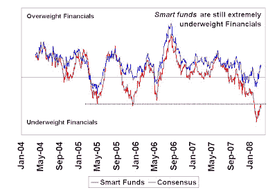

<!--yml
category: 未分类
date: 2024-05-18 01:11:28
-->

# Humble Student of the Markets: Smart funds still underweight financials

> 来源：[https://humblestudentofthemarkets.blogspot.com/2008/04/smart-funds-still-underweight.html#0001-01-01](https://humblestudentofthemarkets.blogspot.com/2008/04/smart-funds-still-underweight.html#0001-01-01)

A reader recently wrote and asked if the

[smart funds](http://humblestudentofthemarkets.blogspot.com/2008/02/smart-money-postured-for-recession.html)

had reacted to the Fed’s rescue efforts of Bear Stearns et al. A check in with the analysis of

*Smart Funds*

show that they remain more underweight Financials than they ever have in the last four years, though they have somewhat moderated their underweight. By contrast, consensus mutual funds have moved to a slight overweight in the sector.

**Another shoe to drop?**

This posture is suggestive that the Smart funds believe that there are more trouble ahead for banks. Barry Ritholtz at Big Picture recently posted on a RBC Capital Markets research report on

[5 reasons why bank stocks have not bottomed](http://bigpicture.typepad.com/comments/2008/04/5-reasons-why-b.html)

. I would also add my comment that in extreme market conditions the brokers tend to trade at about book value. Today, most are trading at 1.6 to 1.7 times book. JPM and C moved to a price/book of 1 in the recent turmoil, but they are financial conglomerates and not pure brokers.

In addition, John Mauldin at

[Thoughts from the Frontline](http://www.frontlinethoughts.com/)

wrote in his weekly newsletter that:

> In an [opinion letter](http://www.sec.gov/divisions/corpfin/guidance/fairvalueltr0308.htm) posted on the SEC website last weekend clarifying how banks are supposed to mark their assets to market prices is this little gem (emphasis [his]):
> 
> "Fair value assumes the exchange of assets or liabilities ***in orderly transactions***. Under SFAS 157, it is appropriate for you to consider actual market prices, or observable inputs, even when the market is less liquid than historical market volumes, ***unless those prices are the result of a forced liquidation or distress sale***. Only when actual market prices, or relevant observable inputs, are not available is it appropriate for you to use unobservable inputs which reflect your assumptions of what market participants would use in pricing the asset or liability."
> 
> …There are two problems with this rule. First, it clearly creates a lack of ransparency. The whole reason to require banks to mark their assets to market price rather than mark to model was to provide shareholders and other lenders transparency as to the real capital assets of a bank or company. Second, can a forced liquidation or distress sale be from a margin call? Obviousy [sic] the answer is yes. but as Barry Ritholtz points out, this opens the door for some rather blatant potential manipulation. If a bank makes a margin call to hedge funds or their clients to make the last price of a similar derivative on their own books look like a forced liquidation, do they then get to not have to value the paper at its market price? Is this not an incentive to make margin calls? One price for my customers and a different one for the shareholders? If a hedge fund was forced to sell assets and then they find out that the investment bank is valuing them differently on their books than the price at which they were forced to sell, there will be some very upset managers and investors. Cue the lawyers.

In other words, this is going to be a mess.